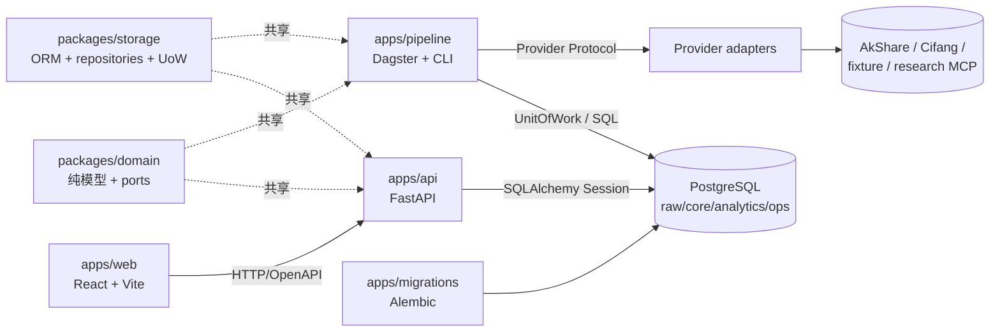
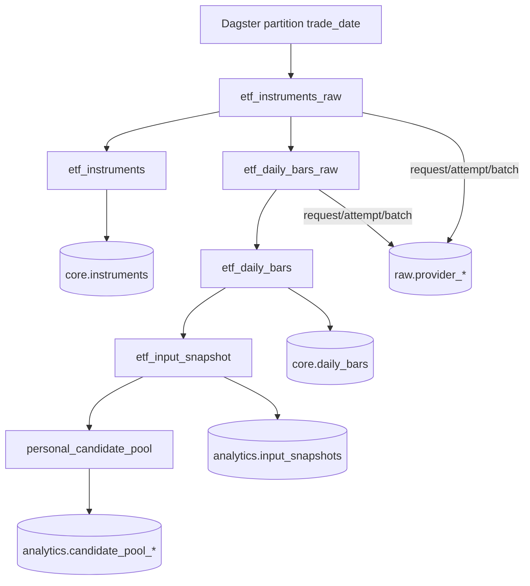
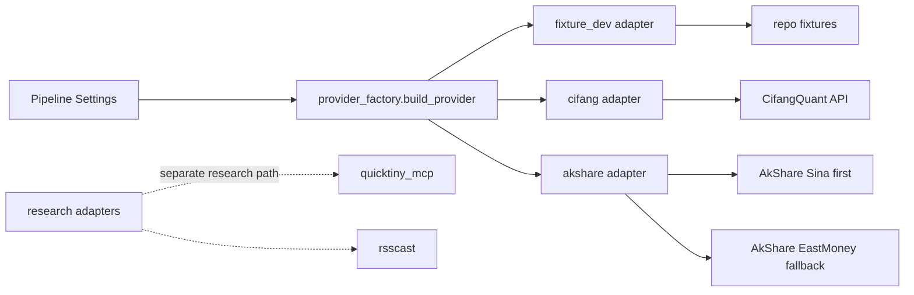
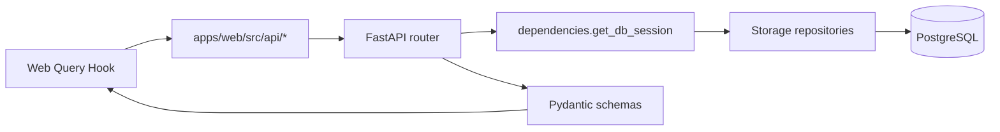
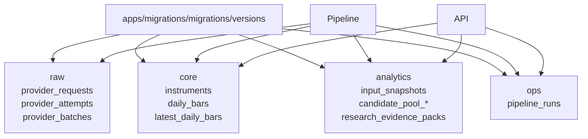

# invest-infra 代码图索引

> 基于 2026-08-04 源码快照整理。本文是“从哪里进、经过哪些模块、数据落到哪里”的代码导航，不替代架构决策和接口文档。

## 1. 一张图看全系统



运行边界：Web 只访问 API；API 不调用 Provider；Domain 不依赖框架、数据库或 SDK；Pipeline 才负责采集、计算和写入。

## 2. 运行入口索引

| 入口 | 位置 | 作用 |
|---|---|---|
| API 应用 | [`apps/api/src/invest_api/main.py:14`](../apps/api/src/invest_api/main.py#L14) | 创建 FastAPI 应用并注册路由 |
| API 路由聚合 | [`apps/api/src/invest_api/routes.py:14`](../apps/api/src/invest_api/routes.py#L14) | 健康检查和兼容的 instruments 接口 |
| Dagster Definitions | [`apps/pipeline/src/invest_pipeline/definitions.py:28`](../apps/pipeline/src/invest_pipeline/definitions.py#L28) | 注册 assets、job、schedule |
| 每日任务 | [`apps/pipeline/src/invest_pipeline/definitions.py:16`](../apps/pipeline/src/invest_pipeline/definitions.py#L16) | `personal_etf_daily_job` 的资产选择 |
| 手动每日 CLI | [`apps/pipeline/src/invest_pipeline/personal_daily_cli.py:931`](../apps/pipeline/src/invest_pipeline/personal_daily_cli.py#L931) | 受保护的个人 ETF 日任务入口 |
| 历史回填 CLI | [`apps/pipeline/src/invest_pipeline/historical_daily_bars_cli.py`](../apps/pipeline/src/invest_pipeline/historical_daily_bars_cli.py) | 只回填历史日线，不触发候选池和 AI 研究资产 |
| 数据源工厂 | [`apps/pipeline/src/invest_pipeline/provider_factory.py:66`](../apps/pipeline/src/invest_pipeline/provider_factory.py#L66) | 根据 `INVEST_PIPELINE_PROVIDER_KEY` 构造 Provider |
| 数据库迁移 | [`apps/migrations/migrations/versions/`](../apps/migrations/migrations/versions/) | Alembic 唯一 schema 变更入口 |
| Web 路由 | [`apps/web/src/router.tsx`](../apps/web/src/router.tsx) | 页面级导航和参数解析 |

## 3. 核心数据流

### 3.1 ETF 每日采集与候选池



资产实现集中在 [`apps/pipeline/src/invest_pipeline/assets.py`](../apps/pipeline/src/invest_pipeline/assets.py)：

- `seed_instruments:51`：fixture_dev 种子主数据。
- `etf_instruments_raw:141` → `etf_instruments:210`：先保存 Provider 三层证据，再标准化写入 `core.instruments`。
- `etf_daily_bars_raw:298` → `etf_daily_bars:390`：按个人 ETF universe 采集并写入 `core.daily_bars`。
- `etf_input_snapshot:499`：绑定行情输入和算法版本。
- `personal_candidate_pool:586`：读取 snapshot，计算并发布候选池。

对应的应用服务和持久化边界：

| 层 | 文件 | 责任 |
|---|---|---|
| 采集/标准化 | [`etf_instruments.py`](../apps/pipeline/src/invest_pipeline/etf_instruments.py) | 主数据 raw evidence、反序列化、upsert |
| 采集/标准化 | [`etf_daily_bars.py`](../apps/pipeline/src/invest_pipeline/etf_daily_bars.py) | 日线 raw evidence、日期窗口、upsert |
| 输入绑定 | [`input_snapshot.py`](../apps/pipeline/src/invest_pipeline/input_snapshot.py) | 生成可重放的输入快照 |
| 候选池用例 | [`candidate_pool_service.py`](../apps/pipeline/src/invest_pipeline/candidate_pool_service.py) | 加载策略、计算、状态推进、发布 |
| 纯算法 | [`packages/domain/src/invest_domain/candidate_pool/calculator.py`](../packages/domain/src/invest_domain/candidate_pool/calculator.py) | 不接触网络和数据库的筛选计算 |

### 3.2 Provider 选择与适配器



协议和边界：

- Provider 抽象：[`packages/domain/src/invest_domain/market_data/ports.py:61`](../packages/domain/src/invest_domain/market_data/ports.py#L61) 和 `:73`。
- 运行时构造：[`provider_factory.py:66`](../apps/pipeline/src/invest_pipeline/provider_factory.py#L66)。当前工厂运行分支是 `fixture_dev`、`cifangquant`、`akshare`；Provider catalog 的声明集合更大，不等于每个声明都已接入 ETF 运行时工厂。
- 能力/角色目录：[`provider_catalog.py:90`](../apps/pipeline/src/invest_pipeline/provider_catalog.py#L90)、`:143`。
- 数据集路由：[`provider_routing/datasets.py`](../apps/pipeline/src/invest_pipeline/provider_routing/datasets.py)、[`provider_routing/selection.py`](../apps/pipeline/src/invest_pipeline/provider_routing/selection.py)。
- AkShare 客户端：[`adapters/akshare/client.py:85`](../apps/pipeline/src/invest_pipeline/adapters/akshare/client.py#L85)。ETF 日线通过新浪优先、东方财富回退；该策略的适配器执行点在 [`adapters/akshare/adapter.py`](../apps/pipeline/src/invest_pipeline/adapters/akshare/adapter.py)。
- 适配器只返回 Domain/Provider 证据对象，不接收 SQLAlchemy Session，不直接写数据库。

### 3.3 API 查询流



| API surface | 路由入口 | Web 消费者 |
|---|---|---|
| ETF 主数据/日线 | [`routers/etf.py:30`](../apps/api/src/invest_api/routers/etf.py#L30)，`:33`，`:60` | `EtfDetailPage`、`api/instruments.ts`、`api/dailyBars.ts` |
| 候选池及跨期 diff | [`routers/candidate_pool.py:43`](../apps/api/src/invest_api/routers/candidate_pool.py#L43)，`:132`，`:250` | `CandidatePoolPage`、`DashboardPage` |
| Pipeline 运行历史 | [`routers/pipeline_runs.py:37`](../apps/api/src/invest_api/routers/pipeline_runs.py#L37)，`:62`，`:99` | `OperationsPage` |
| 数据新鲜度 | [`routers/data_freshness.py:63`](../apps/api/src/invest_api/routers/data_freshness.py#L63)，`:232` | `DashboardPage`、`OperationsPage` |
| 健康/兼容接口 | [`routes.py:17`](../apps/api/src/invest_api/routes.py#L17)，`:22` | 运维和旧接口调用方 |

API 通过 [`dependencies.py:14`](../apps/api/src/invest_api/dependencies.py#L14) 建立 Engine/Session；路由只负责参数校验、Repository 查询和 Pydantic 响应转换，不触发 Pipeline。

## 4. 模块地图

### Domain：业务契约和纯计算

| bounded context | 主要文件 | 关键对象 |
|---|---|---|
| instruments | [`packages/domain/src/invest_domain/instruments/`](../packages/domain/src/invest_domain/instruments/) | `Instrument`, `InstrumentId`, 交易所/状态值 |
| market_data | [`packages/domain/src/invest_domain/market_data/`](../packages/domain/src/invest_domain/market_data/) | `DailyBar`, `ProviderRequest`, `ProviderAttempt`, `ProviderBatch`, Provider ports |
| candidate_pool | [`packages/domain/src/invest_domain/candidate_pool/`](../packages/domain/src/invest_domain/candidate_pool/) | 状态机、规则结果、候选池结果、V1 adapter |
| input_snapshot | [`packages/domain/src/invest_domain/input_snapshot/`](../packages/domain/src/invest_domain/input_snapshot/) | 输入快照及绑定 hash |
| research | [`packages/domain/src/invest_domain/research/`](../packages/domain/src/invest_domain/research/) | Evidence Pack、factor observations、quality gate |
| shared | [`packages/domain/src/invest_domain/shared/`](../packages/domain/src/invest_domain/shared/) | canonical serialization、hash、值对象 |

Domain 的硬约束由 [`scripts/check_architecture.py`](../scripts/check_architecture.py) 检查：不能导入 FastAPI、SQLAlchemy、Dagster、Provider SDK 或计算框架。

### Storage：数据库映射和事务边界

- ORM 表模型：[`packages/storage/src/invest_storage/models.py:40`](../packages/storage/src/invest_storage/models.py#L40) 起，覆盖 `InstrumentRow`、Provider 三层证据、`DailyBarRow`、Pipeline Run、Candidate Pool、Input Snapshot、Research Evidence Pack。
- Repository：[`repositories.py:255`](../packages/storage/src/invest_storage/repositories.py#L255) 起，按业务对象拆分读写。
- Unit of Work：[`unit_of_work.py:223`](../packages/storage/src/invest_storage/unit_of_work.py#L223) 定义协议，`:260` 实现 `SqlAlchemyUnitOfWork`。
- 数据库连接：[`database.py`](../packages/storage/src/invest_storage/database.py)。

### API：只读查询边界

- 应用装配：[`main.py:14`](../apps/api/src/invest_api/main.py#L14)。
- 响应契约：[`apps/api/src/invest_api/schemas/`](../apps/api/src/invest_api/schemas/)。
- OpenAPI 导出：[`export_openapi.py`](../apps/api/src/invest_api/export_openapi.py)；生成结果为 [`apps/api/openapi.json`](../apps/api/openapi.json)。

### Web：按页面组织的查询工作台

| 页面 | 文件 | 主要查询 |
|---|---|---|
| Dashboard | [`pages/DashboardPage.tsx`](../apps/web/src/pages/DashboardPage.tsx) | 新鲜度、候选池摘要/diff、最新运行 |
| Candidate Pool | [`pages/CandidatePoolPage.tsx`](../apps/web/src/pages/CandidatePoolPage.tsx) | 最新候选、排除原因、跨期 diff |
| ETF Detail | [`pages/EtfDetailPage.tsx`](../apps/web/src/pages/EtfDetailPage.tsx) | 主数据、日线表、收盘价趋势 |
| Operations | [`pages/OperationsPage.tsx`](../apps/web/src/pages/OperationsPage.tsx) | 新鲜度、运行历史、只读重跑提示 |

统一 HTTP 客户端：[`apps/web/src/api/client.ts`](../apps/web/src/api/client.ts)；接口模块按 `candidatePool`、`dailyBars`、`dataFreshness`、`instruments`、`pipelineRuns` 拆分。

## 5. 数据库与迁移图



迁移链顺序以 [`apps/migrations/migrations/versions/`](../apps/migrations/migrations/versions/) 为准；禁止通过 ORM 自动建表或修改线上 schema。表模型与迁移必须同步维护。

## 6. 典型改动的阅读路径

### 新增 ETF 数据源

1. 先读 [`market_data/ports.py`](../packages/domain/src/invest_domain/market_data/ports.py) 的 Provider 契约。
2. 看 [`provider_catalog.py`](../apps/pipeline/src/invest_pipeline/provider_catalog.py) 的角色和 capability。
3. 在 [`apps/pipeline/src/invest_pipeline/adapters/`](../apps/pipeline/src/invest_pipeline/adapters/) 实现 client / mapper / adapter / config。
4. 接入 [`provider_factory.py`](../apps/pipeline/src/invest_pipeline/provider_factory.py)，再补 catalog、routing 和 adapter 测试。
5. 沿 `assets.py → etf_* service → storage repository → models/migration` 验证落库路径。

### 修改候选池规则

1. 读 Domain 状态机和结果契约：[`candidate_pool/models.py`](../packages/domain/src/invest_domain/candidate_pool/models.py)。
2. 读纯算法：[`candidate_pool/calculator.py`](../packages/domain/src/invest_domain/candidate_pool/calculator.py)。
3. 读用例编排：[`candidate_pool_service.py`](../apps/pipeline/src/invest_pipeline/candidate_pool_service.py)。
4. 检查 snapshot、Repository、API schema 和 Web 展示是否仍然保持同一字段语义。

### 修改 Web 展示

1. 先确认 API 路由和 Pydantic schema。
2. 再修改 `apps/web/src/api/` 查询封装和 `api/generated.ts` 契约。
3. 最后修改 page/features；Web 不得直连数据库、Dagster 或 Provider。

## 7. 快速验证

```bash
make arch-check
make test-domain
make test-pipeline
make test-api
cd apps/web && pnpm typecheck && pnpm build
```

架构边界的机器检查入口是 [`scripts/check_architecture.py`](../scripts/check_architecture.py)；完整 CI 测试编排见 [`Makefile`](../Makefile) 的 `test` target。

## 8. 必读文件清单

1. [`README.md`](../README.md)：项目目标、启动方式、系统边界。
2. [`docs/ARCHITECTURE.md`](ARCHITECTURE.md)：分层规则和 schema 所有权。
3. [`apps/pipeline/src/invest_pipeline/assets.py`](../apps/pipeline/src/invest_pipeline/assets.py)：端到端数据编排。
4. [`packages/domain/src/invest_domain/market_data/ports.py`](../packages/domain/src/invest_domain/market_data/ports.py)：Provider 契约。
5. [`apps/pipeline/src/invest_pipeline/provider_factory.py`](../apps/pipeline/src/invest_pipeline/provider_factory.py)：运行时 Provider 选择。
6. [`packages/storage/src/invest_storage/unit_of_work.py`](../packages/storage/src/invest_storage/unit_of_work.py)：事务和 Repository 装配。
7. [`apps/api/src/invest_api/routers/`](../apps/api/src/invest_api/routers/)：对外查询边界。
8. [`apps/web/src/pages/`](../apps/web/src/pages/)：用户可见工作台。
9. [`scripts/check_architecture.py`](../scripts/check_architecture.py)：禁止依赖和架构门禁。
