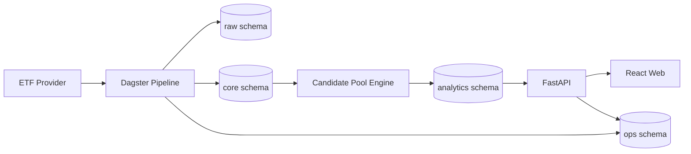
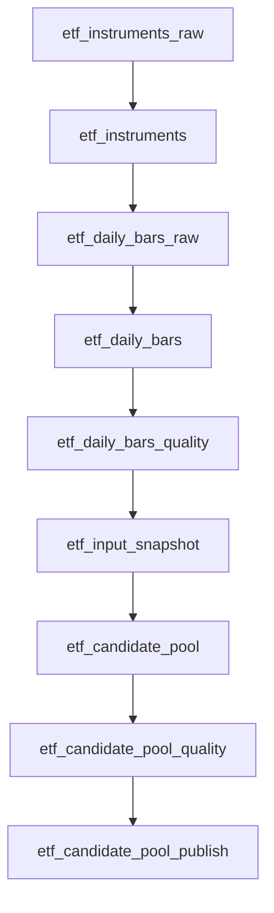

# invest-infra-v2：ETF Provider → 日行情 → 候选池生产级垂直链路实施方案

> 文档版本：v1.0
> 适用仓库：`invest-infra-v2`
> 实施原则：全新实现；旧系统仅作为业务语义、算法经验和验收样例参考，不迁移旧数据库，不保留旧接口兼容层。

---

## 1. 目标与范围

本阶段只完成一条可在生产环境稳定运行、可观测、可重跑、可解释的垂直链路：

```text
真实 ETF 数据源
    ↓
ETF 主数据同步
    ↓
ETF 日行情采集与标准化
    ↓
数据质量校验
    ↓
候选池计算
    ↓
结果持久化
    ↓
FastAPI 查询接口
    ↓
React 候选池页面
```

### 1.1 交付目标

完成后，系统应具备以下能力：

1. 从至少一个真实数据源同步 ETF 主数据和日行情。
2. 支持指定交易日采集，也支持日期区间回补。
3. 采集、标准化、校验、计算全过程具备独立运行记录。
4. 相同参数重复执行不会生成重复业务数据。
5. 候选池结果具有算法版本、参数版本和输入数据版本。
6. 能解释每只 ETF 为什么入选或被排除。
7. 数据源异常时能够重试、降级、告警和人工重跑。
8. API 和前端只读取已完成、已发布的候选池结果。
9. CI 能阻止架构越界、迁移缺失和关键测试失败。
10. 新开发者可以通过一套本地命令启动并验证完整链路。

### 1.2 本阶段明确不做

- 不迁移旧系统数据库。
- 不兼容旧 API。
- 不引入 Redis、Kafka、Celery、Kubernetes。
- 不实现完整 FQIR、新闻、资金流、财务和回测体系。
- 不做实时行情和分钟级行情。
- 不支持自动交易。
- 不做复杂用户权限；仅保留未来扩展边界。
- 不同时接入多个复杂数据源；第二数据源只作为降级或交叉校验能力。
- 不在报告模板中执行采集或候选池计算。

---

## 2. 关键架构决策

### 2.1 技术栈

| 层级 | 技术 | 说明 |
|---|---|---|
| 前端 | React + TypeScript + Vite | 展示数据新鲜度、流水线运行和候选池 |
| API | FastAPI + Pydantic | 查询接口和运维触发接口 |
| 数据库 | PostgreSQL | 当前唯一强制基础设施 |
| ORM/迁移 | SQLAlchemy 2 + Alembic | Schema、Repository 和数据库迁移 |
| 编排 | Dagster | 资产依赖、重跑、分区、可观测性 |
| HTTP | httpx | 数据源访问 |
| 重试 | tenacity | 网络级瞬态错误重试 |
| 日志 | structlog | 结构化日志 |
| 测试 | pytest + Testcontainers/临时 PostgreSQL | 单元、契约、集成和端到端测试 |
| 前端数据 | TanStack Query | 服务端状态、缓存和错误处理 |
| API Client | OpenAPI 生成 | 禁止手写重复 DTO |

### 2.2 架构形态

采用“模块化单体 + 独立运行单元”：



运行单元独立，但不拆微服务：

- `apps/api`：查询和运维 API。
- `apps/pipeline`：Dagster definitions、Provider Adapter、标准化和计算。
- `packages/domain`：纯领域对象、值对象、规则和端口接口。
- `packages/storage`：SQLAlchemy 模型、Repository 和 Unit of Work。
- `apps/web`：运维和投研页面。

### 2.3 强制边界

```text
domain       不得依赖 FastAPI、SQLAlchemy、Dagster、AkShare 或具体供应商 SDK
storage      只负责持久化，不实现候选池规则
pipeline     可以依赖 domain、storage 和数据源 adapter
api          可以依赖 domain、storage，不得依赖具体 Provider SDK
web          只能通过 API 访问数据
research     不得作为生产包依赖
```

---

## 3. 建议目录结构

```text
invest-infra-v2/
├── apps/
│   ├── api/
│   │   ├── src/invest_api/
│   │   │   ├── main.py
│   │   │   ├── config.py
│   │   │   ├── dependencies.py
│   │   │   ├── errors.py
│   │   │   └── routes/
│   │   │       ├── health.py
│   │   │       ├── instruments.py
│   │   │       ├── market_data.py
│   │   │       ├── candidate_pools.py
│   │   │       └── pipeline_runs.py
│   │   ├── tests/
│   │   ├── pyproject.toml
│   │   └── Dockerfile
│   │
│   ├── pipeline/
│   │   ├── src/invest_pipeline/
│   │   │   ├── definitions.py
│   │   │   ├── resources.py
│   │   │   ├── config.py
│   │   │   ├── assets/
│   │   │   │   ├── instruments.py
│   │   │   │   ├── daily_bars.py
│   │   │   │   ├── data_quality.py
│   │   │   │   └── candidate_pool.py
│   │   │   ├── adapters/
│   │   │   │   ├── provider_a/
│   │   │   │   │   ├── client.py
│   │   │   │   │   ├── mapper.py
│   │   │   │   │   └── provider.py
│   │   │   │   └── provider_b/
│   │   │   ├── services/
│   │   │   │   ├── ingestion_service.py
│   │   │   │   ├── normalization_service.py
│   │   │   │   └── publishing_service.py
│   │   │   └── jobs/
│   │   │       ├── daily_close.py
│   │   │       └── backfill.py
│   │   ├── tests/
│   │   ├── pyproject.toml
│   │   └── Dockerfile
│   │
│   └── web/
│       ├── src/
│       │   ├── api/generated/
│       │   ├── pages/
│       │   │   ├── CandidatePoolPage.tsx
│       │   │   ├── DataFreshnessPage.tsx
│       │   │   └── PipelineRunsPage.tsx
│       │   └── features/
│       ├── package.json
│       └── Dockerfile
│
├── packages/
│   ├── domain/
│   │   └── src/invest_domain/
│   │       ├── instruments/
│   │       ├── market_data/
│   │       ├── candidate_pool/
│   │       │   ├── models.py
│   │       │   ├── policy.py
│   │       │   ├── scoring.py
│   │       │   └── ports.py
│   │       └── shared/
│   │
│   └── storage/
│       ├── src/invest_storage/
│       │   ├── db.py
│       │   ├── models/
│       │   ├── repositories/
│       │   └── unit_of_work.py
│       ├── migrations/
│       └── pyproject.toml
│
├── contracts/
│   ├── provider-fixtures/
│   └── golden-cases/
├── docs/
│   ├── adr/
│   ├── runbooks/
│   └── implementation/
├── scripts/
│   ├── check_architecture.py
│   ├── generate_api_client.sh
│   └── verify_migrations.sh
├── compose.yaml
├── Makefile
└── .github/workflows/
```

---

## 4. 数据源 Provider 设计

### 4.1 数据源选择原则

生产系统不应把某个第三方 SDK 直接散落在业务代码中。应先确定“数据契约”，再实现 Adapter。

优先级建议：

1. **主数据源**：有明确授权、稳定 SLA、可追踪请求额度和错误码的数据源。
2. **备用数据源**：用于紧急补数或交叉校验，不作为无条件自动切换的黑盒。
3. **研究数据源**：聚合型开源库只允许在研究或低风险补数中使用。

上线前必须确认：

- ETF 数据使用授权和再分发范围。
- 日行情复权口径。
- 交易日和时区定义。
- 停牌、退市、上市首日和异常行情的返回规则。
- 历史数据回补限制。
- API 限频和请求并发限制。
- 数据源是否会修订历史数据。

### 4.2 领域端口

`packages/domain/src/invest_domain/market_data/ports.py`

```python
from datetime import date
from typing import Protocol, Sequence

from invest_domain.instruments.models import Instrument
from invest_domain.market_data.models import DailyBar, ProviderBatch


class EtfMarketDataProvider(Protocol):
    @property
    def provider_key(self) -> str:
        ...

    def fetch_instruments(self, as_of: date) -> ProviderBatch[Instrument]:
        ...

    def fetch_daily_bars(
        self,
        symbols: Sequence[str],
        start_date: date,
        end_date: date,
    ) -> ProviderBatch[DailyBar]:
        ...
```

`ProviderBatch` 必须携带：

```python
class ProviderBatch[T]:
    provider_key: str
    request_id: str | None
    requested_at: datetime
    received_at: datetime
    records: list[T]
    raw_payload_hash: str
    warnings: list[str]
```

### 4.3 Adapter 职责

Provider Adapter 只负责：

- 鉴权。
- HTTP 请求。
- 限流。
- 响应解析。
- 供应商字段映射。
- 供应商错误转换。
- 原始响应摘要或原始 payload 保存。
- 返回标准领域对象。

Provider Adapter 不负责：

- 候选池筛选。
- 数据库事务。
- 业务排名。
- 页面展示格式。
- 直接修改发布状态。

### 4.4 错误分类

定义统一异常类型：

```text
ProviderAuthenticationError    鉴权失败，不自动重试
ProviderRateLimitError         限流，按 Retry-After 重试
ProviderTimeoutError           超时，可指数退避重试
ProviderUnavailableError       服务不可用，可重试
ProviderBadResponseError       响应格式错误，保存证据并告警
ProviderDataContractError      数据字段违反契约，不自动吞掉
ProviderPermanentError         明确永久失败
```

重试策略：

| 错误 | 自动重试 | 建议 |
|---|---:|---|
| 超时/连接重置 | 是 | 指数退避 + 抖动，最多 3～5 次 |
| HTTP 429 | 是 | 遵守 `Retry-After` |
| HTTP 5xx | 是 | 有上限重试 |
| HTTP 401/403 | 否 | 立即告警 |
| 数据字段缺失 | 否 | 保存 payload 摘要，阻止发布 |
| 单个标的异常 | 视情况 | 隔离失败标的，批次标记 partial |

### 4.5 限流与批量

Provider Resource 应集中实现限流，不允许各 asset 自行 `sleep`：

```python
class ProviderRateLimiter:
    requests_per_second: float
    max_concurrency: int
    burst: int
```

建议：

- 按数据源配置最大并发和批量大小。
- 请求日志记录 provider、endpoint、request_id、耗时、返回条数。
- 不在日志中记录 token、Cookie 和完整敏感响应。
- 同一日回补任务使用小批量，避免一次失败丢失全部进度。

---

## 5. 数据模型设计

采用四个 PostgreSQL Schema：

```text
raw         原始批次和供应商证据
core        标准化主数据和行情
analytics   候选池运行及结果
ops         流水线运行、数据质量、发布状态
```

### 5.1 `raw.provider_batches`

记录每一次真实 Provider 请求或批次。

| 字段 | 类型 | 说明 |
|---|---|---|
| id | uuid | 主键 |
| provider_key | text | 数据源标识 |
| dataset_key | text | `etf_instruments` / `etf_daily_bars` |
| request_key | text | 幂等键 |
| request_params | jsonb | 脱敏请求参数 |
| provider_request_id | text | 供应商请求 ID |
| requested_at | timestamptz | 请求时间 |
| received_at | timestamptz | 接收时间 |
| status | text | succeeded/partial/failed |
| record_count | integer | 返回记录数 |
| raw_payload_uri | text nullable | 大 payload 的外部位置，第一阶段可为空 |
| raw_payload_json | jsonb nullable | 小 payload 或摘要 |
| payload_sha256 | text | 内容哈希 |
| error_code | text nullable | 统一错误码 |
| error_message | text nullable | 脱敏错误 |
| created_at | timestamptz | 创建时间 |

约束：

```text
UNIQUE(provider_key, dataset_key, request_key)
```

第一阶段不强制引入 MinIO。小型响应或必要审计证据存 JSONB；大 payload 只保存摘要和哈希。后续确认有容量需求再引入对象存储。

### 5.2 `core.instruments`

| 字段 | 类型 | 说明 |
|---|---|---|
| id | uuid | 内部稳定 ID |
| symbol | text | 标准代码 |
| exchange | text | 交易所 |
| name | text | 名称 |
| instrument_type | text | ETF |
| currency | text | CNY |
| list_date | date nullable | 上市日期 |
| delist_date | date nullable | 退市日期 |
| status | text | active/suspended/delisted/unknown |
| underlying_index | text nullable | 跟踪指数 |
| category | text nullable | 宽基/行业/主题/商品等 |
| provider_symbol_map | jsonb | 各数据源代码映射 |
| valid_from | date | 有效起始 |
| valid_to | date nullable | 有效结束 |
| source_provider | text | 当前来源 |
| source_updated_at | timestamptz | 源更新时间 |
| created_at | timestamptz | 创建时间 |
| updated_at | timestamptz | 更新时间 |

核心约束：

```text
UNIQUE(symbol, exchange, valid_from)
CHECK(valid_to IS NULL OR valid_to >= valid_from)
```

不要用 ETF 名称做唯一键。

### 5.3 `core.daily_bars`

| 字段 | 类型 | 说明 |
|---|---|---|
| instrument_id | uuid | 标的 |
| trade_date | date | 交易日 |
| open | numeric(20,6) | 开盘 |
| high | numeric(20,6) | 最高 |
| low | numeric(20,6) | 最低 |
| close | numeric(20,6) | 收盘 |
| prev_close | numeric(20,6) nullable | 昨收 |
| volume | numeric(28,4) nullable | 成交量 |
| amount | numeric(28,4) nullable | 成交额 |
| nav | numeric(20,6) nullable | 单位净值 |
| iopv | numeric(20,6) nullable | IOPV |
| premium_rate | numeric(16,8) nullable | 溢价率 |
| adjustment | text | none/qfq/hfq |
| trading_status | text | normal/suspended/missing |
| source_provider | text | 数据源 |
| source_batch_id | uuid | 原始批次 |
| observed_at | timestamptz | 数据观测时间 |
| revision | integer | 历史修订版本 |
| row_hash | text | 标准化后内容哈希 |
| created_at | timestamptz | 创建时间 |

主键建议：

```text
PRIMARY KEY(instrument_id, trade_date, adjustment, revision)
```

同时创建只读 View `core.latest_daily_bars`，只返回每个标的、日期和复权口径的最新修订。

保留 `revision` 的原因：

- 数据供应商可能修正历史行情。
- 能审计候选池使用了哪一版输入。
- 避免直接覆盖后无法解释历史结果。

### 5.4 `ops.pipeline_runs`

| 字段 | 类型 | 说明 |
|---|---|---|
| id | uuid | 内部运行 ID |
| dagster_run_id | text | Dagster Run ID |
| job_key | text | 作业名称 |
| partition_key | text nullable | 通常为交易日 |
| trigger_type | text | schedule/manual/backfill/retry |
| status | text | queued/running/succeeded/failed/partial |
| algorithm_version | text nullable | 算法版本 |
| config_snapshot | jsonb | 脱敏配置 |
| started_at | timestamptz | 开始时间 |
| finished_at | timestamptz nullable | 完成时间 |
| error_summary | text nullable | 错误摘要 |
| created_at | timestamptz | 创建时间 |

### 5.5 `ops.data_quality_results`

| 字段 | 类型 | 说明 |
|---|---|---|
| id | uuid | 主键 |
| pipeline_run_id | uuid | 关联运行 |
| dataset_key | text | 数据集 |
| partition_key | text | 交易日 |
| check_key | text | 校验项 |
| severity | text | info/warn/error |
| passed | boolean | 是否通过 |
| observed_value | jsonb | 观测结果 |
| expected_rule | jsonb | 规则 |
| affected_count | integer | 受影响记录数 |
| sample_records | jsonb | 脱敏样例 |
| created_at | timestamptz | 创建时间 |

### 5.6 `analytics.candidate_pool_runs`

| 字段 | 类型 | 说明 |
|---|---|---|
| id | uuid | 运行 ID |
| trade_date | date | 交易日 |
| algorithm_key | text | `etf_candidate_pool` |
| algorithm_version | text | 例如 `1.0.0` |
| parameter_set_key | text | 参数集名称 |
| parameter_hash | text | 规范化参数哈希 |
| input_snapshot_id | uuid | 输入快照 |
| input_row_count | integer | 输入标的数 |
| included_count | integer | 入选数 |
| status | text | calculated/validated/published/rejected |
| quality_summary | jsonb | 数据质量摘要 |
| started_at | timestamptz | 开始时间 |
| finished_at | timestamptz | 完成时间 |
| published_at | timestamptz nullable | 发布时间 |
| created_at | timestamptz | 创建时间 |

唯一约束：

```text
UNIQUE(
  trade_date,
  algorithm_key,
  algorithm_version,
  parameter_hash,
  input_snapshot_id
)
```

### 5.7 `analytics.candidate_pool_items`

| 字段 | 类型 | 说明 |
|---|---|---|
| candidate_pool_run_id | uuid | 运行 ID |
| instrument_id | uuid | ETF |
| included | boolean | 是否入选 |
| rank | integer nullable | 入选排名 |
| total_score | numeric(16,8) nullable | 综合分 |
| metrics | jsonb | 使用的标准化指标 |
| rule_results | jsonb | 每项规则结果 |
| exclusion_reasons | jsonb | 排除原因数组 |
| created_at | timestamptz | 创建时间 |

主键：

```text
PRIMARY KEY(candidate_pool_run_id, instrument_id)
```

候选池必须保存全部输入标的的判断结果，而不只保存入选项。这样才能解释“为什么没选中”。

### 5.8 `analytics.input_snapshots`

输入快照用于把一次候选池结果绑定到具体行情版本。

| 字段 | 类型 | 说明 |
|---|---|---|
| id | uuid | 主键 |
| dataset_key | text | `etf_daily_bars` |
| trade_date | date | 交易日 |
| query_definition | jsonb | 输入范围定义 |
| row_count | integer | 行数 |
| min_observed_at | timestamptz | 最早观测时间 |
| max_observed_at | timestamptz | 最晚观测时间 |
| content_hash | text | 排序后核心字段哈希 |
| created_at | timestamptz | 创建时间 |

---

## 6. 幂等、修订与发布模型

### 6.1 采集幂等

`request_key` 示例：

```text
sha256(
  provider_key
  + dataset_key
  + sorted(symbols)
  + start_date
  + end_date
  + provider_api_version
)
```

相同请求：

- 已成功且 payload 哈希未变化：复用原批次。
- 成功但 payload 发生变化：创建新原始批次并增加行情 revision。
- 失败：允许重试，但保留失败记录。

### 6.2 计算幂等

候选池唯一性由以下内容确定：

```text
交易日
+ 算法版本
+ 规范化参数哈希
+ 输入快照 ID
```

相同组合重复执行应返回已有运行，或以显式 `force_recompute=true` 创建新的技术运行，但不重复发布相同业务结果。

### 6.3 发布状态

候选池采用“两阶段”：

```text
calculated → validated → published
                    ↘ rejected
```

只有 `published` 才能被默认 API 和前端消费。

发布前门禁：

- 输入数据质量无 error。
- 覆盖率达到阈值。
- 交易日合法。
- 算法完成且结果非空。
- 入选数量在合理区间。
- 与上一交易日差异未超过异常阈值，或已人工批准。
- 所有结果均可生成解释字段。

---

## 7. Dagster 资产和作业

### 7.1 分区模型

日行情和候选池使用按交易日分区：

```text
2026-07-27
2026-07-28
2026-07-29
```

不要用执行时间代替交易日。交易日应经过交易日历判断。

### 7.2 资产图



建议资产：

#### `etf_instruments_raw`

- 调用真实 Provider。
- 写 `raw.provider_batches`。
- 输出批次 ID、条数、哈希和警告。

#### `etf_instruments`

- 供应商字段映射到标准 Instrument。
- upsert 主数据。
- 对名称变化、状态变化生成审计事件。
- 不删除历史标的。

#### `etf_daily_bars_raw`

- 按分区日期采集。
- 可以按 symbol batch 分组。
- 每批独立保存状态。
- 所有批次完成后汇总为分区结果。

#### `etf_daily_bars`

- 标准化数值、单位、复权和状态。
- 保存 revision。
- 拒绝明显非法记录。
- 建立输入覆盖统计。

#### `etf_daily_bars_quality`

执行质量规则，决定分区能否继续。

#### `etf_input_snapshot`

- 查询该交易日有效 ETF 和最新行情 revision。
- 生成稳定排序和内容哈希。
- 写 `analytics.input_snapshots`。

#### `etf_candidate_pool`

- 加载参数集。
- 执行规则、评分和排名。
- 写 run 和全部 items。
- 不直接发布。

#### `etf_candidate_pool_quality`

- 校验结果分布、入选数量和日间漂移。
- 生成质量报告。

#### `etf_candidate_pool_publish`

- 只有所有 error 级规则通过才发布。
- 事务内更新 run 状态和发布时间。
- 发布后触发通知或物化 API 缓存可以后续实现。

### 7.3 作业

#### `daily_close_job`

```text
instrument refresh（按需）
→ 当日日行情
→ 数据质量
→ 输入快照
→ 候选池
→ 候选池质量
→ 发布
```

#### `backfill_daily_bars_job`

参数：

```yaml
start_date: 2025-01-01
end_date: 2026-07-29
symbols: []
force_refresh: false
max_parallel_partitions: 3
```

#### `recompute_candidate_pool_job`

不重新请求数据源，只基于已有输入快照重算：

```yaml
trade_date: 2026-07-29
algorithm_version: 1.1.0
parameter_set_key: default
publish: false
```

---

## 8. 数据质量规则

质量规则需要分级，不能只有“成功/失败”。

### 8.1 主数据规则

| 检查 | 级别 | 示例 |
|---|---|---|
| symbol 非空且符合交易所规则 | error | 无效代码阻止入库 |
| exchange 有效 | error | 仅允许配置交易所 |
| 同日重复标的 | error | 同 symbol/exchange 重复 |
| 名称为空 | warn/error | 根据数据源能力决定 |
| 活跃 ETF 数量突降 | error | 比近 20 日中位数下降超过阈值 |
| 主数据总量突增 | warn | 需要审计数据源变化 |

### 8.2 日行情规则

| 检查 | 级别 | 规则 |
|---|---|---|
| OHLC 非负 | error | 任意价格 < 0 |
| 高低价关系 | error | `high >= max(open, close, low)` |
| 低价关系 | error | `low <= min(open, close, high)` |
| 成交量/额非负 | error | 小于 0 |
| 覆盖率 | error | 活跃且应交易 ETF 的行情覆盖率低于阈值 |
| 重复记录 | error | 同标的、日期、revision 重复 |
| 日期一致 | error | 返回日期不等于分区日期 |
| 异常涨跌幅 | warn | 超过市场规则或历史极端阈值 |
| 零成交 | warn | 非停牌但 volume=0 |
| 价格跳变 | warn | 与昨收偏差异常 |
| 数据新鲜度 | error | observed_at 超出容忍窗口 |

质量阈值必须配置化并版本化，不散落在 asset 中。

### 8.3 候选池质量规则

| 检查 | 级别 |
|---|---|
| 输入 ETF 数量不低于最低值 | error |
| 每个标的均有明确 included/excluded | error |
| 被排除标的至少有一个 exclusion reason | error |
| 入选标的具备排名和分数 | error |
| 排名连续且无重复 | error |
| 入选数量处于配置范围 | error/warn |
| 与上一个发布版本的 Jaccard 变化异常 | warn/error |
| 单一类别占比过高 | warn |
| 所有指标无 NaN/Infinity | error |
| 算法版本和参数哈希非空 | error |

---

## 9. 候选池算法第一版

第一版目标是验证架构，不追求复杂因子。应选择可解释、稳定、输入要求较少的规则。

### 9.1 输入

- 有效 ETF 主数据。
- 当前交易日日行情。
- 至少最近 20～60 个交易日行情，用于流动性和波动计算。
- 可选基础属性：上市日期、类别、跟踪指数。

### 9.2 建议硬性过滤

示例参数，实际值必须配置化：

```yaml
algorithm_key: etf_candidate_pool
algorithm_version: 1.0.0

eligibility:
  min_listing_days: 60
  require_current_day_bar: true
  exclude_suspended: true
  allowed_exchanges: ["SSE", "SZSE"]

liquidity:
  lookback_days: 20
  min_valid_days: 15
  min_median_amount_cny: 10000000

price_quality:
  max_missing_ratio: 0.10
  max_zero_volume_days: 3

risk:
  volatility_lookback_days: 20
  max_annualized_volatility: 0.80
  drawdown_lookback_days: 60
  max_drawdown: 0.40

selection:
  max_candidates: 100
```

以上金额只是初始示例，不应直接视为最终投资标准。

### 9.3 第一版评分

硬性过滤通过后，再进行简单评分：

```text
total_score =
    0.45 × liquidity_score
  + 0.30 × stability_score
  + 0.15 × data_quality_score
  + 0.10 × listing_maturity_score
```

所有分项归一化到 `[0, 100]`。

必须保存：

```json
{
  "metrics": {
    "median_amount_20d": 153240000,
    "annualized_volatility_20d": 0.236,
    "max_drawdown_60d": 0.118,
    "valid_days_20d": 20
  },
  "rule_results": {
    "listing_days": {"passed": true, "value": 612, "threshold": 60},
    "liquidity": {"passed": true, "value": 153240000, "threshold": 10000000}
  },
  "exclusion_reasons": []
}
```

### 9.4 纯函数接口

候选池核心必须是纯函数，方便黄金样例和性质测试：

```python
def build_candidate_pool(
    instruments: list[Instrument],
    histories: dict[InstrumentId, list[DailyBar]],
    policy: CandidatePoolPolicy,
    context: CalculationContext,
) -> CandidatePoolResult:
    ...
```

该函数不能：

- 查询数据库。
- 调用数据源。
- 读取环境变量。
- 写日志文件。
- 获取当前时间。
- 隐式加载全局配置。

时间、版本、参数和数据全部显式传入。

---

## 10. API 设计

所有接口以 `/v1` 开头。

### 10.1 查询候选池

```http
GET /v1/candidate-pools/latest
GET /v1/candidate-pools/{run_id}
GET /v1/candidate-pools/{run_id}/items
GET /v1/candidate-pools/{run_id}/items/{symbol}
```

`latest` 默认只返回：

```text
status = published
```

参数：

```text
trade_date
included
category
min_score
limit
cursor
```

### 10.2 数据新鲜度

```http
GET /v1/data-freshness
```

返回：

```json
{
  "datasets": [
    {
      "dataset_key": "etf_daily_bars",
      "latest_trade_date": "2026-07-29",
      "latest_observed_at": "2026-07-29T15:12:00+08:00",
      "status": "fresh",
      "coverage_ratio": 0.997
    }
  ]
}
```

### 10.3 流水线运行

```http
GET /v1/pipeline-runs
GET /v1/pipeline-runs/{run_id}
GET /v1/pipeline-runs/{run_id}/quality-results
```

### 10.4 运维触发接口

第一阶段可以通过 Dagster UI 手动触发。若必须提供 API：

```http
POST /v1/operations/daily-close-runs
POST /v1/operations/backfills
POST /v1/operations/candidate-pool-recomputations
```

要求：

- 明确鉴权。
- 记录操作者和请求参数。
- 默认 `publish=false`。
- 禁止通过 API 传入任意 Shell 命令或代码路径。
- 返回异步运行 ID，不长时间阻塞请求。

---

## 11. 前端页面

### 11.1 候选池页面

应展示：

- 交易日。
- 发布时间。
- 算法版本。
- 参数集。
- 输入数据快照。
- 数据质量摘要。
- 入选数量。
- ETF 排名、分数和关键指标。
- 规则详情和排除原因。
- 与上一交易日的新增/移除变化。

### 11.2 数据新鲜度页面

展示：

- 主数据最后同步时间。
- 最新行情交易日。
- 覆盖率。
- 缺失标的数量。
- Provider 状态。
- 最近失败批次。
- 数据质量 error/warn 数量。

### 11.3 流水线运行页面

展示：

- 运行状态。
- 分区日期。
- 触发方式。
- 每个 asset 状态。
- 重试次数。
- 失败摘要。
- 关联原始批次和候选池运行。

前端不得根据原始行情重新计算候选池分数。

---

## 12. 测试策略

### 12.1 单元测试

覆盖：

- 字段映射。
- 金额和价格单位转换。
- 交易所代码规范化。
- 候选池每项规则。
- 评分归一化。
- 排名稳定性。
- 参数哈希稳定性。
- 输入快照哈希稳定性。
- 异常值和缺失值行为。

目标不是追求总体覆盖率数字，而是核心领域规则接近完整分支覆盖。

### 12.2 Provider 契约测试

保存脱敏 Provider fixture：

```text
contracts/provider-fixtures/
├── instruments_success.json
├── instruments_empty.json
├── daily_bars_success.json
├── daily_bars_partial.json
├── rate_limit.json
└── malformed_response.json
```

契约测试验证：

- 响应变化会明确失败。
- 未知字段允许忽略或保存。
- 必需字段缺失会产生 `ProviderDataContractError`。
- 供应商错误码映射正确。
- 日志不泄漏凭据。

可以每天运行一次真实 Provider 烟雾测试，但不能让普通 PR CI 依赖外部数据源。

### 12.3 数据库集成测试

使用真实 PostgreSQL，不用 SQLite 模拟：

- Alembic 从空库升级到 head。
- Repository upsert 幂等。
- revision 正确增加。
- 唯一约束和外键有效。
- 发布事务原子性。
- 并发运行不会重复发布。
- 回滚后数据一致。

### 12.4 Dagster 集成测试

验证：

- 单分区完整执行。
- 某批 Provider 失败时运行状态正确。
- 重试后可恢复。
- 数据质量失败会阻止候选池或发布。
- 重算候选池不会重新请求 Provider。
- backfill 按分区独立重跑。

### 12.5 黄金样例测试

从旧系统或人工审核中建立固定输入：

```text
contracts/golden-cases/etf-candidate-pool/
├── case_001/
│   ├── instruments.json
│   ├── daily_bars.parquet
│   ├── policy.yaml
│   └── expected.json
```

黄金样例关注：

- 入选集合。
- 排除原因。
- 排名顺序。
- 关键分项。
- 结果解释。

### 12.6 端到端测试

至少一条 CI 端到端链路：

```text
fixture provider
→ PostgreSQL
→ Dagster asset materialize
→ published candidate pool
→ FastAPI
→ API response assertion
```

浏览器 E2E 可以放在后续门禁中。

---

## 13. 可观测性

### 13.1 结构化日志字段

每条关键日志至少包含：

```text
service
environment
pipeline_run_id
dagster_run_id
partition_key
asset_key
provider_key
provider_request_id
source_batch_id
candidate_pool_run_id
duration_ms
record_count
status
error_code
```

禁止仅输出：

```text
任务失败
获取数据异常
未知错误
```

### 13.2 指标

建议指标：

```text
provider_requests_total
provider_request_duration_seconds
provider_request_failures_total
provider_rate_limit_total
daily_bars_records_ingested_total
daily_bars_coverage_ratio
data_quality_failures_total
pipeline_run_duration_seconds
pipeline_run_failures_total
candidate_pool_included_count
candidate_pool_turnover_ratio
candidate_pool_publish_lag_seconds
```

### 13.3 告警

P0：

- 鉴权失败。
- 当日行情无法发布。
- 覆盖率低于 error 阈值。
- 候选池未在预期时间前发布。
- 数据库迁移或连接失败。

P1：

- Provider 限流持续。
- 数据出现异常修订。
- 候选池日间变化过大。
- 部分标的连续缺失。

P2：

- 单次请求重试。
- 非关键字段缺失。
- 入选数量接近边界。

### 13.4 Runbook

至少建立：

```text
docs/runbooks/provider-auth-failure.md
docs/runbooks/daily-bars-missing.md
docs/runbooks/reprocess-partition.md
docs/runbooks/reject-candidate-pool.md
docs/runbooks/database-restore.md
```

每份 Runbook 应包含：

- 症状。
- 判断命令或页面。
- 安全恢复步骤。
- 是否允许重新采集。
- 是否会生成新 revision。
- 如何验证恢复。
- 如何回滚发布。

---

## 14. 配置与密钥

### 14.1 配置层次

```text
代码默认值
→ 环境配置
→ 部署平台 Secret
→ 运行参数
```

配置分为：

- 静态配置：数据库地址、Provider endpoint。
- 密钥：token、secret、Cookie。
- 业务参数：候选池阈值。
- 运行参数：日期范围、是否发布。

业务参数不应只存在环境变量中，应保存版本化 YAML/JSON，并计算参数哈希。

### 14.2 安全要求

- 不提交 `.env` 和真实 fixture。
- 日志自动脱敏 Authorization、Cookie、token。
- Provider 凭据只注入 pipeline。
- API 不需要 Provider 凭据。
- 数据库账户按职责拆分：
  - `pipeline_writer`
  - `api_reader`
  - `migration_owner`
- 默认不对公网暴露 PostgreSQL。
- 运维触发接口与查询接口权限分离。

---

## 15. CI/CD 门禁

PR 必须通过：

```text
Python format/lint
Python type check
Unit tests
Provider fixture contract tests
Architecture dependency check
Alembic single-head check
Empty database migration test
PostgreSQL integration tests
API OpenAPI generation
Frontend type check
Frontend unit tests
Container build
Dependency vulnerability scan
Secret scan
```

主分支发布前：

```text
生成镜像并记录不可变 digest
部署迁移 Job
运行数据库迁移
部署 pipeline
部署 API
部署 web
执行 fixture E2E
执行只读生产 smoke test
```

迁移规范：

- 禁止应用启动时自动建表。
- 每个数据库变化必须有 Alembic migration。
- destructive migration 分两次发布。
- 迁移脚本需要前向验证和回滚说明。
- 发布时只允许单个 migration owner 执行。

---

## 16. 交付里程碑

### M0：项目门禁和 ADR

交付：

- 架构依赖检查。
- ADR：单 PostgreSQL 基础设施。
- ADR：Provider Adapter 边界。
- ADR：日行情 revision 模型。
- ADR：候选池 calculated/validated/published 状态机。
- CI 基础门禁。

验收：

- 空仓库可运行测试。
- `domain` 越界 import 会导致 CI 失败。
- Alembic 只能存在一个 head。

### M1：数据库和领域模型

交付：

- 四个 Schema。
- Instrument、DailyBar、ProviderBatch、CandidatePool 模型。
- Repository 和 Unit of Work。
- 第一版 Alembic migration。
- PostgreSQL 集成测试。

验收：

- 空数据库可以升级到 head。
- 主数据 upsert 幂等。
- 行情修订可追踪。
- 候选池结果可完整保存。

### M2：真实 ETF Provider

交付：

- 真实 Provider client 和 adapter。
- 鉴权、限流、重试和错误分类。
- 主数据和日行情 fixture 契约测试。
- 原始批次持久化。
- Provider 烟雾测试脚本。

验收：

- 能同步真实 ETF 主数据。
- 能采集指定交易日行情。
- 失败请求有明确错误码和证据。
- 日志无敏感信息。
- 重复请求不产生重复批次。

### M3：Dagster 行情链路

交付：

- ETF 主数据 asset。
- 日行情分区 asset。
- 标准化 asset。
- 数据质量 asset。
- 日常收盘 job 和 backfill job。
- 运行记录和指标。

验收：

- 指定交易日可以独立运行。
- 日期区间可以回补。
- 单个分区失败不污染其他分区。
- 质量 error 会阻止后续发布。
- 重跑保持幂等。

### M4：候选池引擎

交付：

- 参数化 Policy。
- 纯函数规则和评分。
- 输入快照。
- CandidatePool run/items。
- 黄金样例。
- 质量和发布 asset。

验收：

- 每个标的都有完整判断。
- 入选与排除原因可解释。
- 相同输入、版本和参数得到相同结果。
- 算法升级不会覆盖旧结果。
- 发布门禁有效。

### M5：API 和前端

交付：

- Candidate Pool API。
- Data Freshness API。
- Pipeline Run API。
- OpenAPI TypeScript Client。
- 候选池、数据新鲜度和运行页面。

验收：

- 默认只显示 published 结果。
- 可以查看某只 ETF 的全部规则结果。
- 可以从候选池追踪到输入快照和 Provider 批次。
- 前端不包含业务计算。

### M6：生产准备

交付：

- 镜像。
- 部署清单。
- 数据库账户分离。
- 告警和 Dashboard。
- Runbook。
- 生产 smoke test。
- 回滚演练记录。

验收：

- 新环境可从零部署。
- Provider 凭据轮换不需要重新构建镜像。
- 任意交易日可以安全重跑。
- 候选池可以拒绝发布或回退到上一已发布版本。
- 核心故障有明确恢复步骤。

---

## 17. 建议 GitHub Issue 拆分

### Epic A：Foundation

1. 建立四 Schema 和 migration。
2. 实现数据库会话和 Unit of Work。
3. 建立领域包依赖门禁。
4. 建立 pipeline run 状态模型。
5. 配置 CI PostgreSQL 集成环境。

### Epic B：Provider

6. 定义 ETF Provider Port。
7. 实现主数据 Provider Adapter。
8. 实现日行情 Provider Adapter。
9. 实现 Provider 错误分类。
10. 实现限流和重试。
11. 建立 Provider fixture 契约测试。
12. 保存 raw provider batch。

### Epic C：Market Data

13. 实现 Instrument upsert。
14. 实现 DailyBar 标准化。
15. 实现 DailyBar revision。
16. 实现行情数据质量规则。
17. 实现交易日分区。
18. 实现 backfill job。
19. 实现 input snapshot。

### Epic D：Candidate Pool

20. 定义 CandidatePoolPolicy。
21. 实现资格过滤规则。
22. 实现流动性指标。
23. 实现风险指标。
24. 实现评分和排名。
25. 保存全部候选判断。
26. 实现黄金样例。
27. 实现候选池质量规则。
28. 实现发布状态机。

### Epic E：Serving

29. 实现候选池查询 API。
30. 实现数据新鲜度 API。
31. 实现流水线运行 API。
32. 生成 TypeScript Client。
33. 实现候选池页面。
34. 实现数据质量页面。
35. 实现运行详情页面。

### Epic F：Operations

36. 结构化日志。
37. 指标和 Dashboard。
38. P0/P1 告警。
39. Provider 凭据轮换 Runbook。
40. 分区重跑 Runbook。
41. 容器构建和生产部署。
42. 生产 smoke test 和回滚演练。

---

## 18. Definition of Done

整条垂直链路只有满足以下条件才算完成：

### 功能

- [ ] 真实数据源能够同步 ETF 主数据。
- [ ] 能够采集和回补 ETF 日行情。
- [ ] 能生成、校验和发布候选池。
- [ ] API 和前端能查询结果及解释。
- [ ] 可以按交易日重跑。

### 数据

- [ ] 原始批次可追踪。
- [ ] 日行情修订可追踪。
- [ ] 候选池绑定输入快照。
- [ ] 算法版本和参数哈希完整。
- [ ] 所有入选和排除均可解释。

### 可靠性

- [ ] 网络错误可有限重试。
- [ ] 鉴权和契约错误不会被吞掉。
- [ ] 数据质量失败会阻止发布。
- [ ] 相同运行保持幂等。
- [ ] 并发运行不会重复发布。

### 工程

- [ ] 空库迁移测试通过。
- [ ] 单元、契约、集成、黄金样例和 E2E 测试通过。
- [ ] OpenAPI Client 自动生成。
- [ ] 架构边界检查通过。
- [ ] 所有镜像可以构建。
- [ ] 没有密钥进入仓库和日志。

### 运维

- [ ] Dashboard 可查看新鲜度和失败。
- [ ] P0/P1 告警可触发。
- [ ] 存在重跑、拒绝发布和凭据故障 Runbook。
- [ ] 完成一次全新环境部署。
- [ ] 完成一次失败恢复或回滚演练。

---

## 19. 推荐实施顺序

严格按以下顺序推进：

```text
数据库运行模型
→ Provider 契约
→ 真实主数据
→ 真实日行情
→ 数据质量
→ 输入快照
→ 纯函数候选池
→ 发布门禁
→ API
→ 前端
→ 告警和 Runbook
```

不要优先制作复杂页面，也不要在真实日行情稳定前迁移旧系统复杂因子。

第一个可演示版本可以只包含：

```text
1 个真实 Provider
+ 1 个交易日
+ 100～300 只 ETF
+ 4～6 条可解释规则
+ 1 个候选池页面
```

第一个可生产版本必须补齐：

```text
全量活跃 ETF
+ 历史回补
+ revision
+ 输入快照
+ 质量门禁
+ 发布状态
+ 告警
+ Runbook
```

---

## 20. 最终原则

1. **先把数据可信度做正确，再增加算法复杂度。**
2. **先保证可解释和可重跑，再追求实时。**
3. **Provider 是 Adapter，不是业务核心。**
4. **候选池算法必须是纯函数。**
5. **任何结果都必须能追溯到输入数据版本。**
6. **不发布质量不合格的数据。**
7. **不用新基础设施解决尚未发生的问题。**
8. **旧系统只提供业务知识和黄金样例，不提供新架构边界。**
