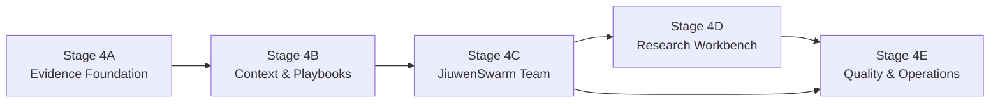
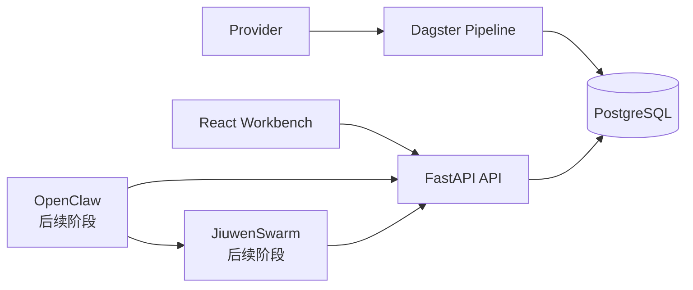
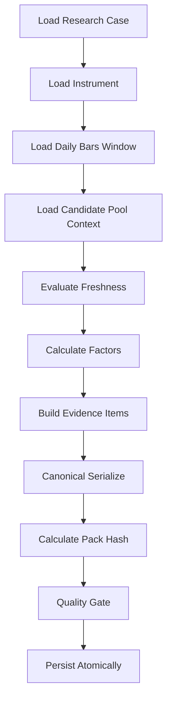

# invest-infra V2：AI 投资研判系统分阶段路线与第一阶段实施计划

> 文档版本：v1.0  
> 制定日期：2026-08-03  
> 适用仓库：`shivchen-dev/invest-infra`  
> 当前基线：`main`，以 2026-08-03 的 `e250051` 附近代码与文档状态为基线  
> 目标定位：**证据驱动的 AI 投资研判系统**  
> 第一阶段名称：**Stage 4A — Research Evidence Foundation**  
> 建议状态：Draft for Review  
> 建议落库路径：`docs/plan/invest-infra-v2-stage4a-ai-research-evidence-foundation-plan.md`

---

## 1. 执行摘要

`invest-infra V2` 已完成 ETF 主数据、日行情、Input Snapshot、Candidate Pool MVP、Pipeline Run、数据新鲜度、只读 API 和 Web 工作台等基础能力。下一阶段不应把系统建设重心转向重型回测、参数寻优或自动交易，而应明确升级为：

> 为 AI 投资研判团队提供可信数据、标准因子、策略剧本、可追溯证据和结构化研究上下文的基础设施。

系统中的确定性组件负责：

- 数据采集与标准化；
- 数据版本、时间和来源管理；
- 因子计算；
- 数据质量检查；
- Evidence Pack 构建；
- 研究任务和研判结果持久化；
- API、审计和运行治理。

JiuwenSwarm 负责：

- 由 Leader 拆解投资研判问题；
- 组织专业 Agent 分工；
- 基于策略剧本分析证据；
- 形成正方、反方、风险和综合判断；
- 保留 Agent 分歧和未解决问题。

GPT-5.6 负责后续独立验收，不参与同一轮研判团队讨论。

本计划建议后续工作分为 **5 个阶段**。第一阶段不直接建设完整 JiuwenSwarm 投资团队，而是先完成项目目标重基线，并交付一个可复现、可追踪、可供 Agent 消费的最小 Research Evidence Pack 垂直切片。

---

## 2. 建设原则

### 2.1 核心原则

1. **事实计算确定化**  
   数据清洗、因子值、时间窗口、内容哈希和数据质量状态必须由确定性代码产生。

2. **因子解释结构化**  
   因子是 AI 的观察变量，不直接等价于机械买卖信号。

3. **投资判断多 Agent 化**  
   观点形成、反方质询、风险识别和综合研判由 JiuwenSwarm 团队完成。

4. **证据引用强制化**  
   Agent 的关键事实和数字必须引用 Evidence ID，不能只引用提示词中的零散文本。

5. **研究过程可追溯**  
   任何研判必须能追溯到输入快照、数据来源、因子版本、策略剧本版本和完整运行记录。

6. **AI 只读访问数据**  
   JiuwenSwarm Agent 不直接连接 PostgreSQL，不直接执行任意 SQL，不绕过 API/Tool 层。

7. **结论与执行隔离**  
   AI 研判结果不是订单，不直接调用券商接口，不自动执行交易。

8. **轻量后验而非重型回测**  
   当前只做研判结果的后验跟踪和典型案例复盘，不建设参数优化、复杂撮合和重型回测平台。

### 2.2 保留的 V2 架构原则

继续遵守现有 V2 边界：

- `packages/domain` 保持纯领域模型和端口；
- `packages/storage` 负责 SQLAlchemy、Repository 和 Unit of Work；
- `apps/pipeline` 负责数据装载、确定性计算和持久化；
- `apps/api` 负责轻量只读查询和应用用例；
- `apps/web` 只通过 OpenAPI API 读取；
- PostgreSQL 仍是当前唯一持久化基础设施；
- 数据源 SDK 只能存在于 Provider Adapter；
- 所有数据库变化只通过 Alembic；
- 不提前引入 Redis、Kafka、Celery、Kubernetes 或第二套后端。

### 2.3 继承旧方案中仍有效的规则

旧分层方案中的 **ETF 动态选择原则** 继续有效：

- 下游不维护固定 ETF 名单；
- Research Case 默认从已发布 Candidate Pool 或明确的用户选择创建；
- Candidate Pool 缺失时不静默回退到硬编码 ETF；
- 数据缺失时 fail closed 或返回明确的 partial/missing 状态。

---

## 3. 推荐的五阶段路线

## 3.1 阶段总览

| 阶段 | 名称 | 核心目标 | 主要交付 |
|---|---|---|---|
| Stage 4A | Research Evidence Foundation | 统一系统目标，建立 Research Case、Evidence Pack 和最小因子快照 | 文档重基线、ADR、领域模型、迁移、Evidence Builder、只读 API |
| Stage 4B | Research Context & Playbooks | 丰富 ETF、市场、行业、事件上下文，定义 AI 研判剧本 | ETF Research Profile、因子集扩展、市场状态、Playbook Schema、研究工具 |
| Stage 4C | JiuwenSwarm Investment Team | 通过 E2A 调度多 Agent 投资研判团队 | jiuwenswarm-e2a Skill、Agent Team、Swarm Workflow、恢复/重试、GPT-5.6 验收 |
| Stage 4D | Research Workbench | 提供研判任务、证据、分歧和报告的可视化工作台 | Research Case 页面、Agent 过程、证据查看、报告、人工介入 |
| Stage 4E | Research Quality & Operations | 建立研判质量、后验跟踪和持续运营闭环 | 5/10/20 日跟踪、假设复盘、置信度校准、Agent 质量统计、通知和日报 |

### 3.2 阶段依赖



### 3.3 为什么不先开发 JiuwenSwarm 团队

如果没有稳定 Evidence Pack 和 Tool Contract，Agent 会出现以下问题：

- 各 Agent 自己选择数据口径；
- 相同数字来自不同日期或 revision；
- Agent 自行拼接 SQL；
- 研判报告中的数字无法追溯；
- 因子名称相同但公式不同；
- 重试后输入发生漂移；
- 无法判断结论变化来自数据变化还是模型变化。

因此第一阶段必须先把 AI 的“研究材料”做成正式系统资产。

---

# 第一阶段：Stage 4A — Research Evidence Foundation

## 4. 第一阶段目标

第一阶段交付一个完整但严格收敛的垂直切片：

```text
指定 ETF / 已发布 Candidate Pool
        ↓
创建 Research Case
        ↓
读取 Instrument + Daily Bars + Candidate Context
        ↓
计算最小 Factor Snapshot
        ↓
构建不可变 Research Evidence Pack
        ↓
写入 PostgreSQL
        ↓
通过只读 API 查询
        ↓
生成可供 JiuwenSwarm 后续消费的标准 JSON
```

### 4.1 阶段成功标准

完成后，系统应能够：

1. 为一个 ETF 和一个 `as_of_date` 创建 Research Case。
2. 从现有标准化数据中生成 Evidence Pack。
3. 计算第一批确定性日频因子。
4. 对缺失、陈旧、修订和不完整数据进行显式标记。
5. 为每个 Evidence Item 分配稳定 Evidence ID。
6. 对整个 Evidence Pack 计算 canonical content hash。
7. 相同输入得到相同 hash 和相同因子结果。
8. 行情 revision 或输入快照变化后生成新的 Evidence Pack。
9. 通过 FastAPI 查询 Research Case、Evidence Pack 和 Factor Observations。
10. 项目主文档、架构文档和 OpenWiki 全部对齐“AI 投资研判系统”目标。
11. 不引入 JiuwenSwarm 运行时依赖。
12. 不引入重型回测或参数优化能力。

---

## 5. 第一阶段范围

### 5.1 包含

- 产品目标与架构文档重基线；
- 新增 AI 投资研判 ADR；
- Research Case 领域模型；
- Research Evidence Pack 领域模型；
- Evidence Item 和 Evidence ID；
- Factor Observation 最小模型；
- 第一批确定性因子；
- Evidence Pack Builder；
- PostgreSQL 迁移和 Repository；
- Pipeline CLI/Asset；
- 只读 Research API；
- OpenAPI 生成契约；
- Golden Case 和 PostgreSQL E2E；
- 数据质量和内容哈希测试；
- 一个 Fixture ETF 的完整演示样例；
- 真实 Provider 数据验收作为发布门禁。

### 5.2 不包含

- 完整 JiuwenSwarm Agent Team；
- E2A Gateway 接入；
- LLM Prompt 和 Agent Persona；
- 新闻、政策和互联网检索；
- 财务报表、宏观和行业数据库；
- 分钟级行情；
- 自然语言报告生成；
- 前端 Research Case 创建页面；
- 策略代码动态执行；
- 参数寻优；
- 回测引擎；
- 自动交易；
- 券商接口；
- 用户权限和多租户；
- Redis、消息队列和向量数据库。

### 5.3 真实数据验收门禁

Stage 4A 可以使用 `fixture_dev` 完成开发，但不得仅凭 Fixture 宣布生产完成。

进入 Stage 4B 前至少满足：

- 真实 CifangQuant 主数据和日行情完成一次脱敏验收；
- 同交易日重跑无错误 revision 增长；
- 数据新鲜度 API 与实际一致；
- Stage 2 影子运行已有可核验记录；
- Evidence Pack 在真实数据下能够构建；
- Provider Key、请求头和原始敏感响应未进入 Evidence Pack。

---

## 6. 目标架构

### 6.1 系统上下文



Stage 4A 只建设图中的数据和 API 边界。OpenClaw、JiuwenSwarm 连线在本阶段仅作为目标架构记录，不实现运行时接入。

### 6.2 确定性边界与概率性边界

```text
确定性系统边界
├─ Provider 数据
├─ 标准化数据
├─ 数据质量
├─ 因子公式
├─ Evidence ID
├─ Content Hash
├─ Research Case 状态
└─ API Contract

概率性 AI 边界（Stage 4C）
├─ 观点解释
├─ 多角色研判
├─ 反方质询
├─ 风险排序
├─ 置信度判断
└─ 最终研究结论
```

**禁止把 AI 生成的判断写回确定性 Evidence Item。**

---

## 7. 文档重基线工作包

文档对齐不是收尾任务，而是第一阶段的第一个提交。目标是防止后续 Agent 继续按“量化回测平台”或“普通 ETF Dashboard”理解项目。

## 7.1 新增文档

### A. `docs/product/AI-INVESTMENT-RESEARCH-SYSTEM.md`

作为产品目标单一真源，至少包含：

- 系统使命；
- 目标用户；
- 核心用例；
- 非目标；
- 数据层、因子层、策略剧本、AI 团队的职责；
- 确定性与概率性边界；
- Research Case 生命周期；
- Evidence-first 原则；
- 不自动交易声明；
- 当前五阶段路线。

### B. `docs/adr/0012-evidence-driven-ai-investment-research-system.md`

建议状态：`Accepted`

ADR 需要明确：

- 决策：系统定位为 Evidence-Driven AI Investment Research System；
- 原因：AI 研判需要可信、版本化、可追踪的研究材料；
- 选择：JiuwenSwarm 负责多 Agent 协作，invest-infra 负责证据和数据工具；
- 放弃：当前不建设重型回测和参数优化；
- 约束：Agent 不直连数据库；
- 约束：关键事实必须引用 Evidence ID；
- 后果：增加 Research bounded context 和 API；
- 后果：文档与后续 PR 必须按该目标验收。

### C. `docs/domain/research-evidence-contract.md`

定义：

- Research Case；
- Evidence Pack；
- Evidence Item；
- Factor Observation；
- Evidence ID；
- 内容哈希；
- freshness/quality 状态；
- Agent 引用约定。

### D. `docs/validation/stage4a-research-evidence-acceptance.md`

提供可填写的验收模板：

- 基线提交；
- Instrument；
- as_of_date；
- 输入快照；
- 数据条数；
- 因子数量；
- Evidence Item 数量；
- hash；
- 重跑结果；
- revision 变化结果；
- API 返回；
- 敏感信息检查；
- 最终结论。

## 7.2 修改现有文档

| 文件 | 当前问题 | Stage 4A 修改目标 |
|---|---|---|
| `README.md` | 仍以 greenfield starter 和数据工作台为主要描述 | 标题和执行摘要改为 AI 投资研判基础设施；保留当前能力说明；新增目标架构和五阶段路线 |
| `docs/ARCHITECTURE.md` | `analytics` 仍描述为因子、信号、候选池和回测结果；没有 AI 边界 | 增加 Research Evidence Layer、AI Tool Boundary、Evidence Traceability 规则；弱化回测目标 |
| `docs/implementation/M0-DECISIONS.md` | 早期决策未体现 AI 研判目标 | 新增目标定位、Agent 数据访问边界、Evidence ID 和非目标 |
| `docs/implementation/M0-CODING-BRIEF.md` | 后续编码任务可能继续偏向候选池或 Web | 增加 Research Case/Evidence Pack 优先级及验收要求 |
| `openwiki/quickstart.md` | 当前核心路线是数据、Candidate Pool、Web | 增加 AI 研判目标、Research Evidence 导航和阶段路线 |
| `openwiki/architecture/overview.md` | 没有外部 AI 编排层 | 增加 OpenClaw/JiuwenSwarm 目标拓扑和只读边界 |
| `openwiki/domain/overview.md` | 缺少 Research bounded context | 增加 Research Case、Evidence Pack、Factor Observation |
| `openwiki/storage/overview.md` | 只描述现有九类 Repository | 增加 Research Repository、表所有权和 hash 约束 |
| `openwiki/pipeline/overview.md` | 主要描述数据采集和 Candidate Pool | 增加 Evidence Pack Builder 和 Stage 4A Pipeline |
| `openwiki/api/overview.md` | 没有 Research API | 增加只读 Research Case/Evidence/Factor Contract |
| `openwiki/testing-and-ops/overview.md` | 没有 Evidence 完整性和文档一致性门禁 | 增加 golden hash、revision 测试、敏感信息扫描和 docs alignment gate |

## 7.3 修改 `README.md` 的目标文案

建议首段调整为：

> `invest-infra V2` 是一个面向个人和小型研究团队的证据驱动 AI 投资研判基础设施。系统负责采集和标准化金融数据、计算可解释因子、构建不可变 Research Evidence Pack，并通过受控 API 向 OpenClaw/JiuwenSwarm 投资研判团队提供研究材料。系统当前不以重型回测、参数寻优或自动交易为建设重点。

### 设计目标建议调整为

1. 为 AI 研判提供可信、版本化、可追踪的研究证据；
2. 确定性数据计算与概率性 AI 判断严格分离；
3. 所有关键数据带来源、数据时间、质量状态和 Evidence ID；
4. 因子用于描述市场状态，不直接作为自动交易指令；
5. JiuwenSwarm Agent 只通过受控 API/Tool 获取数据；
6. 研判结果保留策略版本、证据引用、分歧、风险和失效条件；
7. PostgreSQL 仍是当前唯一持久化基础设施；
8. 不提前建设重型回测和自动交易平台。

## 7.4 新增架构铁律

建议在 `docs/ARCHITECTURE.md` 增加：

### AI-01：证据引用铁律

关键事实、数字和因子判断必须能够映射到 Evidence ID。

### AI-02：AI 数据访问铁律

AI Agent 禁止直连 PostgreSQL、执行任意 SQL或读取 Provider 凭据，只能通过 Research API/Tool Contract。

### AI-03：确定性边界铁律

AI 不得修改历史行情、因子值、Evidence Item、内容哈希和数据质量状态。

### AI-04：判断与执行隔离铁律

AI 研判只能形成研究结论、观察项和风险提示，不能直接生成可执行订单。

### AI-05：缺失数据不补全铁律

数据缺失、过期或冲突时必须返回 `missing/stale/partial/conflict`，禁止由 LLM 猜测补全。

---

## 8. 领域模型设计

建议新增：

```text
packages/domain/src/invest_domain/research/
├── __init__.py
├── cases.py
├── evidence.py
├── factors.py
├── hashing.py
└── ports.py
```

## 8.1 ResearchCase

```python
@dataclass(frozen=True)
class ResearchCase:
    id: UUID
    case_key: str
    instrument_ids: tuple[UUID, ...]
    as_of_date: date
    question: str
    horizon: ResearchHorizon
    strategy_key: str | None
    strategy_version: str | None
    status: ResearchCaseStatus
    created_at: datetime
```

### ResearchHorizon

首期固定枚举：

- `short_term_1_20d`
- `medium_term_20_60d`
- `long_term_60_250d`
- `unspecified`

### ResearchCaseStatus

- `draft`
- `evidence_building`
- `evidence_ready`
- `evidence_partial`
- `failed`
- `archived`

Stage 4A 不增加 `analyzing/completed`，这些状态在 Stage 4C 加入。

## 8.2 ResearchEvidencePack

```python
@dataclass(frozen=True)
class ResearchEvidencePack:
    id: UUID
    research_case_id: UUID
    schema_version: str
    as_of_date: date
    input_snapshot_id: UUID | None
    candidate_pool_run_id: UUID | None
    factor_set_key: str
    factor_set_version: str
    freshness_status: EvidenceFreshness
    quality_status: EvidenceQuality
    content_hash: str
    item_count: int
    factor_count: int
    created_at: datetime
```

## 8.3 EvidenceItem

```python
@dataclass(frozen=True)
class EvidenceItem:
    evidence_id: str
    evidence_key: str
    evidence_type: EvidenceType
    instrument_id: UUID | None
    observed_at: datetime | date
    source_kind: EvidenceSourceKind
    source_ref: str
    payload: Mapping[str, JsonValue]
    quality_status: EvidenceQuality
    content_hash: str
```

### EvidenceType

首期支持：

- `instrument_profile`
- `price_snapshot`
- `return_observation`
- `trend_observation`
- `volatility_observation`
- `drawdown_observation`
- `liquidity_observation`
- `candidate_pool_context`
- `data_freshness`
- `data_quality`

### EvidenceSourceKind

- `core_table`
- `analytics_table`
- `ops_table`
- `derived_factor`
- `provider_batch`

## 8.4 FactorObservation

```python
@dataclass(frozen=True)
class FactorObservation:
    instrument_id: UUID
    factor_key: str
    factor_version: str
    as_of_date: date
    window: str
    value_numeric: Decimal | None
    value_text: str | None
    state: str | None
    unit: str | None
    quality_status: EvidenceQuality
    evidence_id: str
```

## 8.5 Evidence 状态

### EvidenceFreshness

- `fresh`
- `stale`
- `missing`
- `partial`
- `failed`

建议沿用现有 Data Freshness 语义，避免建立第二套相似词汇。

### EvidenceQuality

- `complete`
- `partial`
- `missing`
- `invalid`
- `conflict`

## 8.6 Evidence ID 规范

建议格式：

```text
evi:{pack_id}:{evidence_key}:{hash_prefix}
```

示例：

```text
evi:2ef4...:factor.return_20d:a81bf4737e91
```

要求：

- 对同一 Pack 内唯一；
- 不包含敏感值；
- 不使用自然语言标题作为唯一主键；
- Evidence ID 可安全出现在 Agent 报告、日志和 API；
- 完整内容校验仍使用 64 位 SHA-256。

## 8.7 Canonical Hash

哈希输入规则：

- JSON Key 按字典序；
- 日期使用 ISO 8601；
- 时间统一 UTC；
- `Decimal` 转为规范化字符串；
- UUID 转小写标准格式；
- 列表顺序必须由业务规则明确；
- 不加入 `created_at`、数据库自增 ID 等非业务值；
- 不使用 Python 默认 `repr()`；
- 不使用二进制浮点字符串作为业务哈希输入。

---

## 9. 第一批因子集

因子集：

```text
factor_set_key: etf_research_daily
factor_set_version: 1.0.0
```

第一阶段只使用现有标准化日行情可以稳定计算的因子。

| Factor Key | 窗口 | 含义 | 缺失处理 |
|---|---:|---|---|
| `return_20d` | 20 交易日 | 近 20 日收益 | 数据不足返回 missing |
| `return_60d` | 60 交易日 | 近 60 日收益 | 数据不足返回 missing |
| `return_120d` | 120 交易日 | 近 120 日收益 | 数据不足返回 missing |
| `distance_ma20` | 20 | 收盘价相对 MA20 偏离 | 数据不足返回 missing |
| `distance_ma60` | 60 | 收盘价相对 MA60 偏离 | 数据不足返回 missing |
| `realized_volatility_20d` | 20 | 日收益年化波动 | 非法价格返回 invalid |
| `max_drawdown_60d` | 60 | 近 60 日最大回撤 | 数据不足返回 missing |
| `avg_turnover_amount_20d` | 20 | 近 20 日平均成交额 | 无 amount 字段时 partial |
| `liquidity_change_20_vs_60` | 20/60 | 近期流动性相对中期变化 | 任一窗口不足返回 missing |
| `data_completeness_60d` | 60 | 有效行情覆盖比例 | 始终返回，用于质量判断 |

### 9.1 因子只描述，不自动下结论

因子输出可以提供 `state`，但状态必须是客观分类，例如：

```json
{
  "factor_key": "distance_ma60",
  "value_numeric": "0.0831",
  "state": "above",
  "quality_status": "complete"
}
```

禁止在因子层输出：

```json
{
  "action": "buy",
  "recommendation": "加仓"
}
```

### 9.2 可选 interpretation_hint

Stage 4A 可以在 Factor Definition 中记录固定、非个性化提示：

```text
价格高于 MA60 表示中期趋势偏强，但不得脱离波动、流动性和市场环境单独形成投资结论。
```

该提示属于静态元数据，不属于 AI 研判结果。

---

## 10. 数据库设计

继续使用 `analytics` Schema，暂不新增 `research` Schema，避免第一阶段扩大迁移和运维复杂度。

建议新增四张表。

## 10.1 `analytics.research_cases`

核心字段：

```text
id UUID PRIMARY KEY
case_key VARCHAR NOT NULL
as_of_date DATE NOT NULL
question TEXT NOT NULL
horizon VARCHAR NOT NULL
strategy_key VARCHAR NULL
strategy_version VARCHAR NULL
status VARCHAR NOT NULL
instrument_ids JSONB NOT NULL
created_at TIMESTAMPTZ NOT NULL
updated_at TIMESTAMPTZ NOT NULL
```

约束：

- `instrument_ids` 非空；
- Stage 4A 最多支持一个 instrument；
- `status` 受 CHECK 约束；
- `case_key` 唯一；
- `as_of_date` 不得晚于创建时指定的 market date，由应用层验证。

## 10.2 `analytics.research_evidence_packs`

```text
id UUID PRIMARY KEY
research_case_id UUID NOT NULL
schema_version VARCHAR NOT NULL
as_of_date DATE NOT NULL
input_snapshot_id UUID NULL
candidate_pool_run_id UUID NULL
factor_set_key VARCHAR NOT NULL
factor_set_version VARCHAR NOT NULL
freshness_status VARCHAR NOT NULL
quality_status VARCHAR NOT NULL
content_hash CHAR(64) NOT NULL
item_count INTEGER NOT NULL
factor_count INTEGER NOT NULL
created_at TIMESTAMPTZ NOT NULL
```

约束：

- FK → `research_cases`;
- FK → `input_snapshots`；
- FK → `candidate_pool_runs`；
- `length(content_hash) = 64`；
- `item_count >= 1`；
- `factor_count >= 0`；
- 唯一键建议：
  `(research_case_id, schema_version, content_hash)`。

## 10.3 `analytics.research_evidence_items`

```text
id UUID PRIMARY KEY
evidence_pack_id UUID NOT NULL
evidence_id VARCHAR NOT NULL
evidence_key VARCHAR NOT NULL
evidence_type VARCHAR NOT NULL
instrument_id UUID NULL
observed_at TIMESTAMPTZ NULL
observed_date DATE NULL
source_kind VARCHAR NOT NULL
source_ref VARCHAR NOT NULL
payload JSONB NOT NULL
quality_status VARCHAR NOT NULL
content_hash CHAR(64) NOT NULL
created_at TIMESTAMPTZ NOT NULL
```

约束：

- FK → `research_evidence_packs`;
- `(evidence_pack_id, evidence_key)` 唯一；
- `evidence_id` 全局唯一；
- `payload` 必须为 JSON object；
- `length(content_hash) = 64`。

## 10.4 `analytics.factor_observations`

```text
id UUID PRIMARY KEY
evidence_pack_id UUID NOT NULL
instrument_id UUID NOT NULL
factor_key VARCHAR NOT NULL
factor_version VARCHAR NOT NULL
as_of_date DATE NOT NULL
window VARCHAR NOT NULL
value_numeric NUMERIC NULL
value_text VARCHAR NULL
state VARCHAR NULL
unit VARCHAR NULL
quality_status VARCHAR NOT NULL
evidence_id VARCHAR NOT NULL
created_at TIMESTAMPTZ NOT NULL
```

约束：

- FK → `research_evidence_packs`;
- FK → `core.instruments`;
- FK → `research_evidence_items.evidence_id`;
- `(evidence_pack_id, instrument_id, factor_key, factor_version)` 唯一；
- `value_numeric` 和 `value_text` 至少一个非空，或者质量状态为 missing/invalid。

## 10.5 索引

建议：

- `research_cases (as_of_date DESC, status)`；
- `research_cases USING GIN (instrument_ids)`；
- `research_evidence_packs (research_case_id, created_at DESC)`；
- `research_evidence_packs (as_of_date DESC, quality_status)`；
- `research_evidence_items (evidence_pack_id, evidence_type)`；
- `factor_observations (instrument_id, as_of_date DESC)`；
- `factor_observations (factor_key, as_of_date DESC)`。

---

## 11. Storage 和 Unit of Work

新增：

```text
SqlAlchemyResearchCaseRepository
SqlAlchemyResearchEvidencePackRepository
SqlAlchemyResearchEvidenceItemRepository
SqlAlchemyFactorObservationRepository
```

Unit of Work 增加：

```python
research_cases
research_evidence_packs
research_evidence_items
factor_observations
```

### 11.1 Repository 职责

Repository 仅负责：

- add；
- get_by_id；
- get_by_case_key；
- get_latest_by_instrument；
- list_by_case；
- bulk_add_items；
- bulk_add_factor_observations。

禁止在 Repository 中：

- 计算收益率；
- 计算移动平均；
- 判断数据是否陈旧；
- 构建 Agent Prompt；
- 生成投资观点。

### 11.2 事务边界

一次 Evidence Pack 发布应在单一 Unit of Work 中完成：

```text
Research Case 状态 → evidence_building
        ↓
写 Evidence Pack Header
        ↓
写 Evidence Items
        ↓
写 Factor Observations
        ↓
更新数量和 hash
        ↓
Research Case 状态 → evidence_ready / evidence_partial
        ↓
COMMIT
```

任一步失败：

- 整体回滚；
- Research Case 由外层失败处理写入 `failed`；
- 不允许存在只有 Header、没有 Items 的已发布 Pack。

---

## 12. Evidence Pack Builder

建议目录：

```text
apps/pipeline/src/invest_pipeline/research/
├── __init__.py
├── case_service.py
├── evidence_builder.py
├── factor_calculators.py
├── factor_set.py
├── quality_gate.py
├── serializers.py
└── cli.py
```

## 12.1 输入

```python
BuildResearchEvidenceRequest(
    research_case_id=...,
    instrument_id=...,
    as_of_date=...,
    factor_set_key="etf_research_daily",
    factor_set_version="1.0.0",
)
```

## 12.2 数据来源

Stage 4A 仅从现有受控数据读取：

- `core.instruments`;
- `core.daily_bars` / Repository 的 latest revision 读取接口；
- `analytics.input_snapshots`;
- `analytics.candidate_pool_runs`;
- `analytics.candidate_pool_items`;
- `ops.pipeline_runs`;
- 现有 data freshness 查询逻辑；
- Provider Batch ID 引用，不复制敏感原始响应。

## 12.3 构建步骤



## 12.4 Quality Gate

### `evidence_ready`

必须满足：

- Instrument 存在；
- 最新有效价格存在；
- `as_of_date` 不晚于市场日期；
- 至少 60 个有效交易日；
- `data_completeness_60d >= 0.90`；
- Evidence Pack hash 可生成；
- 没有 invalid 级别的核心 Evidence；
- 所有 Factor Observation 都有 Evidence ID。

### `evidence_partial`

以下情况允许生成 partial Pack：

- 只有 20–59 个有效交易日；
- `amount` 缺失但 OHLCV 完整；
- Candidate Pool Context 缺失；
- 部分 120 日因子无法计算；
- 数据陈旧但仍可明确标记。

### `failed`

- Instrument 不存在；
- 无任何有效行情；
- 非法价格导致基础价格快照不可生成；
- 数据哈希失败；
- Evidence Item 冲突；
- 数据库事务失败。

---

## 13. Pipeline 和 CLI

### 13.1 CLI

建议新增：

```bash
make research-case-create \
  INSTRUMENT_ID=<uuid> \
  AS_OF=2026-08-03 \
  QUESTION='评估该 ETF 未来 20-60 个交易日的中期趋势与主要风险'

make research-evidence-build \
  RESEARCH_CASE_ID=<uuid>
```

也可以提供单命令：

```bash
make research-evidence-demo \
  INSTRUMENT_ID=<uuid> \
  AS_OF=2026-08-03
```

### 13.2 Dagster Asset

第一阶段建议提供手工触发 Asset：

```text
research_evidence_pack
```

依赖：

```text
etf_instruments
etf_daily_bars
etf_input_snapshot
personal_candidate_pool
```

但不立即加入自动每日 Schedule，避免未完成真实数据验收时自动产生大量 Pack。

### 13.3 幂等性

相同：

- Research Case；
- as_of_date；
- input snapshot；
- daily bar revisions；
- factor set version；
- schema version；

应得到相同 `content_hash`。

重复执行时：

- 如果已存在相同 hash Pack，返回现有 Pack；
- 不新增重复 Evidence Items；
- 不新增重复 Factor Observations；
- Pipeline Run 可以记录一次 skipped/idempotent 结果。

---

## 14. API 设计

Stage 4A 保持 API 只读。Research Case 创建和 Evidence Build 通过 Pipeline CLI 完成。

建议新增 Router：

```text
apps/api/src/invest_api/routers/research.py
```

## 14.1 接口

### 获取 Research Case

```http
GET /api/v1/research-cases/{case_id}
```

### 获取 Case 的 Evidence Pack

```http
GET /api/v1/research-cases/{case_id}/evidence-pack
```

### 获取 Evidence Items

```http
GET /api/v1/research-evidence-packs/{pack_id}/items
```

查询参数：

- `evidence_type`
- `instrument_id`
- `quality_status`

### 获取 Factor Observations

```http
GET /api/v1/research-evidence-packs/{pack_id}/factors
```

### 获取 Instrument 最新 Evidence Pack

```http
GET /api/v1/research-evidence-packs/latest?instrument_id=<uuid>
```

## 14.2 Agent 友好响应结构

Evidence Pack API 顶层建议保持稳定：

```json
{
  "research_case": {},
  "evidence_pack": {
    "schema_version": "1.0.0",
    "content_hash": "...",
    "freshness_status": "fresh",
    "quality_status": "complete",
    "as_of_date": "2026-08-03"
  },
  "items": [],
  "factors": [],
  "missing_fields": [],
  "warnings": []
}
```

### 14.3 API 禁止事项

- 不在请求过程中计算因子；
- 不访问 Provider 网络；
- 不生成自然语言投资结论；
- 不返回 Provider Key；
- 不返回原始敏感响应；
- 不提供任意 SQL 或字段选择接口；
- 不允许 Agent 提交任意 Python 代码。

---

## 15. JiuwenSwarm Tool Contract 预留

Stage 4A 不实现 JiuwenSwarm Tool，但应冻结后续 Tool 所需响应约定。

建议预留：

```text
get_research_case
get_research_evidence_pack
get_factor_snapshot
get_data_freshness
```

统一工具返回：

```json
{
  "status": "ok",
  "data": {},
  "evidence_ids": [],
  "as_of": "2026-08-03",
  "freshness": "fresh",
  "quality": "complete",
  "missing_fields": [],
  "warnings": [],
  "content_hash": "..."
}
```

错误必须结构化：

```json
{
  "status": "error",
  "error_code": "evidence_pack_not_ready",
  "message": "Research Evidence Pack is not ready.",
  "retryable": false
}
```

Stage 4C 的 E2A Skill 只能依赖该 Contract，不应重新定义数据返回格式。

---

## 16. Web 范围

Stage 4A 不建设完整 Research Workbench，只增加最小只读入口以验证数据。

建议增加：

```text
/research/:caseId
```

最小页面展示：

- Case ID；
- Instrument；
- as_of_date；
- Evidence Pack hash；
- freshness/quality；
- Evidence Item 数量；
- Factor 表；
- 缺失字段；
- warnings；
- Evidence ID。

不包括：

- Agent 对话；
- Swarm 状态；
- 报告编辑；
- 用户创建 Case；
- 人工审批；
- 投资建议按钮。

若需要进一步收敛，Web 页面可延后，Stage 4A 只交付 API 和 OpenAPI Contract。

---

## 17. 测试计划

## 17.1 Domain Unit Tests

覆盖：

- Research Case 状态转换；
- Evidence ID 稳定性；
- canonical JSON；
- SHA-256 稳定性；
- Decimal 规范化；
- 日期/UUID 规范化；
- 每个因子正常路径；
- 窗口不足；
- 非法价格；
- amount 缺失；
- 数据完整性；
- 无未来数据使用；
- 相同输入得到相同结果。

## 17.2 Storage Mock Tests

覆盖：

- Research Case add/get；
- Evidence Pack add/get；
- Evidence Items bulk insert；
- Factor Observations bulk insert；
- 唯一键冲突；
- 获取最新 Pack；
- Unit of Work rollback；
- 重复 hash 返回已有结果。

## 17.3 PostgreSQL Integration Tests

覆盖：

- 四张表创建；
- FK；
- CHECK；
- JSONB；
- NUMERIC 精度；
- 唯一约束；
- 同一事务完整发布；
- rollback 后无孤立 Header；
- migration downgrade/upgrade。

## 17.4 Pipeline Tests

覆盖：

- Fixture ETF 完整 Pack；
- 20–59 日 partial；
- 无行情 failed；
- Candidate Pool Context 缺失；
- amount 缺失；
- 同输入重复执行；
- 日行情 revision 后 hash 变化；
- 内容中不存在 Provider Key；
- Pack 数量与 Item/Factor 数量一致。

## 17.5 API Tests

覆盖：

- 获取 Case；
- 获取 Pack；
- 获取 Items；
- Filter；
- 获取 Factors；
- 最新 Pack；
- UUID 校验；
- 404；
- 数据库异常脱敏；
- OpenAPI 生成类型同步。

## 17.6 Golden Case

新增固定测试资料：

```text
tests/fixtures/research/
├── etf_research_case.json
├── daily_bars_120d.json
├── expected_factor_observations.json
├── expected_evidence_items.json
└── expected_pack_hash.txt
```

Golden Case 不用于优化参数，只用于验证：

- 公式；
- 数据口径；
- 序列化；
- hash；
- API Contract。

## 17.7 文档一致性 Gate

建议增加脚本：

```text
scripts/check_research_goal_alignment.py
```

检查：

- `README.md` 包含“AI 投资研判”；
- `docs/ARCHITECTURE.md` 包含 AI Tool Boundary；
- ADR-0012 存在且为 Accepted；
- 不再把“重型回测平台”表述为当前目标；
- OpenWiki Quickstart 链接 Research Evidence 文档；
- Research API 文档存在；
- 新表在 migrations/storage/OpenWiki 中均有记录。

该 Gate 不是语义理解器，只检查关键文件和必要标识，避免文档再次漂移。

---

## 18. 建议的 PR 拆分

第一阶段建议拆为 5 个独立 PR，每个 PR 均可独立验收和回滚。

## PR-A：目标重基线与 ADR

建议分支：

```text
docs/stage4a-ai-research-baseline
```

内容：

- 新增产品目标文档；
- 新增 ADR-0012；
- 修改 README；
- 修改 ARCHITECTURE；
- 修改 M0 Decisions/Coding Brief；
- 增加五阶段路线；
- 标记重型回测为当前非目标；
- 增加 AI 架构铁律。

验收：

- 文档内部无目标冲突；
- 链接可用；
- OpenWiki 更新计划明确；
- 不改运行代码。

## PR-B：Research Domain 与 Storage

建议分支：

```text
feat/stage4a-research-domain-storage
```

内容：

- Domain 模型；
- hashing；
- Repository Ports；
- ORM；
- UoW；
- Alembic migration；
- Unit/Integration Tests。

验收：

- migration roundtrip；
- hash golden tests；
- storage tests；
- architecture gate。

## PR-C：Factor Set 与 Evidence Builder

建议分支：

```text
feat/stage4a-evidence-builder
```

内容：

- 第一批因子；
- Factor Set；
- Evidence Builder；
- Quality Gate；
- CLI；
- Dagster Asset；
- Pipeline Tests。

验收：

- Fixture 完整 Pack；
- partial/failed；
- 幂等；
- revision；
- 敏感信息扫描。

## PR-D：Research API 与 OpenAPI Contract

建议分支：

```text
feat/stage4a-research-api
```

内容：

- schemas；
- router；
- repository query；
- API tests；
- OpenAPI 导出；
- Web generated client；
- 可选最小只读页面。

验收：

- API Contract；
- 404/validation；
- generated client 无漂移；
- API 不执行计算。

## PR-E：E2E、OpenWiki 与验收模板

建议分支：

```text
test/stage4a-research-e2e-docs
```

内容：

- PostgreSQL E2E；
- Golden Fixture；
- Docs alignment gate；
- OpenWiki 更新；
- Stage 4A acceptance template；
- 真实数据验收说明；
- 操作 Runbook。

验收：

- `make test`；
- Stage 4A E2E；
- docs gate；
- acceptance template 可执行。

---

## 19. 推荐 Make Targets

```make
research-case-create
research-evidence-build
research-evidence-demo
test-research-domain
test-research-storage
test-research-pipeline
test-research-api
test-research-e2e
check-research-docs
```

`make test` 应纳入：

```text
check-research-docs
test-research-domain
test-research-storage
test-research-pipeline
test-research-api
```

PostgreSQL E2E 可作为独立 CI Job，避免拖慢快速单元测试。

---

## 20. CI 调整

建议新增：

### `research-domain`

运行 Research Domain 与 Hash Tests。

### `research-evidence-e2e`

使用 PostgreSQL 16：

1. migrations upgrade；
2. 写入 Fixture Instrument；
3. 写入 120 日 Daily Bars；
4. 创建 Input Snapshot；
5. 创建 Candidate Pool Context；
6. 创建 Research Case；
7. 构建 Evidence Pack；
8. 调用 API；
9. 验证 Golden Hash；
10. 重跑并验证幂等。

### `research-docs-alignment`

运行文档目标一致性检查。

现有：

- architecture；
- migrations；
- storage integration；
- pipeline；
- API；
- OpenAPI Contract；

继续保留。

---

## 21. 第一阶段验收场景

## 21.1 场景 A：完整数据

给定：

- 一个有效 ETF；
- 120 个以上有效交易日；
- amount/volume 完整；
- Candidate Pool 已发布；
- 数据日期与 `as_of_date` 一致。

预期：

- Case → `evidence_ready`；
- Pack → `fresh/complete`；
- 10 个 Factor Observation；
- 每个因子有 Evidence ID；
- hash 与 Golden Case 一致；
- API 返回完整内容。

## 21.2 场景 B：120 日窗口不足

给定：

- 只有 60–119 个有效交易日。

预期：

- 20/60 日因子正常；
- 120 日收益 missing；
- Pack → `partial`；
- 不猜测 120 日值；
- warning 明确。

## 21.3 场景 C：流动性字段缺失

给定：

- OHLCV 完整；
- amount 缺失。

预期：

- 价格、收益、趋势、波动、回撤正常；
- 成交额因子 partial；
- Pack 可生成；
- missing_fields 包含 amount。

## 21.4 场景 D：完全无行情

预期：

- Pack 不发布；
- Case → `failed`；
- 错误码稳定；
- 不产生孤立 Evidence Item。

## 21.5 场景 E：相同输入重跑

预期：

- 返回同一或等价 Pack；
- content hash 不变；
- Evidence Item 不重复；
- Factor Observation 不重复。

## 21.6 场景 F：日行情 revision

预期：

- 使用新 revision；
- Evidence Item hash 变化；
- Pack content hash 变化；
- 旧 Pack 保留；
- API latest 指向新 Pack。

## 21.7 场景 G：敏感信息

检查：

- `INVEST_PIPELINE_CIFANG_API_KEY`；
- `x-api-key`；
- token/signature query；
- 原始 Provider 响应；
- 个人账户信息。

预期：

- Evidence Pack、日志、Fixture、API 全部不出现。

---

## 22. Definition of Done

Stage 4A 只有同时满足下列条件才可完成。

### 产品和文档

- [ ] README 明确系统是 AI 投资研判基础设施；
- [ ] ADR-0012 为 Accepted；
- [ ] ARCHITECTURE 增加 AI 边界和 Evidence 铁律；
- [ ] 当前阶段明确不建设重型回测和自动交易；
- [ ] OpenWiki 所有关键页面已同步；
- [ ] 文档一致性 Gate 通过。

### Domain 和 Storage

- [ ] Research Case 模型完成；
- [ ] Evidence Pack 模型完成；
- [ ] Evidence Item 完成；
- [ ] Factor Observation 完成；
- [ ] canonical hashing 完成；
- [ ] 四张表和 Repository 完成；
- [ ] Migration roundtrip 通过。

### Pipeline

- [ ] 第一批因子完成；
- [ ] Evidence Builder 完成；
- [ ] Quality Gate 完成；
- [ ] CLI/Asset 可运行；
- [ ] 相同输入幂等；
- [ ] revision 后产生新 Pack；
- [ ] 不包含敏感内容。

### API

- [ ] Research API 完成；
- [ ] OpenAPI Contract 生成；
- [ ] Agent 友好响应结构冻结；
- [ ] API 不执行因子计算；
- [ ] API 异常脱敏。

### 测试

- [ ] Domain Unit Tests；
- [ ] Storage Unit/Integration；
- [ ] Pipeline Tests；
- [ ] API Tests；
- [ ] PostgreSQL E2E；
- [ ] Golden Hash；
- [ ] 完整 `make test` 通过。

### 真实环境门禁

- [ ] 至少一次真实 Provider Evidence Pack；
- [ ] 同日重跑验证；
- [ ] 数据新鲜度验证；
- [ ] Stage 2 影子运行记录更新；
- [ ] 无凭据泄漏。

---

## 23. 风险与控制

| 风险 | 表现 | 控制措施 |
|---|---|---|
| 重新过度设计 | 第一阶段引入通用研究平台、复杂 DSL | 固定单 ETF、固定因子集、固定 JSON Contract |
| 文档再次漂移 | README、Architecture、OpenWiki 目标不同 | ADR 单一真源 + docs alignment gate |
| 因子变成机械信号 | 因子层输出 buy/sell | Domain Contract 禁止 action/recommendation |
| Evidence JSON 过大 | 把完整历史行情复制进每个 Pack | Pack 保存摘要和 Source Ref，不复制全部原始数据 |
| AI 后续绕过 API | Agent 直接连接数据库 | ADR + 架构 Gate + 独立只读 Tool Adapter |
| Provider 敏感数据泄漏 | 原始响应或请求头写入 Evidence | 白名单序列化 + Secret Scanner |
| 真实数据不足 | Factor 大量 missing | partial Pack，不用 LLM 补全 |
| Hash 不稳定 | Decimal、时间或列表顺序变化 | Canonical Serializer + Golden Hash |
| Pack 重复 | 重跑产生多份相同内容 | 自然键/Hash 幂等 Repository |
| 当前 Candidate Pool 语义影响研判 | MVP Pool 过滤太简单 | Pack 明确记录 Candidate Pool 版本和限制，不把其视为最终结论 |

---

## 24. 第一阶段结束时的演示

演示命令：

```bash
make research-evidence-demo \
  INSTRUMENT_ID=<fixture-etf-uuid> \
  AS_OF=2026-08-03
```

命令输出：

```json
{
  "research_case_id": "...",
  "evidence_pack_id": "...",
  "as_of_date": "2026-08-03",
  "quality_status": "complete",
  "freshness_status": "fresh",
  "item_count": 14,
  "factor_count": 10,
  "content_hash": "...",
  "api_url": "/api/v1/research-cases/.../evidence-pack"
}
```

API 页面应能展示：

- Instrument；
- Candidate Pool Context；
- 10 个因子；
- 数据质量；
- Evidence IDs；
- Pack Hash；
- 缺失字段；
- warnings。

此时尚不输出：

- 看多/看空；
- 买入/卖出；
- 仓位建议；
- 目标价；
- 自动交易指令。

这些属于后续 JiuwenSwarm 研判阶段。

---

## 25. 后续阶段入口条件

进入 Stage 4B 前：

- Stage 4A Definition of Done 全部满足；
- Evidence Pack Contract 冻结为 `1.0.0`；
- 第一批因子公式和单位冻结；
- 至少一个真实数据 Pack 通过验收；
- 文档目标无冲突；
- 已确定第一批 Playbook：
  - ETF 中期趋势研判；
  - ETF 行业轮动研判；
  - ETF 风险与防御研判。

进入 Stage 4C 前：

- Research Tool Contract 冻结；
- Playbook Schema 冻结；
- 外部事件证据来源完成最小接入；
- Evidence ID 引用规则完成；
- jiuwenswarm-e2a Skill 的 session/request/workspace 约束完成设计。

---

## 26. 参考依据

本计划基于以下项目材料制定：

### 当前 V2

- `README.md`
- `docs/ARCHITECTURE.md`
- `openwiki/quickstart.md`
- `openwiki/domain/*`
- `openwiki/storage/*`
- `openwiki/pipeline/*`
- `openwiki/api/*`
- `openwiki/testing-and-ops/*`
- 当前 ETF 数据、Candidate Pool、Pipeline Run 和 Web Workbench 实现

### V2 前分层方案

- 旧版 `ARCHITECTURE.md`
- ETF 动态选择边界；
- 分层访问和数据所有权原则；
- 因子、风险、决策和可视化模块的历史需求材料。

保留其有效业务原则，但不恢复旧版 TypeScript 后端、固定 ETF、Python 数据库直连、Redis/MinIO 和多套数据模型。

### Candidate Pool v2 计划

- 基础因子；
- 确定性计算；
- 因子版本；
- 数据质量；
- 可解释结果；
- V1/V2 影子运行思想。

本计划调整其目标：因子主要服务于 AI 研判 Evidence，而不是建设自动买卖或重型回测链路。

### JiuwenSwarm

- Leader 分解复杂任务；
- Swarm 多 Agent 协作；
- Plan/Performance/Swarm 模式；
- E2AEnvelope/E2AResponse；
- request/session/correlation 管理；
- 流式结果和中断恢复；
- 后续通过 `params` 传递 Research Case 和 Evidence Pack 引用。

### `stock_monitor` 参考项目

仅借鉴：

- 定时研究任务；
- 结果去重；
- 合并通知；
- 收盘摘要；
- 后续质量跟踪。

当前不迁移：

- SQLite 策略库；
- 动态执行 Python 策略；
- 模拟 Broker；
- 回测引擎；
- 自动买卖逻辑。

---

## 27. 最终建议

下一阶段按 **5 个阶段** 推进，第一阶段严格聚焦：

> **项目目标重基线 + Research Case + Factor Snapshot + Research Evidence Pack + 只读 API。**

不要在第一阶段同时建设：

- 完整 JiuwenSwarm 团队；
- 新闻研究；
- Web 交互工作台；
- 通知；
- 持仓；
- 回测；
- 自动交易。

Stage 4A 的真正交付不是一个新的页面，而是一份可以被不同 Agent、不同模型、不同时间重复读取，并能得到相同事实基础的标准研究材料。

只有当 Evidence Pack 稳定后，JiuwenSwarm 投资研判团队才有可靠的“共同事实底座”。
