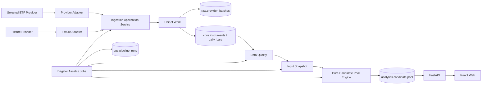

# invest-infra V2 项目纠偏实施方案

> 文档版本：v1.0  
> 审计基线仓库：`shivchen-dev/invest-infra`  
> 审计基线提交：`e09ceaf615179c2b8b64c9b3fd95fc802d1921d9`  
> 目标：消除当前架构偏移，恢复“真实 ETF Provider → 日行情 → 数据质量 → 输入快照 → 候选池 → 发布 → API/Web”的垂直交付路径。  
> 适用范围：V2 尚未正式生产部署、不需要兼容旧系统数据和旧 API。

---

## 1. 纠偏结论

当前项目没有偏离到错误技术路线，但已经出现以下早期风险：

```text
文档与领域模型快速扩张
+ 多 Provider 抽象提前建设
+ Greenfield 项目编写兼容型迁移
+ 测试数量增长但 CI 未实际覆盖
- 真实 ETF 日行情垂直链路
```

本次纠偏不推倒重来，采用：

```text
暂停新增抽象
→ 修复运行阻断问题
→ 收敛 Provider 边界
→ 重置 Greenfield 迁移
→ 补齐 CI 真实性
→ 只实现一个真实 Provider
→ 恢复垂直链路交付
```

---

## 2. 纠偏目标

完成本方案后，仓库必须满足：

1. Dagster definitions 可以成功导入和启动。
2. Pipeline 中不存在 `providers.py` 与 `providers/` 同名冲突。
3. Provider 只存在一套正式契约。
4. 第一阶段运行时只保留 `fixture_dev` 和一个选定的真实 Provider。
5. 数据库只使用 `raw/core/analytics/ops` 四个 Schema。
6. 不再向 `app.pipeline_runs` 写入新逻辑。
7. Greenfield 初始迁移一次创建正确结构，不保留骨架兼容迁移。
8. Python 版本约束与 ADR 保持一致：CPython 3.12.x。
9. CI 实际运行领域、Pipeline、Storage、迁移和导入测试。
10. 后续开发严格按真实垂直链路推进，不再先增加横向框架。

---

## 3. 本次明确不做

纠偏阶段不实现：

- 第二个真实 Provider。
- RSSCast 或 Quicktiny MCP 运行时 Adapter。
- 新闻、财报、报告和回测。
- Redis、Kafka、Celery、Kubernetes。
- 实时行情和分钟行情。
- 完整复杂候选池因子。
- 用户权限系统。
- 旧数据库迁移。
- 旧 API 兼容。
- 多 Provider 自动切换和自动仲裁。
- Provider SLA 平台。
- 插件市场式 Provider Registry。

---

# 4. P0 问题及修复方案

## P0-1：消除 `providers.py` 与 `providers/` 同名冲突

### 当前问题

当前 Pipeline 同时存在：

```text
apps/pipeline/src/invest_pipeline/providers.py
apps/pipeline/src/invest_pipeline/providers/
```

旧 `assets.py` 导入：

```python
from invest_pipeline.providers import MockInstrumentProvider
```

Python 会优先解析包目录 `providers/`，而包的 `__init__.py` 未导出旧类，导致 Dagster definitions 存在导入失败风险。

### 目标结构

统一使用 `adapters/`：

```text
apps/pipeline/src/invest_pipeline/
├── adapters/
│   ├── __init__.py
│   ├── errors.py
│   ├── fixture_dev/
│   │   ├── __init__.py
│   │   └── adapter.py
│   └── selected_provider/
│       ├── __init__.py
│       ├── client.py
│       ├── mapper.py
│       ├── adapter.py
│       └── config.py
├── application/
│   ├── ingest_instruments.py
│   ├── ingest_daily_bars.py
│   └── publish_candidate_pool.py
├── assets/
│   ├── instruments.py
│   ├── daily_bars.py
│   ├── data_quality.py
│   └── candidate_pool.py
├── resources.py
└── definitions.py
```

### 操作步骤

1. 新建 `invest_pipeline/adapters/`。
2. 将 `fixture_dev.py` 移入 `adapters/fixture_dev/adapter.py`。
3. 删除旧 `invest_pipeline/providers.py`。
4. 删除或迁移 `invest_pipeline/providers/` 内有效代码。
5. 修改所有 import。
6. `assets.py` 拆为 `assets/` 包。
7. 加入 Dagster definitions 导入烟雾测试。

### 验收

```bash
PYTHONPATH=packages/domain/src:packages/storage/src:apps/pipeline/src \
python -c "from invest_pipeline.definitions import defs; print(defs)"
```

退出码必须为 0。

---

## P0-2：将 `app.pipeline_runs` 纠正为 `ops.pipeline_runs`

### 当前问题

冻结决策要求：

```text
raw
core
analytics
ops
```

但当前实现继续强化：

```text
app.pipeline_runs
```

并且字段不足以支撑 Dagster 分区、触发类型、配置快照和运行追踪。

### 目标表

```sql
CREATE TABLE ops.pipeline_runs (
    id uuid PRIMARY KEY,
    dagster_run_id text,
    job_key text NOT NULL,
    partition_key text,
    trigger_type text NOT NULL,
    status text NOT NULL,
    algorithm_version text,
    config_snapshot jsonb NOT NULL DEFAULT '{}'::jsonb,
    started_at timestamptz,
    finished_at timestamptz,
    error_summary text,
    created_at timestamptz NOT NULL DEFAULT now(),
    updated_at timestamptz NOT NULL DEFAULT now()
);
```

状态建议：

```text
queued
running
succeeded
failed
partial
cancelled
```

### 领域模型要求

`PipelineRun` 必须区分：

```text
queued_at / created_at
started_at
finished_at
```

规则：

- `queued`：允许 `started_at=None`。
- `running`：必须有 `started_at`。
- `succeeded/failed/partial/cancelled`：必须有 `finished_at`。
- 非失败状态不得携带 `error_summary`。
- `algorithm_version` 对采集任务允许为空。
- 状态转换必须在领域或应用服务中显式验证。

### Repository 更新要求

Repository 不得无条件覆盖状态。

示例：

```python
def mark_succeeded(
    self,
    run_id: UUID,
    *,
    expected_status: PipelineRunStatus = PipelineRunStatus.RUNNING,
    finished_at: datetime,
) -> PipelineRun:
    ...
```

SQL 更新应包含：

```sql
WHERE id = :run_id
  AND status = :expected_status
```

若受影响行数为 0，应抛出并发冲突或非法状态异常。

### 验收

- 仓库代码不再出现新的 `app.pipeline_runs` 写操作。
- `ops.pipeline_runs` 字段覆盖垂直链路需要。
- 状态转换测试覆盖合法和非法路径。
- 并发更新不能把 `failed` 重新标记为 `succeeded`。

---

## P0-3：让 CI 真正运行全部测试

### 当前问题

当前 CI 主要执行：

- 架构检查。
- 根目录 unittest。
- API Ruff。
- Pipeline Ruff。

没有完整执行：

- `packages/domain/tests`
- `apps/pipeline/tests`
- Storage pytest
- PostgreSQL 集成测试
- Alembic 空库升级
- Dagster definitions import
- API import/OpenAPI
- Web 类型检查

### 目标 CI Jobs

```text
architecture
domain-tests
storage-unit
storage-integration
migrations
pipeline-tests
pipeline-import-smoke
api-tests
api-openapi-smoke
web-check
container-build
```

### 最小 CI 命令

```bash
python scripts/check_architecture.py

PYTHONPATH=packages/domain/src \
pytest packages/domain/tests -q

PYTHONPATH=packages/domain/src:packages/storage/src:tests \
pytest tests/storage --ignore=tests/storage/integration -q

PYTHONPATH=packages/domain/src:packages/storage/src:tests \
pytest tests/storage/integration -q

cd apps/api
uv sync --frozen --group dev
uv run alembic upgrade head
uv run ruff check src tests
uv run pytest -q

cd apps/pipeline
uv sync --frozen --group dev
uv run ruff check src tests
uv run pytest -q
uv run python -c "from invest_pipeline.definitions import defs"

cd apps/web
pnpm install --frozen-lockfile
pnpm typecheck
pnpm test --run
pnpm build
```

### CI 原则

- CI 中 PostgreSQL 集成测试不得因为缺 Docker 而自动 skip。
- 开发机可以通过环境变量跳过集成测试。
- CI 若发现 integration tests 被全部跳过，应判定失败。
- 每个 PR 必须显示实际运行的测试数量。
- 结果文档不能代替 CI 证据。

---

# 5. P1 问题及修复方案

## P1-1：统一 Provider 契约

### 当前问题

目前存在：

1. `invest_domain.market_data.ProviderBatch`
2. Pipeline 本地 `ProviderBatch Protocol`
3. Pipeline `_FixtureBatch`
4. Storage `NewProviderBatch`
5. Storage `StoredProviderBatch`

其中 4、5 是持久化 DTO，可以保留；1、2、3 是运行时响应契约重复。

### 目标

Provider Adapter 统一返回：

```python
ProviderBatch[Instrument]
ProviderBatch[DailyBar]
```

定义只存在于：

```text
packages/domain/src/invest_domain/market_data/models.py
```

### 删除项

删除：

```text
apps/pipeline/.../fixture_dev.py 中的 ProviderBatch Protocol
apps/pipeline/.../fixture_dev.py 中的 _FixtureBatch
```

### 映射关系

```text
ProviderBatch[T]
    ↓ application service
NewProviderBatch
    ↓ repository
StoredProviderBatch
```

不要让 Storage DTO 反向进入 Domain。

---

## P1-2：收敛多 Provider 设计

### 当前问题

运行时已经提前加入：

- AkShare
- Cifang
- RSSCast
- Quicktiny MCP
- Registry
- Capability
- 多套 Settings
- 多套环境变量

这超出了首条 ETF 垂直链路需要。

### 目标

第一阶段运行时只保留：

```text
fixture_dev
selected_real_provider
```

### 保留方式

其他数据源仅保留在：

```text
docs/implementation/DATA-SOURCE-MIGRATION-MATRIX.md
```

不进入：

- Provider Registry。
- `.env.example`。
- 运行时 Settings。
- Pipeline definitions。
- Docker 环境变量。
- 生产镜像依赖。

### 是否保留 Registry

首个真实 Provider 阶段可以不需要 Registry：

```python
def build_provider(settings: PipelineSettings) -> EtfMarketDataProvider:
    if settings.provider_key == "fixture_dev":
        return FixtureDevEtfMarketDataProvider()
    if settings.provider_key == "selected_provider":
        return SelectedProviderAdapter(...)
    raise UnknownProviderError(...)
```

只有第二个真实 Provider 被正式接入时，再恢复通用 Registry。

---

## P1-3：重置 Greenfield 迁移

### 当前问题

当前迁移为骨架表编写了：

- shadow rename；
- legacy table；
- 数据回填；
- 复杂 downgrade 审计；
- 多个修补迁移。

V2 尚未生产部署，也不需要兼容旧数据，这些兼容逻辑没有业务价值。

### 目标

在第一次生产部署前，将迁移重置为清晰基线。

建议：

```text
20260730_0001_initial_v2.py
```

一次创建：

```text
raw
core
analytics
ops
```

纠偏阶段先创建当前已实现的必要表：

```text
raw.provider_batches
core.instruments
ops.pipeline_runs
```

后续按垂直链路增量增加：

```text
core.daily_bars
ops.data_quality_results
analytics.input_snapshots
analytics.input_snapshot_rows
analytics.candidate_pool_runs
analytics.candidate_pool_items
analytics.candidate_pool_publications
```

### 操作条件

仅当以下全部成立时允许 squash：

- 尚无正式生产数据库。
- 无需保留现有测试数据库数据。
- 没有外部系统依赖当前 migration revision。
- 团队明确确认当前仍处于首次生产发布前。

### 验收

```bash
uv run alembic heads
uv run alembic history
uv run alembic upgrade head
uv run alembic downgrade base
uv run alembic upgrade head
```

要求：

- 只有一个 head。
- 空库可以升降级。
- 不存在 `_legacy` 表。
- 不创建 `app` Schema。

---

## P1-4：统一 Python 版本

所有 Python 项目改为：

```toml
requires-python = ">=3.12,<3.13"
```

覆盖：

```text
packages/domain/pyproject.toml
packages/storage/pyproject.toml
apps/api/pyproject.toml
apps/pipeline/pyproject.toml
```

CI、Dockerfile 和开发文档统一为 Python 3.12。

---

## P1-5：修复架构检查覆盖不足

### 当前检查不足

现有脚本只检查：

- Domain 禁止部分框架依赖。
- API 禁止 Dagster/AkShare 等。

### 新增规则

```text
domain 禁止：
  sqlalchemy
  fastapi
  dagster
  httpx
  requests
  akshare
  pandas
  polars
  os.environ

api 禁止：
  dagster
  Provider SDK
  adapters
  research
  vectorbt
  backtrader

storage 禁止：
  fastapi
  dagster
  Provider SDK
  candidate_pool application service

pipeline adapters 禁止：
  sqlalchemy Session
  repository
  UnitOfWork
  commit
  rollback

pipeline assets 禁止：
  直接导入 Provider SDK
  直接构造 SQLAlchemy Session
  subprocess
```

同时检查：

- `providers.py` 与 `providers/` 同名冲突。
- production package 不得 import `research`。
- 不允许 `subprocess.run` 调用仓库内 Python 脚本。
- 不允许新的 `app` Schema。
- 不允许 `qfq/hfq` 出现在生产路径。

---

# 6. 纠偏后的目标架构



关键规则：

```text
Adapter 不写数据库
Asset 不直接管理 Session
Application Service 管理业务流程
UnitOfWork 管理事务
Repository 只做持久化
Domain 不访问 IO
API 只读已发布结果
```

---

# 7. 建议 PR 顺序

## PR-1：Pipeline 导入稳定化

### 范围

- 消除 `providers.py` / `providers/` 冲突。
- 建立 `adapters/fixture_dev`。
- 修改 `assets.py` 导入。
- 加入 definitions import smoke test。
- 不修改数据库模型。

### 验收

```bash
ruff check
pytest apps/pipeline/tests
python -c "from invest_pipeline.definitions import defs"
```

---

## PR-2：Provider 契约收敛

### 范围

- 删除 Pipeline 本地 ProviderBatch。
- Fixture 返回 Domain `ProviderBatch[T]`。
- 统一 Adapter 错误映射。
- 删除运行时 RSSCast/Quicktiny 声明。
- Registry 简化为显式 Provider Builder。

### 验收

- Provider 契约只有一套。
- Fixture 和真实 Adapter 使用同一 Protocol。
- Provider Adapter 契约测试通过。
- 默认运行不访问网络。

---

## PR-3：数据库基线重置

### 范围

- 删除 `app` Schema。
- 创建 `raw/core/analytics/ops`。
- 重建 `core.instruments`。
- 重建 `raw.provider_batches`。
- 创建正确的 `ops.pipeline_runs`。
- 删除 Greenfield legacy/shadow 兼容迁移。
- 更新 ORM。

### 验收

- 单 Alembic head。
- 空库升级成功。
- 升降级成功。
- ORM metadata 与迁移一致。
- 不存在 `_legacy` 表。

---

## PR-4：PipelineRun 状态机和 UoW

### 范围

- 修正 PipelineRun 领域模型。
- 增加合法状态转换。
- Repository 使用 compare-and-set 更新。
- 增加并发冲突测试。
- Dagster Run ID 和 partition key 可持久化。

### 验收

- 领域构造不能产生数据库必然拒绝的对象。
- failed 不能被重新标记 succeeded。
- ingestion run 可以没有 algorithm_version。
- 并发状态覆盖被阻止。

---

## PR-5：CI 真实性

### 范围

- 拆分 CI jobs。
- 运行全部测试。
- 增加 PostgreSQL service/Testcontainers。
- 增加 Alembic smoke。
- 增加 API/OpenAPI smoke。
- 增加 Pipeline definitions smoke。
- 增加 Web typecheck/build。

### 验收

- CI 中集成测试实际运行。
- 任何测试全部 skip 都会失败。
- PR 页面可以看到各测试 Job。
- `main` 分支无空 CI 状态。

---

## PR-6：选定真实 Provider 最小实现

### 前置条件

必须确认：

- Provider 法定名称。
- 授权范围。
- ETF 主数据字段。
- 日行情字段。
- `none` 口径。
- 限频。
- 历史起点。
- 停牌和缺失语义。
- 凭据注入方式。

### 范围

只实现：

```text
selected_provider/client.py
selected_provider/mapper.py
selected_provider/adapter.py
selected_provider/config.py
selected_provider/fixtures/
```

### 验收

- 真实同步 ETF 主数据。
- 真实采集一个交易日日行情。
- 不将 token 写入日志。
- 超时、429、5xx、鉴权、坏响应分类明确。
- Fixture 契约测试与真实 smoke 分离。

---

# 8. 纠偏后恢复垂直链路

稳定化完成后，开发顺序固定为：

## Step 1：真实 ETF 主数据

```text
Provider
→ ProviderBatch[Instrument]
→ raw.provider_batches
→ core.instruments
```

验收：

- active ETF 数量合理。
- symbol/exchange 唯一。
- 重复采集幂等。
- Provider 批次可追踪。

## Step 2：真实 ETF 日行情

```text
Provider
→ ProviderBatch[DailyBar]
→ raw.provider_batches
→ core.daily_bars revision
→ core.latest_daily_bars
```

验收：

- 指定交易日采集。
- 日期区间回补。
- row_hash 相同 no-op。
- 内容变化 revision+1。
- 历史行不 update/delete。

## Step 3：数据质量

```text
OHLC
覆盖率
日期一致
重复
新鲜度
停牌
零成交
异常跳变
```

验收：

- error 阻止后续发布。
- warn 允许继续但保留证据。
- 每项结果写入 `ops.data_quality_results`。

## Step 4：输入快照

```text
analytics.input_snapshots
analytics.input_snapshot_rows
```

验收：

- 快照精确绑定 DailyBar revision。
- 相同输入生成相同 content hash。
- 快照不可修改。

## Step 5：第一版候选池

只实现可解释的基础规则：

- 上市天数。
- 当日行情存在。
- 停牌排除。
- 流动性。
- 数据缺失率。
- 波动率。
- 最大回撤。
- 简单评分和排名。

验收：

- 核心函数纯函数。
- 每只 ETF 都保存 include/exclude。
- 被排除项有 reason。
- 相同输入和参数结果确定。

## Step 6：验证与发布

状态：

```text
calculated
→ validated
→ published
        ↘ rejected
```

验收：

- 默认 API 只读取 published。
- 新发布原子更新 publication pointer。
- 历史 published run 保留。
- 不允许回改终态。

## Step 7：API 和 Web

最小接口：

```http
GET /v1/candidate-pools/latest
GET /v1/candidate-pools/{run_id}
GET /v1/candidate-pools/{run_id}/items
GET /v1/data-freshness
GET /v1/pipeline-runs
```

最小页面：

- 候选池列表。
- 单标的规则解释。
- 数据新鲜度。
- Pipeline runs。

---

# 9. 文件级操作清单

| 当前路径 | 操作 | 目标 |
|---|---|---|
| `apps/pipeline/src/invest_pipeline/providers.py` | 删除/迁移 | 消除同名冲突 |
| `apps/pipeline/src/invest_pipeline/providers/` | 重命名/收敛 | 改为 `adapters/` |
| `apps/pipeline/src/invest_pipeline/providers/fixture_dev.py` | 重写 | 返回 Domain ProviderBatch |
| `apps/pipeline/src/invest_pipeline/providers/registry.py` | 简化或暂删 | 首期不做插件式 Registry |
| `apps/pipeline/src/invest_pipeline/providers/settings.py` | 收敛 | 只保留 fixture 和 selected |
| `apps/pipeline/src/invest_pipeline/assets.py` | 拆分 | 改为 `assets/` 包 |
| `apps/pipeline/src/invest_pipeline/definitions.py` | 更新 | 注册真实 assets/jobs/resources |
| `.env.example` | 收敛 | 删除非当前 Provider 环境变量 |
| `apps/api/migrations/versions/*` | 重置 | Greenfield 单一正确基线 |
| `packages/domain/.../pipeline/models.py` | 重构 | ops 运行状态和约束 |
| `packages/storage/.../models.py` | 更新 | 使用 ops Schema |
| `packages/storage/.../repositories.py` | 拆分 | 避免单文件继续膨胀 |
| `scripts/check_architecture.py` | 扩展 | 检查更多架构边界 |
| `.github/workflows/ci.yml` | 重写 | 运行全部测试和 smoke |
| `Makefile` | 更新 | `make test` 与 CI 一致 |

---

# 10. Repository 文件拆分建议

当前 `repositories.py` 已快速增长，建议在纠偏阶段拆分：

```text
packages/storage/src/invest_storage/
├── repositories/
│   ├── __init__.py
│   ├── instruments.py
│   ├── provider_batches.py
│   ├── pipeline_runs.py
│   ├── daily_bars.py
│   ├── input_snapshots.py
│   └── candidate_pools.py
├── models/
│   ├── __init__.py
│   ├── raw.py
│   ├── core.py
│   ├── analytics.py
│   └── ops.py
├── database.py
└── unit_of_work.py
```

约束：

- 每个 Repository 只操作所属表。
- 不使用“万能 Repository”。
- Repository 不负责状态业务规则。
- Repository 不 commit。
- Repository 返回 Domain 或明确 Application DTO。

---

# 11. 测试门禁清单

## Domain

- [ ] Instrument 不变量。
- [ ] DailyBar OHLC、停牌、revision、hash。
- [ ] ProviderBatch 时间和状态。
- [ ] PipelineRun 合法状态。
- [ ] CandidatePool 纯函数。
- [ ] Canonical hash 稳定性。

## Adapter

- [ ] 主数据成功响应。
- [ ] 日行情成功响应。
- [ ] 空响应。
- [ ] 部分响应。
- [ ] 429。
- [ ] 401/403。
- [ ] 5xx。
- [ ] 超时。
- [ ] 字段缺失。
- [ ] unsupported adjustment。
- [ ] 凭据日志脱敏。

## Storage

- [ ] 空库迁移。
- [ ] Instrument upsert 幂等。
- [ ] ProviderBatch 唯一键。
- [ ] DailyBar revision。
- [ ] UoW commit/rollback。
- [ ] PipelineRun compare-and-set。
- [ ] Candidate publish 原子性。
- [ ] 并发发布唯一性。

## Pipeline

- [ ] definitions import。
- [ ] fixture 主数据 asset。
- [ ] 真实主数据 asset fixture test。
- [ ] 单日行情 asset。
- [ ] backfill 分区。
- [ ] 数据质量阻断。
- [ ] 候选池重算不重新请求 Provider。
- [ ] 失败运行写入 ops。

## API/Web

- [ ] OpenAPI 生成。
- [ ] latest 只返回 published。
- [ ] 分页稳定。
- [ ] 无候选池时返回明确状态。
- [ ] Web 类型检查。
- [ ] Web 构建。
- [ ] 页面不重新计算业务分数。

---

# 12. GitHub Issue 拆分

## Epic：Correction Foundation

1. 消除 Pipeline Provider 模块同名冲突。
2. 将 `providers/` 重命名为 `adapters/`。
3. Fixture Adapter 使用 Domain ProviderBatch。
4. 增加 Dagster definitions import smoke。
5. 收敛 Provider Settings。
6. 移除 RSSCast/Quicktiny 运行时声明。
7. 简化 Provider Builder。
8. 扩展架构边界检查。

## Epic：Database Reset

9. 确认尚无生产数据库依赖。
10. Squash Alembic Greenfield migration。
11. 删除 `app` Schema。
12. 创建 `ops.pipeline_runs`。
13. 更新 ORM Schema。
14. 修复 PipelineRun Domain。
15. 实现状态 compare-and-set。
16. 补齐迁移升降级测试。

## Epic：CI Truthfulness

17. 增加 Domain pytest Job。
18. 增加 Pipeline pytest Job。
19. 增加 Storage unit Job。
20. 增加 PostgreSQL integration Job。
21. 增加 Alembic empty-db Job。
22. 增加 Dagster import smoke Job。
23. 增加 FastAPI/OpenAPI smoke Job。
24. 增加 Web typecheck/build Job。
25. 禁止 CI integration tests 全部 skip。

## Epic：Vertical Slice Resume

26. 冻结选定真实 Provider。
27. 实现 Provider client。
28. 实现主数据 mapper/adapter。
29. 实现日行情 mapper/adapter。
30. 实现 raw batch application service。
31. 实现 `core.daily_bars` migration。
32. 实现 DailyBar Repository/revision。
33. 实现日行情 Dagster partition。
34. 实现 backfill job。
35. 实现数据质量结果。
36. 实现 input snapshot。
37. 实现候选池纯函数。
38. 实现候选池持久化。
39. 实现验证和发布状态机。
40. 实现 Candidate Pool API。
41. 实现 Data Freshness API。
42. 实现最小 Web 页面。

---

# 13. 纠偏完成定义

本次纠偏阶段完成，不等于完整垂直链路完成。

纠偏阶段 Definition of Done：

## 运行

- [ ] `invest_pipeline.definitions` 可以导入。
- [ ] Dagster dev server 可以启动。
- [ ] API 可以启动。
- [ ] PostgreSQL 空库可以迁移到 head。
- [ ] 不存在 `providers.py`/`providers/` 同名冲突。

## 架构

- [ ] Provider 只有一套 Domain 契约。
- [ ] Adapter 不管理数据库事务。
- [ ] Asset 不直接构造 SQLAlchemy Session。
- [ ] 不存在新 `app` Schema。
- [ ] Python 项目均固定 `<3.13`。
- [ ] 运行时只保留 fixture 和 selected Provider。

## 测试

- [ ] Domain tests 全部执行。
- [ ] Pipeline tests 全部执行。
- [ ] Storage unit/integration tests 全部执行。
- [ ] Alembic 升降级测试通过。
- [ ] Dagster import smoke 通过。
- [ ] CI 无空状态。
- [ ] CI 中集成测试没有被全部 skip。

## 文档

- [ ] M0 Decisions 与代码一致。
- [ ] README 不再描述旧 Mock 导入路径。
- [ ] Provider 未决项更新为明确决定或阻塞项。
- [ ] 不宣称“生产就绪”。

---

# 14. 垂直链路最终完成定义

只有以下全部满足，才能宣称“ETF 垂直链路完成”：

- [ ] 真实 Provider 获取 ETF 主数据。
- [ ] 真实 Provider 获取 ETF 日行情。
- [ ] 原始批次证据可追踪。
- [ ] DailyBar revision 可追踪。
- [ ] 数据质量 error 能阻止计算或发布。
- [ ] 输入快照精确绑定行情 revision。
- [ ] 候选池纯函数通过黄金样例。
- [ ] 每个 ETF 有完整规则解释。
- [ ] 候选池状态机和 publication pointer 原子。
- [ ] API 默认只读 published。
- [ ] Web 可查看结果、新鲜度和运行状态。
- [ ] 指定交易日可安全重跑。
- [ ] 日期区间可回补。
- [ ] 凭据未进入仓库、日志和镜像。
- [ ] 生产 smoke 和失败恢复演练完成。

---

# 15. 开发执行红线

纠偏及后续开发期间禁止：

1. 增加第二个真实 Provider。
2. 为未来能力建立新的通用 Registry。
3. 在真实日行情完成前开发报告和回测。
4. 在 Asset 中直接 commit/rollback。
5. 在 Adapter 中注入 SQLAlchemy Session。
6. 通过 subprocess 调用仓库 Python 脚本。
7. 修改终态候选池运行。
8. 覆盖历史 DailyBar revision。
9. 在前端重新实现候选池规则。
10. 用测试结果 Markdown 代替 CI。
11. 为未部署的 Greenfield 表编写旧数据兼容逻辑。
12. 把示例阈值当作生产投资参数。

---

# 16. 推荐执行顺序

```text
PR-1 运行导入稳定化
→ PR-2 Provider 契约收敛
→ PR-3 数据库基线重置
→ PR-4 PipelineRun 状态修复
→ PR-5 CI 真实性
→ 冻结真实 Provider
→ PR-6 真实 Provider 最小实现
→ 日行情
→ 数据质量
→ 输入快照
→ 候选池
→ 发布
→ API/Web
```

每个 PR 必须满足：

- 范围单一。
- 有可执行验收命令。
- 不夹带下一阶段功能。
- CI 全绿。
- 架构检查通过。
- 文档和代码同步。

---

## 最终原则

> 本次纠偏的核心不是减少代码数量，而是恢复“每次提交都让真实垂直链路更接近可运行”的开发节奏。

接下来每个增量都应回答：

```text
它是否让真实 ETF 数据更接近：
可采集
可验证
可追踪
可计算
可发布
可查询
```

不能回答其中任何一项的抽象，应推迟到真实需求出现后再实现。
