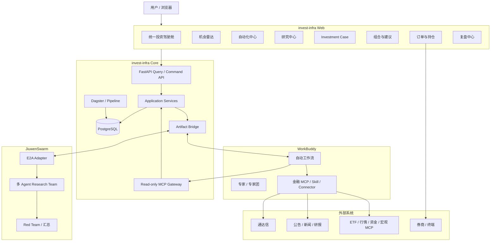

# invest-infra：WorkBuddy + JiuwenSwarm 统一投资驾驶舱与 ETF 投资闭环总蓝图

> 文档版本：v1.2
> 文档状态：Draft for Review
> 制定日期：2026-08-13
> 适用仓库：`shivchen-dev/invest-infra`
> 当前代码基线：`main` / `907d296bfe503b4f937af73643beb2f2f349cce0`
> 建议阶段命名：**Stage 4D–4G：统一投资工作台、决策、交易与复盘闭环**
> 主要平台：`invest-infra`、WorkBuddy、JiuwenSwarm
> 主要资产类别：A 股 ETF，A 股个股数据主要作为市场、板块和 ETF 穿透研究上下文
> 建设原则：统一入口、平台分工、证据分层、结构化集成、可追溯、人工最终控制、逐阶段收敛

> 文档职责：本文件保留 Stage 4D–4G 的产品、架构和长期路线边界，不再作为 Stage 4D 的日常派工清单。
> Stage 4D 当前执行权威：`docs/plan/invest-infra-stage4d-mvp-phased-execution-plan-v1.0.md`。
> Stage 4D 当前任务清单：`tasks/stage4d-mvp-phased-execution-todo.md`。

> 拆分说明：本文件第 25、33–37 节保留为原始设计基线；若其任务顺序、阶段边界或验收口径与 Stage 4D 当前执行权威冲突，以分阶段执行计划为准。

---

## 1. 执行摘要

本计划的目标不是把三个系统简单放在同一个页面中，也不是将 WorkBuddy 或 JiuwenSwarm 的完整界面以 iframe 方式嵌入 `invest-infra`。目标是建设一个以 `invest-infra Web` 为统一入口的 **ETF 投资驾驶舱**：

```text
用户
  ↓
invest-infra 统一投资驾驶舱
  ├─ 发起 WorkBuddy 自然语言任务
  ├─ 查看 WorkBuddy 金融 MCP 聚合结果
  ├─ 对外部观察执行正式数据验证
  ├─ 创建 Research Case / Evidence Pack
  ├─ 调度 JiuwenSwarm 深度研究
  ├─ 查看研究观点、风险、分歧与证据引用
  ├─ 形成投资建议、组合约束和人工审批
  ├─ 管理订单、成交、持仓和对账
  └─ 执行日度、T+5、T+20 与月度复盘
```

三套平台的最终定位如下：

- **WorkBuddy**：自然语言投资工作台、金融 MCP 编排器、自动工作流执行器、快速研究与报告生成平台。
- **invest-infra**：确定性投资内核、统一事实源、Evidence 治理、组合与风控、订单与成交账本、统一可视化入口。
- **JiuwenSwarm**：复杂课题的多智能体研究委员会，负责任务分解、正反方分析、Red Team、深度报告和结构化研究结论。

建议采用两条集成通道：

```text
控制、查询、小型结构化数据
WorkBuddy / JiuwenSwarm ↔ MCP / HTTP / E2A ↔ invest-infra

报告、Excel、图片、附件和诊断产物
WorkBuddy / JiuwenSwarm ↔ 共享目录 Artifact Bridge ↔ invest-infra
```

第一批落地不直接建设完整订单系统，而先交付：

```text
WorkBuddy 多源 ETF 筛选
→ ExternalObservation
→ invest-infra 正式验证
→ Research Case / Evidence
→ JiuwenSwarm 深度研究
→ 投研系统统一展示
```

完成该闭环后，再依次增加投资建议、组合、订单、成交、持仓和复盘。

---

## 2. 当前代码与架构基线

### 2.1 已有能力

截至本计划基线，仓库已经具备以下可复用能力：

- ETF 主数据、日线、ETF Profile 与 Candidate Pool；
- Input Snapshot、数据 freshness、Pipeline Run 与 Provider provenance；
- Research Case、Research Run、Research Result、Evidence Pack、Evidence Bundle；
- JiuwenSwarm Adapter、Runner、Codec、Prompt、Transport 与 Research Orchestration；
- Market Temperature、Market Breadth、Limit Sentiment；
- Tushare 主源、TDX fallback 与 Provider Registry/Engine；
- FastAPI 只读查询服务；
- FastMCP 最小只读网关；
- React Dashboard、Candidate Pool、ETF Detail、Research History、Research Case、Operations 页面；
- Research Workspace Widget Runtime；
- PostgreSQL、Alembic、Repository、Unit of Work 与较完整测试基线。

### 2.2 当前明确缺口

当前缺少：

1. WorkBuddy 运行与结果的正式领域模型；
2. WorkBuddy 结构化输出合同；
3. 外部金融 MCP 结果的来源、时间、工具和验证状态；
4. 外部观察进入正式 Evidence 的准入流程；
5. 从投研系统发起 WorkBuddy 自动工作流的受控入口；
6. WorkBuddy、JiuwenSwarm、Candidate Pool、Evidence、建议和订单的统一时间线；
7. 面向用户的“机会雷达”和“自动化中心”；
8. 贯穿发现、研究、建议、执行和复盘的 Investment Case；
9. 组合、风险预算、审批、订单、成交、持仓与对账领域；
10. 研究质量、执行质量和投资逻辑后验闭环。

### 2.3 当前约束

当前架构治理要求：

- 下游不能回写上游事实；
- Analytics 只做确定性计算；
- Research 负责组织 Evidence；
- AI 只能消费 Evidence/Context，不修改事实；
- Context Projection 不能成为第二套事实源；
- Repository 必须有明确生命周期、查询接口、事务要求和单一 owner；
- 当前 MCP 网关为只读；
- 当前 Web 明确“不触发写操作”。

本计划会新增受控写操作和新的稳定对象，因此必须通过新的 ADR 显式扩展当前治理基线，不能在 Router 或前端中绕过既有边界直接写表。

---

## 3. 产品目标与非目标

## 3.1 产品目标

统一投资驾驶舱应支持：

1. **自然语言发现机会**
   用户在投研系统输入筛选、比较、事件映射或复盘问题，由 WorkBuddy 调用多个金融 MCP 和技能完成。

2. **外部结果可视化**
   WorkBuddy 返回的候选、指标、结论、来源、工具调用摘要和报告可以在投研系统中展示。

3. **外部观察正式验证**
   所有 WorkBuddy 结果先进入 `ExternalObservation`，由投研系统根据内部正式数据和来源规则进行校验。

4. **深度研究升级**
   用户可将验证后的 ETF 或主题升级为 Research Case，并使用现有 JiuwenSwarm 路径做多 Agent 深度研究。

5. **统一决策链路**
   同一 ETF 的发现、证据、研究、建议、风险、审批、订单、持仓和复盘在统一 Case 页面呈现。

6. **ETF 组合与交易闭环**
   后续增加组合目标、风险约束、订单状态机、成交和持仓对账，但保持人工最终审批。

7. **持续复盘**
   系统定期评价研究结论、执行质量、持仓表现、失效条件和工作流质量。

## 3.2 明确非目标

首批阶段不做：

- 在投研系统中复刻完整 WorkBuddy 聊天界面；
- iframe 嵌入 WorkBuddy 或 JiuwenSwarm 全站；
- 允许 WorkBuddy 任意写 PostgreSQL；
- 将任意金融 MCP 返回值自动视为正式 Evidence；
- 保存模型私有推理链；
- 无人工审批的自动交易；
- 高频、Tick 或 Level-2 交易；
- 重型回测和参数寻优；
- 引入 Kafka、Redis、Celery 或新微服务作为前置条件；
- 将共享目录作为正式业务数据库；
- 一次阶段内同时完成工作台、组合、OMS、自动执行和完整复盘。

---

## 4. 关键架构决策

建议新增 ADR：

```text
docs/adr/0014-unified-investment-workbench-and-external-workflows.md
docs/adr/0015-external-observation-admission.md
docs/adr/0016-investment-decision-and-trading-boundary.md
```

### ADR-01：invest-infra Web 是统一入口，但不是所有平台的替代品

投研系统负责：

- 发起任务；
- 展示任务状态；
- 展示关键结构化结果；
- 显示来源和可信状态；
- 接入正式研究、建议、交易和复盘。

完整的 WorkBuddy 编辑、技能配置、连接管理和复杂交互仍留在 WorkBuddy。完整 JiuwenSwarm 调试过程仍留在其运行环境。投研系统可以提供“打开原平台”的深链接，但不复制全部能力。

### ADR-02：WorkBuddy Run 与 Research Run 不合并为同一领域对象

两者语义不同：

- `ExternalWorkflowRun`：多工具编排、搜索、筛选、报告和自动化任务；
- `ResearchRun`：围绕冻结 Evidence Pack 和 Playbook 的正式 AI 研究运行。

UI 可以统一显示为时间线，但数据库和生命周期保持独立，避免用通用任务模型抹平研究语义。

### ADR-03：ExternalObservation 不是 Evidence

WorkBuddy 及其金融 MCP 返回的数字、观点和筛选结果先保存为：

```text
ExternalObservation
```

只有满足来源、时间、口径和交叉验证要求后，才可：

```text
unverified
→ corroborated
→ admitted
```

`admitted` 后仍需生成新的正式 Evidence Item，不能原地修改成 Evidence。

### ADR-04：控制通道与 Artifact 通道分离

- MCP/HTTP/E2A 用于任务控制、查询、状态和小型 JSON；
- 共享目录用于 Markdown、Excel、图片、PDF、JSON 结果包和诊断文件；
- 业务对象只保存逻辑 URI、hash、MIME、大小和 provenance；
- 浏览器不读取宿主机绝对路径。

### ADR-05：读 MCP 与写命令 API 分离

现有 `invest-api` FastMCP 保持只读并扩充查询工具。写操作放入受控 HTTP Command API：

```text
Read MCP
  get_...

Command API
  create...
  submit...
  approve...
  cancel...
```

禁止通过一个开放式 MCP 工具提供任意写入或任意 SQL。

### ADR-06：浏览器写入必须有操作门禁

所有写操作要求：

- 功能开关默认关闭；
- 服务端校验；
- 幂等键；
- 审计主体；
- 操作原因；
- CSRF/本地会话保护；
- 对高风险操作二次确认。

### ADR-07：共享目录只保存不可变消息与产物

消费者不得修改生产者文件。修订必须生成新版本和新 hash。WorkBuddy 候选 JSON 经 Candidate Intake 做轻量结构校验、按项隔离和不可变归档后，投影为 ExternalObservation；三件套严格报告审计是可选旁路。WorkBuddy 不接入投研系统内部 CandidatePool 计算，原始文件归档是生产输入权威源，数据库是外部观察、准入状态、关联和查询权威源。

---

## 5. 目标总体架构



### 5.1 逻辑数据流

```text
WorkBuddy candidates JSON / legacy 三件套
        ↓
Candidate Intake（轻量校验 + item-level 隔离）
        ↓
原始 artifact 不可变归档 / intake result
        ↓
ExternalWorkflowRun / ExternalArtifact
        ↓
ExternalObservation / External Candidate Admission
        ↓
Observation Admission
        ↓
Core / Analytics 交叉验证
        ↓
Research Evidence Item / Evidence Bundle
        ↓
JiuwenSwarm Research Run / Result
        ↓
Investment Proposal
        ↓
Risk Check / Human Approval
        ↓
Trade Intent / Order / Fill / Position
        ↓
Review Case / Quality Metrics
```

---

## 6. 平台职责和数据所有权

| 能力或数据 | WorkBuddy | invest-infra | JiuwenSwarm |
|---|---|---|---|
| 自然语言任务入口 | 可提供原生入口 | 提供统一轻量入口 | 不作为普通入口 |
| 外部金融 MCP 编排 | 主责 | 不复制所有连接 | 不主责 |
| 快速筛选和比较 | 主责 | 正式验证和重算 | 高价值任务可参与 |
| 自动晨报和盘后报告 | 主责 | 保存摘要、状态和附件 | 重大主题可深研 |
| ETF 正式主数据和行情 | 只读消费 | 唯一正式 owner | 只读消费 |
| Candidate Pool | 可提供探索候选 | 仅维护既有内部候选池兼容能力；不负责 WorkBuddy 选股 | 解释，不修改 |
| ExternalObservation | 生产 | 持久化、验证和准入 | 可作为上下文阅读 |
| Evidence Pack/Bundle | 不修改 | 正式 owner | 只读消费 |
| Research Run | 可发起升级 | 生命周期 owner | 执行引擎 |
| Research Result | 可展示摘要 | 校验、持久化和关联 | 生成 |
| Investment Proposal | 可辅助解释 | 正式 owner | 提供研究依据 |
| Risk Check | 不绕过 | 正式 owner | 不修改 |
| Approval | 展示和提醒 | 正式 owner | 不参与 |
| Order/Fill/Position | 可辅助执行和读取 | 唯一正式账本 | 不参与 |
| Review | 生成叙事和报告 | 指标、后验和正式记录 | 深度复盘 |
| 完整报告/Excel/图表 | 生成 | Artifact 索引和预览 | 生成深研报告 |

---

## 7. 完整 ETF 投资工作流

## 7.1 盘前机会发现

```text
WorkBuddy 自动任务
→ 调用公告、新闻、ETF、行情、资金和宏观 MCP
→ 生成晨报、事件清单、ETF 关注列表
→ 写入结构化 Result Package
→ invest-infra 导入 ExternalWorkflowRun
→ Dashboard 展示“今日外部机会”
```

关键展示信息：

- 任务名称和模板版本；
- 运行时间；
- 使用的 MCP/Skill；
- 数据截止时间；
- 候选 ETF；
- 关键指标；
- 事件影响链；
- 风险和数据冲突；
- 报告附件；
- 验证状态。

## 7.2 探索式 ETF 筛选

用户在投研系统输入：

> 筛选近 20 日成交活跃、资金改善、趋势向上的 ETF；同一指数只保留流动性最优者，并说明淘汰原因。

流程：

```text
Command API 创建任务
→ WorkBuddy Adapter 生成 request package
→ WorkBuddy 调用多个金融 MCP
→ 返回候选集和来源
→ ExternalObservation 入库
→ invest-infra 使用正式数据重算
→ 机会雷达并排展示“外部结果 vs 正式验证”
```

如同时展示既有内部 Candidate Pool 排名，必须与 WorkBuddy 外部评分分栏展示，不能合并成一个分数。

## 7.3 正式研究升级

```text
用户选择已验证 ETF
→ 创建或关联 Research Case
→ 构建最新 Evidence Pack/Bundle
→ 检查 freshness、quality 和 content_hash
→ 发起 JiuwenSwarm Research Run
→ 多 Agent 分析
→ 返回 Research Result
→ 统一 Case 页面展示
```

## 7.4 投资建议

```text
Research Result
+ 当前组合
+ 风险预算
+ 交易约束
→ Investment Proposal
→ 确定性 Risk Check
→ 人工审批
```

Investment Proposal 只允许：

```text
watch / hold / initiate / increase / reduce / exit / rebalance
```

建议需要包含：

- 目标权重区间；
- 最大金额；
- 进入条件；
- 退出条件；
- 失效条件；
- 复核日期；
- Evidence/Research 引用；
- 风险规则版本。

## 7.5 订单执行

后续阶段：

```text
Approved Proposal
→ Trade Intent
→ Order Draft
→ WorkBuddy / 通达信预填
→ 人工最终确认
→ 委托回执
→ Order Event / Fill
→ Position Snapshot
→ Reconciliation
```

WorkBuddy 不得修改批准后的证券代码、方向、价格、数量、账户或有效期。

## 7.6 复盘

```text
T+0 执行复盘
T+5 研究逻辑初步后验
T+20 中期结果评价
月度工作流和 Agent 质量复盘
```

---

## 8. 核心业务对象

## 8.1 ExternalWorkflowRun

逻辑 owner：`Ops / Integration`

建议状态：

```text
draft
→ queued
→ dispatched
→ claimed
→ running
→ waiting_user
→ succeeded / partial / failed / cancelled / expired
```

建议字段：

```text
id
platform                    workbuddy
workflow_template_key
workflow_template_version
task_type
title
query_text
request_payload
status
producer_status
intake_status
candidate_rules_version
intake_schema_version
progress_percent
current_stage
external_run_id
external_run_url nullable
requested_by
idempotency_key
started_at
finished_at
expires_at
result_hash nullable
error_code nullable
error_summary nullable
created_at
updated_at
```

## 8.2 ExternalWorkflowEvent

逻辑 owner：`Ops / Integration`

字段：

```text
id
workflow_run_id
sequence_no
event_type
stage
status
message
payload
occurred_at
content_hash
```

事件只保存状态、工具调用摘要和可展示信息，不保存模型私有推理链。

## 8.3 ExternalArtifact

字段：

```text
id
workflow_run_id
artifact_type
logical_uri
display_name
mime_type
size_bytes
sha256
producer
intake_status
created_at
preview_status
security_status
```

支持：

```text
markdown / json / csv / xlsx / png / jpeg / pdf / log
```

## 8.4 ExternalObservation

逻辑 owner：`Research`，物理表首期可暂存在 `analytics`。

字段：

```text
id
workflow_run_id
subject_kind               instrument / theme / market / portfolio
subject_id nullable
symbol nullable
observation_type
title
summary
observed_at
as_of
value_payload
unit nullable
source_refs
tools_used
quality_status
intake_status
admission_status
conflict_summary nullable
content_hash
created_at
```

状态：

```text
unverified
→ corroborated
→ admitted / rejected / expired
```

## 8.5 ObservationAdmission

字段：

```text
id
external_observation_id
decision
validation_method
internal_source_refs
matched_values
conflicts
decided_by
decision_reason
created_at
```

准入不能原地覆盖 Observation。`admitted` 时创建新的 Evidence Item，并保存其 ID。

## 8.6 InvestmentCase

建议在 Stage 4E 正式引入。MVP 阶段优先复用现有 `ResearchCase` 作为已选 ETF 的聚合锚点，避免过早引入跨研究、交易和复盘的大聚合根。

正式状态：

```text
discovered
→ validating
→ evidence_ready
→ researching
→ researched
→ proposed
→ approved / rejected
→ executing
→ monitoring
→ reviewing
→ closed
```

关键关联：

```text
investment_case_id
├─ instrument_id / theme_id
├─ external_workflow_run_ids
├─ external_observation_ids
├─ research_case_id
├─ evidence_pack_ids
├─ research_run_ids
├─ proposal_ids
├─ order_ids
└─ review_case_ids
```

---

## 9. WorkBuddy 集成合同

## 9.1 Adapter Port

不要让业务代码依赖 WorkBuddy 的具体触发方式。

```python
class WorkBuddyGateway(Protocol):
    def submit(self, request: WorkBuddyTaskRequest) -> WorkBuddySubmission: ...
    def get_status(self, external_run_id: str) -> WorkBuddyRunStatus: ...
    def cancel(self, external_run_id: str) -> None: ...
    def fetch_result(self, external_run_id: str) -> WorkBuddyResultPackage: ...
```

首批实现：

```text
SharedDirectoryWorkBuddyGateway
```

后续按 WorkBuddy 实际可用接口增加：

```text
HttpWorkBuddyGateway
ConnectorWorkBuddyGateway
```

如果 WorkBuddy 没有稳定外部触发 API，首批方案仍可通过共享目录 + WorkBuddy Skill/自动工作台监控任务目录完成，不阻塞系统设计。

## 9.2 请求合同

```json
{
  "schema_version": "workbuddy.task/1.0",
  "request_id": "wb_req_<uuid>",
  "workflow_run_id": "<uuid>",
  "workflow_template": {
    "key": "etf_multi_source_screening",
    "version": "1.0.0"
  },
  "task": {
    "type": "etf_screening",
    "title": "ETF 多源筛选",
    "query": "筛选近20日资金与趋势改善的ETF，并做同指数去重"
  },
  "context": {
    "trade_date": "2026-08-13",
    "instrument_ids": [],
    "candidate_pool_run_id": null,
    "research_case_id": null,
    "portfolio_id": null
  },
  "constraints": {
    "asset_class": "cn_etf",
    "language": "zh-CN",
    "require_source_refs": true,
    "require_tools_used": true,
    "output_schema": "workbuddy.invest-result/1.0"
  },
  "artifact_output": {
    "root_uri": "bridge://workbuddy/results/<workflow_run_id>/",
    "formats": ["json", "markdown", "xlsx"]
  },
  "created_at": "2026-08-13T08:00:00+08:00",
  "expires_at": "2026-08-13T20:00:00+08:00",
  "idempotency_key": "..."
}
```

## 9.3 结果合同

```json
{
  "schema_version": "workbuddy.invest-result/1.0",
  "workflow_run_id": "<uuid>",
  "external_run_id": "wb_xxx",
  "status": "succeeded",
  "as_of": "2026-08-13T15:30:00+08:00",
  "summary": "共发现12只候选ETF，其中4只为高优先级。",
  "key_findings": [
    {
      "finding_id": "finding_001",
      "title": "半导体ETF出现资金与趋势共振",
      "summary": "...",
      "subject_refs": ["instrument:SSE:512480"],
      "source_refs": ["source_001", "source_004"],
      "confidence": "medium"
    }
  ],
  "candidates": [
    {
      "symbol": "512480",
      "exchange": "SSE",
      "name": "...",
      "external_score": 82,
      "reasons": [],
      "risks": [],
      "metrics": {},
      "source_refs": []
    }
  ],
  "conflicts": [],
  "warnings": [],
  "tools_used": [
    {
      "tool_name": "example_mcp.etf_quote",
      "provider": "example",
      "purpose": "ETF行情与折溢价",
      "status": "succeeded"
    }
  ],
  "source_refs": [
    {
      "source_id": "source_001",
      "provider": "example",
      "dataset": "etf_realtime",
      "as_of": "2026-08-13T15:00:00+08:00",
      "query_summary": "...",
      "quality": "reported"
    }
  ],
  "artifacts": [
    {
      "logical_uri": "bridge://artifacts/<run_id>/report.md",
      "mime_type": "text/markdown",
      "sha256": "..."
    }
  ],
  "result_hash": "..."
}
```

## 9.4 任务类型

首批冻结：

```text
etf_screening
etf_compare
event_to_etf_mapping
daily_market_brief
portfolio_monitor
position_review
custom_research
```

每个类型必须有独立 JSON Schema 和可验证字段，不能只依赖自然语言 Markdown。

---

## 10. JiuwenSwarm 集成策略

现有仓库已经有 JiuwenSwarm Adapter 和 Research Orchestration，因此本计划不另建第二套 E2A Client。

重点改造：

1. 将 WorkBuddy Observation 作为 Research Case 的候选上下文，而不是直接写入 Evidence；
2. 在 Evidence Bundle 中增加已准入 Observation 的引用；
3. Research Run 页面显示：
   - WorkBuddy 发现来源；
   - 正式验证状态；
   - Evidence Bundle；
   - JiuwenSwarm Agent 结果；
4. 在统一时间线中保留现有 `research_run_id`、`request_id`、`session_id` 和 playbook 版本；
5. 不将 JiuwenSwarm 中间 Agent 输出写成正式 Core/Analytics 数据；
6. 只保存结构化结果、报告、状态事件和必要诊断。

建议新增统一只读投影：

```text
IntegrationRunView
├─ platform
├─ run_id
├─ run_type
├─ status
├─ title
├─ started_at
├─ finished_at
├─ summary
├─ artifact_refs
└─ provenance
```

这是 UI Read Model，不是新的通用运行领域模型。

---

## 11. 共享目录 Artifact Bridge

## 11.1 逻辑目录

```text
<bridge-root>/
├── contracts/
│   ├── workbuddy-task.schema.json
│   ├── workbuddy-result.schema.json
│   ├── workbuddy-event.schema.json
│   ├── jiuwen-request.schema.json
│   └── jiuwen-result.schema.json
│
├── workbuddy/
│   ├── inbox/
│   ├── processing/
│   ├── results/
│   ├── failed/
│   └── archive/
│
├── jiuwenswarm/
│   ├── inbox/
│   ├── processing/
│   ├── results/
│   ├── failed/
│   └── archive/
│
├── invest-infra/
│   ├── imports/
│   ├── rejected/
│   └── archive/
│
└── artifacts/
    └── <workflow_run_id>/
```

### 11.2 跨系统路径

每个平台通过环境变量映射真实路径：

```text
Host:
  /srv/invest-bridge

WorkBuddy Windows container:
  <configured-drive>:\invest-bridge

invest-infra:
  /mnt/invest-bridge

JiuwenSwarm:
  /workspace/invest-bridge
```

业务合同中只允许：

```text
bridge://artifacts/<run_id>/report.md
```

禁止写入真实 Windows 或 Linux 绝对路径。

## 11.3 原子写入协议

```text
创建 <message>.tmp/
→ 写 request/result/artifacts
→ fsync
→ 生成 manifest.json
→ 校验每个文件 hash
→ 原子 rename 为 <message>.ready/
```

消费者：

```text
检测 .ready
→ 创建 claim 文件或原子移动到 processing
→ 校验 bridge manifest、Candidate Intake Schema/hash/权限
→ 按 run-level / item-level intake result 执行准入
→ 单事务入库
→ 移动到 archive 或 rejected
```

Stage 4D 导入器消费 Candidate Intake 生成的不可变原始归档和标准化 intake result：

- 批次结构合法：写入运行和 Artifact，逐项处理 candidates；
- 合法候选：创建 ExternalObservation，进入机会雷达的“待验证”集合；
- 无法映射 symbol：创建 `needs_symbol_resolution` finding，不影响同批其他候选；
- 单项缺少 symbol/reason：只拒绝该项；
- 批次 JSON 不可解析或运行身份不合法：记录失败运行与诊断 Artifact，整批拒绝。

WorkBuddy 生产分数、ranking、stages、source refs、Markdown 和 quality report 均为可选上下文，不参与外部候选准入判定；准入只由投研系统的身份、来源、时间和正式数据验证规则决定。

## 11.4 Manifest

```json
{
  "schema_version": "candidate-intake.manifest/1.0",
  "message_id": "msg_<uuid>",
  "message_type": "workbuddy.candidates",
  "producer": "invest-infra-candidate-intake",
  "consumer": "invest-infra",
  "correlation_id": "<workflow_run_id>",
  "created_at": "2026-08-13T16:00:00+08:00",
  "expires_at": "2026-08-14T16:00:00+08:00",
  "idempotency_key": "...",
  "files": [
    {
      "path": "result.json",
      "mime_type": "application/json",
      "size_bytes": 1000,
      "sha256": "..."
    }
  ]
}
```

该 manifest 由 invest-infra Candidate Intake 在原始产物归档时生成，不要求 WorkBuddy 生成 manifest。它只证明传输和归档完整性，不证明候选已完成正式投研验证。

## 11.5 权限

- WorkBuddy 只能写 `workbuddy/*` 和其 artifact 子目录；
- JiuwenSwarm 只能写 `jiuwenswarm/*`；
- invest-infra 负责归档和拒绝目录；
- 各平台不得读取不必要的凭据目录；
- Artifact 预览通过 API 代理，浏览器不直接挂载共享目录；
- 文件名、MIME、大小、扩展名和压缩包必须白名单校验。

---

## 12. 后端模块设计

## 12.1 Domain

建议新增：

```text
packages/domain/src/invest_domain/integrations/
├── __init__.py
├── external_workflow.py
├── artifacts.py
├── events.py
└── ports.py

packages/domain/src/invest_domain/research/
├── external_observation.py
└── admission.py
```

Stage 4E 再新增：

```text
packages/domain/src/invest_domain/decision/
packages/domain/src/invest_domain/portfolio/
packages/domain/src/invest_domain/trading/
packages/domain/src/invest_domain/review/
```

## 12.2 Pipeline

```text
apps/pipeline/src/invest_pipeline/integrations/
├── bridge_manifest.py
├── bridge_paths.py
├── bridge_ingestor.py
├── workbuddy_gateway.py
├── workbuddy_shared_directory.py
├── result_parser.py
├── observation_builder.py
├── artifact_indexer.py
└── cli.py
```

`bridge_ingestor.py` 读取 Candidate Intake 归档及 manifest；`result_parser.py` 调用候选适配器，将 2.0.0 candidates JSON 或 legacy 1.1.x 三件套投影为标准候选。它不得要求候选先通过 legacy 严格报告审计。

建议使用现有 Pipeline/Dagster，不新增常驻微服务。首批支持：

```text
make external-workflow-import
make workbuddy-task-dispatch
make bridge-health-check
```

后续可以增加低频 Dagster Sensor 或系统定时任务。

## 12.3 API Application Services

```text
apps/api/src/invest_api/application/
├── external_workflows.py
├── external_observations.py
├── opportunities.py
├── integration_health.py
└── investment_case_workspace.py
```

Router 只做：

- 输入校验；
- 权限与 feature flag；
- 调用 Application Service；
- 返回 Schema。

Router 不解析共享目录、不计算验证指标、不直接写 Repository。

## 12.4 Storage

建议新增表：

```text
ops.external_workflow_runs
ops.external_workflow_events
ops.external_artifacts
analytics.external_observations
analytics.observation_admissions
```

PostgreSQL 仅保存标准化候选、业务状态、结构化查询字段、逻辑 URI、hash、版本和关联；原始 candidates JSON 及可选附件继续保存在不可变文件归档中，不将报告正文复制成第二份事实源。

首批不新增 `integration_sources` 表；`tools_used` 和 `source_refs` 先保存 JSONB。只有来源形成稳定查询和独立生命周期后再建立 Registry。

---

## 13. API 设计

## 13.1 Query API

```http
GET /api/v1/external-workflows
GET /api/v1/external-workflows/{run_id}
GET /api/v1/external-workflows/{run_id}/events
GET /api/v1/external-workflows/{run_id}/artifacts
GET /api/v1/external-observations
GET /api/v1/external-observations/{observation_id}
GET /api/v1/opportunities
GET /api/v1/integration-health
GET /api/v1/research-cases/{case_id}/integration-timeline
GET /api/v1/investment-cases/{case_id}/workspace
```

## 13.2 Command API

功能开关默认关闭：

```text
INVEST_COMMAND_API_ENABLED=false
INVEST_WORKBUDDY_ENABLED=false
```

接口：

```http
POST /api/v1/external-workflows
POST /api/v1/external-workflows/{run_id}/cancel
POST /api/v1/external-observations/{id}/admission-decisions
POST /api/v1/external-observations/{id}/create-research-case
POST /api/v1/research-cases/{case_id}/research-runs
```

每个命令要求：

```text
Idempotency-Key
operator identity
reason
expected version
feature flag
```

## 13.3 Artifact API

```http
GET /api/v1/external-artifacts/{artifact_id}/metadata
GET /api/v1/external-artifacts/{artifact_id}/content
GET /api/v1/external-artifacts/{artifact_id}/preview
```

限制：

- 只读取数据库已索引且 hash 校验通过的文件；
- 不接受任意路径参数；
- PDF、图片、Markdown 和表格使用独立预览策略；
- 原始日志默认不向普通 UI 展示。

---

## 14. MCP Gateway 扩展

现有 MCP 工具保留：

```text
get_data_freshness
get_latest_candidate_pool
get_candidate_pool_diff
get_etf_daily_bars
```

建议逐步增加只读工具：

```text
get_market_state
get_market_breadth
get_limit_sentiment
get_etf_profile
compare_etfs
screen_published_etfs
get_research_case_workspace
get_research_evidence_bundle
get_external_observation
get_opportunity_radar
get_portfolio_snapshot             Stage 4F
get_risk_snapshot                  Stage 4F
get_order_status                   Stage 4F
get_review_summary                 Stage 4G
```

规则：

- MCP 返回正式数据时必须带 `as_of`、`quality`、`freshness`、`source_refs`；
- WorkBuddy 可以调用这些工具与外部金融 MCP 做比较；
- MCP 只读；
- 写入通过 Command API；
- MCP 工具不能读取任意 Artifact 路径。

---

## 15. Web 信息架构

当前路由可扩展为：

```text
/dashboard
/opportunities
/candidate-pool
/automation
/research
/research/history
/research/:caseId
/investment-cases/:caseId
/portfolio
/proposals
/orders
/reviews
/operations
/integrations
/etf/:instrumentId
```

左侧导航建议：

```text
投资驾驶舱
机会雷达
候选池
自动化中心
研究中心
组合与建议
订单与持仓
复盘中心
系统运行
集成状态
```

Stage 4D 首批只上线：

```text
投资驾驶舱
机会雷达
自动化中心
研究中心
系统运行
集成状态
```

订单相关导航在对应领域完成前隐藏。

---

## 16. 投资驾驶舱 Dashboard

Dashboard 一屏展示：

### 16.1 市场与数据

- 最新交易日；
- ETF 数据新鲜度；
- A 股日线主备源状态；
- Market Temperature；
- Market Breadth；
- Limit Sentiment；
- 数据质量告警。

### 16.2 WorkBuddy 自动任务

- 今日已运行任务；
- 运行中；
- 失败；
- 等待用户；
- 最新晨报；
- 最新盘后筛选；
- 最近使用的金融 MCP。

### 16.3 机会

- WorkBuddy 新发现候选；
- 已验证候选；
- 外部结果与既有内部 Candidate Pool 冲突（仅提示，不阻断 WorkBuddy 外部准入）；
- 待创建 Research Case；
- 待升级 JiuwenSwarm。

### 16.4 研究

- JiuwenSwarm 运行中；
- 最新观点；
- 观点变化；
- 无效 Evidence 引用；
- 数据不足；
- 待人工复核。

### 16.5 后续阶段

- 待审批建议；
- 组合风险；
- 订单异常；
- 对账差异；
- 待复盘事项。

所有卡片必须显示：

```text
数据时间
来源平台
事实类别
验证状态
刷新状态
```

---

## 17. 机会雷达

路由：

```text
/opportunities
```

核心表格：

| ETF | WorkBuddy 评分 | 正式候选排名 | 外部时间 | 正式数据日期 | 验证状态 | 冲突 | 下一步 |
|---|---:|---:|---|---|---|---|---|
| 512480 | 82 | 4 | 15:20 | 交易日收盘 | corroborated | 无 | 发起深研 |
| 159995 | 79 | 未入选 | 15:15 | 交易日收盘 | rejected | 流动性不足 | 查看原因 |
| 510300 | 75 | 2 | 15:10 | 交易日收盘 | admitted | 无 | 创建建议 |

筛选维度：

- 任务类型；
- WorkBuddy 模板；
- ETF 分类；
- 验证状态；
- Candidate Pool 状态；
- 数据日期；
- 是否存在冲突；
- 是否已有 Research Case。

行详情展示：

- WorkBuddy 原始理由；
- 关键指标；
- 工具和来源；
- invest-infra 重算结果；
- 差异解释；
- 附件；
- 操作历史。

---

## 18. 自动化中心

路由：

```text
/automation
```

展示：

- WorkBuddy Workflow Template；
- 模板版本；
- 调度方式；
- 当前是否启用；
- 最近运行；
- 成功率；
- 失败原因；
- 使用的专家/技能/MCP；
- 输出合同版本；
- 最新结果；
- 重新运行；
- 打开 WorkBuddy。

首批模板：

```text
etf_daily_brief
etf_multi_source_screening
etf_peer_comparison
event_to_etf_mapping
candidate_pool_external_check
portfolio_daily_monitor        后续
position_review                后续
```

投研系统只管理模板引用和参数，不复制 WorkBuddy 内部技能定义。

---

## 19. Research Case 页面扩展

现有 Research Case Workspace 已有：

- Case Overview；
- Evidence Pack；
- Research Result；
- Report Viewer；
- Factor/Risk 预留。

建议新增：

```text
External Discovery
Integration Timeline
Observation Admission
Research Provenance
```

页面布局：

```text
Case 概览
├─ ETF / 研究问题 / horizon / 状态
├─ WorkBuddy 发现来源
├─ 外部候选准入状态
└─ 下一步动作

External Discovery
├─ WorkBuddy Task
├─ 金融 MCP
├─ 外部指标与观点
└─ 验证状态

Evidence
├─ Evidence Pack / Bundle
├─ Factor Snapshot
├─ Market Context
└─ content_hash

JiuwenSwarm
├─ Agent 运行状态
├─ 最终观点
├─ 支持/反方证据
├─ 风险与失效条件
├─ 分歧
└─ 完整报告

Timeline
└─ 发现 → 验证 → Evidence → Research
```

---

## 20. Investment Case Workspace

Stage 4E 新增：

```text
/investment-cases/:caseId
```

标签：

```text
概览
WorkBuddy 情报
正式证据
JiuwenSwarm 深研
投资建议
风险与审批
订单与持仓
复盘
```

顶部状态条：

```text
ETF
当前价格和正式数据日期
当前持仓
Candidate Pool 排名
研究观点
建议动作
审批状态
订单状态
风险等级
```

统一时间线：

```text
WorkBuddy Opportunity
→ Observation Validation
→ Evidence Pack
→ Jiuwen Research
→ Proposal
→ Risk Check
→ Approval
→ Order
→ Fill
→ Position
→ Review
```

---

## 21. 事实与观点的视觉分层

所有页面使用统一 Badge：

| Badge | 含义 |
|---|---|
| `CORE FACT` | 投研系统 canonical 事实 |
| `ANALYTICS` | 确定性计算结果 |
| `EXTERNAL OBSERVATION` | WorkBuddy/MCP 外部观察 |
| `CORROBORATED` | 已交叉印证 |
| `ADMITTED EVIDENCE` | 已准入正式 Evidence |
| `AI INTERPRETATION` | JiuwenSwarm/WorkBuddy 研判 |
| `HUMAN DECISION` | 人工批准或拒绝 |
| `BROKER FACT` | 委托、成交和持仓事实 |
| `STALE/PARTIAL/CONFLICT` | 质量告警 |

任何结果卡片必须能点击查看：

```text
来源
数据时间
导入时间
工具
验证方法
hash
关联 Case/Run
```

---

## 22. 组合、建议与订单领域

本部分在 Stage 4F 实施，但需提前冻结边界。

## 22.1 Portfolio

```text
portfolio
portfolio_policy
portfolio_snapshot
position_snapshot
cash_snapshot
risk_budget
```

## 22.2 InvestmentProposal

状态：

```text
draft
→ research_ready
→ risk_checked
→ awaiting_approval
→ approved / rejected / expired
```

## 22.3 TradeIntent

```text
created
→ risk_passed
→ approved
→ dispatched
→ completed / cancelled / expired
```

## 22.4 Order

```text
pending
→ claimed
→ prepared
→ awaiting_human_confirmation
→ submitted
→ acknowledged
→ partially_filled
→ filled
```

异常终态：

```text
rejected
cancelled
expired
failed
reconciliation_break
```

## 22.5 订单铁律

- 批准后参数冻结；
- 改价改量产生新版本并重新审批；
- WorkBuddy 只能执行，不决定；
- 终端回读字段必须与订单一致；
- 幂等键阻止重复下单；
- 对账差异暂停新订单；
- 初期只允许 ETF、限价单、单账户和人工最终确认。

---

## 23. 安全、权限与审计

### 23.1 Feature Flags

```text
INVEST_EXTERNAL_WORKFLOWS_ENABLED=false
INVEST_WORKBUDDY_ENABLED=false
INVEST_COMMAND_API_ENABLED=false
INVEST_OBSERVATION_ADMISSION_ENABLED=false
INVEST_INVESTMENT_CASE_ENABLED=false
INVEST_TRADING_ENABLED=false
INVEST_LIVE_EXECUTION_ENABLED=false
```

### 23.2 审计字段

所有命令记录：

```text
actor
source_ip / session
reason
idempotency_key
request_hash
expected_version
result
created_at
```

### 23.3 凭据

- WorkBuddy MCP 凭据留在 WorkBuddy；
- Provider 凭据留在 Adapter 配置；
- 券商凭据不写入共享目录和 PostgreSQL；
- Result Package 不包含 Cookie、Token、请求头或完整敏感 payload；
- 错误摘要脱敏。

### 23.4 Prompt Injection 与外部内容

外部新闻、公告和报告属于不可信输入：

- 不能将其指令当系统命令；
- WorkBuddy Result Parser 只读取 Schema 字段；
- Artifact Viewer 禁止执行脚本；
- Markdown HTML 默认净化；
- 文件导入进行 MIME、扩展名、大小和 hash 校验；
- 外部内容不能触发命令 API。

---

## 24. 实施阶段总览

| 阶段 | 名称 | 核心交付 |
|---|---|---|
| Stage 4D | Unified Workbench & External Workflow Foundation | WorkBuddy Run、Artifact Bridge、ExternalObservation、机会雷达、自动化中心、Research 页面联动 |
| Stage 4E | Investment Case & Decision Workflow | Investment Case、统一时间线、Proposal、Risk Check、Approval |
| Stage 4F | Portfolio & Supervised OMS | 组合、订单、成交、持仓、WorkBuddy 监督式执行、对账 |
| Stage 4G | Review & Quality Loop | 日复盘、T+5/T+20 后验、归因、Agent/Workflow 质量和策略改进 |

---

# 25. Stage 4D 详细实施计划

## 25.1 D0：治理与合同冻结

新增：

```text
docs/adr/0014-unified-investment-workbench-and-external-workflows.md
docs/adr/0015-external-observation-admission.md
docs/contracts/workbuddy-task-v1.schema.json
docs/contracts/workbuddy-result-v1.schema.json
docs/contracts/governance-manifest-v1.schema.json
docs/plan/<本文件>
```

修改：

```text
docs/ARCHITECTURE.md
docs/ARCHITECTURE-GOVERNANCE.md
README.md
openwiki/architecture/overview.md
openwiki/domain/overview.md
```

验收：

- WorkBuddy、invest-infra、JiuwenSwarm 所有权无冲突；
- ExternalObservation 与 Evidence 分离；
- 读 MCP 与命令 API 分离；
- 共享目录不是事实源；
- WorkBuddy Candidate Schema 2.0.0、历史三件套适配合同和 Candidate Intake Manifest Schema 冻结；
- Candidate Intake 归档到 Stage 4D 数据库投影的交接合同冻结。

停止条件：合同未冻结前不开发数据库和 UI。

## 25.2 D1：Integration Domain 与 Storage

建议分支：

```text
feat/stage4d-external-workflow-domain
```

实现：

- `ExternalWorkflowRun`；
- `ExternalWorkflowEvent`；
- `ExternalArtifact`；
- `ExternalObservation`；
- `ObservationAdmission`；
- Repository Ports；
- SQLAlchemy Models；
- UoW；
- Alembic Migration。

`ExternalWorkflowRun` 必须分别保存生产者状态与 Candidate Intake 状态，并保存 `candidate_rules_version`、intake schema/version。生产者 `succeeded` 只表示 WorkBuddy 运行完成，不表示候选已通过正式投研验证。

测试：

- 状态转换；
- 唯一幂等键；
- sequence_no；
- JSONB；
- hash；
- migration roundtrip；
- rollback；
- 同一结果重复导入不重复。

验收：

```text
request → run
valid intake batch → run + artifacts + item-level observations
invalid candidate item → item finding; other candidates continue
invalid batch structure → failed run + diagnostics only
duplicate result → idempotent
invalid schema → rejected
```

## 25.3 D2：Artifact Bridge 与导入链路

建议分支：

```text
feat/stage4d-artifact-bridge
```

实现：

- 逻辑 URI；
- 路径映射；
- candidate intake manifest parser；
- candidate intake result parser；
- hash 校验；
- 原子 claim；
- archive/rejected；
- Artifact 索引；
- import CLI；
- bridge health check。

测试：

- `.tmp` 不消费；
- `.ready` 正常消费；
- hash 不一致；
- 目录穿越；
- 重复 message；
- 文件缺失；
- 过期；
- 非法 MIME；
- DB 失败后可重试；
- Windows/Linux 路径映射 fixture。
- run-level / item-level 准入矩阵；
- legacy 报告审计失败不阻断合法候选导入；

## 25.4 D3：WorkBuddy Shared Directory Adapter

建议分支：

```text
feat/stage4d-workbuddy-adapter
```

实现：

```text
SharedDirectoryWorkBuddyGateway
WorkBuddyTaskSerializer
WorkBuddyResultParser
WorkBuddyEventParser
```

Adapter 负责将 WorkBuddy 2.0.0 candidates JSON 或 legacy 1.1.x 三件套交给 Candidate Intake，并将不可变原始归档与标准化候选交给 Stage 4D Ingestor。生产者 `succeeded`、可选分数和排名不得投影为正式验证或发布状态。

提供：

```bash
make workbuddy-task-dispatch
make workbuddy-result-import
make workbuddy-smoke
```

首批不要求 WorkBuddy 直接 HTTP API。通过一个 WorkBuddy Skill/自动流程：

```text
监控 inbox
→ 读取 task.json
→ 执行专家/专家团和金融 MCP
→ 输出 events/result/artifacts
```

手工验收需确认：

- WorkBuddy 能稳定生成 JSON；
- 工具和来源信息可以返回；
- 共享目录写入权限正确；
- 失败能够形成结构化结果；
- 无凭据进入 Result Package。

## 25.5 D4：External Workflow 与 Opportunity API

建议分支：

```text
feat/stage4d-external-workflow-api
```

实现：

- list/detail/events/artifacts；
- observations；
- opportunity radar 聚合；
- integration health；
- artifact metadata/preview；
- OpenAPI Client。

API 不负责解析共享目录，导入由 Pipeline 完成。

测试：

- pagination/filter；
- 404；
- invalid UUID；
- partial/failed；
- producer/governance 状态分别返回；
- artifact unavailable；
- safe error；
- source/provenance 完整；
- OpenAPI 无漂移。

## 25.6 D5：Dashboard、机会雷达和自动化中心

建议分支：

```text
feat/stage4d-unified-workbench-ui
```

修改：

```text
apps/web/src/App.tsx
apps/web/src/components/AppShell.tsx
apps/web/src/pages/DashboardPage.tsx
```

新增：

```text
apps/web/src/pages/OpportunityRadarPage.tsx
apps/web/src/pages/AutomationPage.tsx
apps/web/src/pages/IntegrationsPage.tsx
apps/web/src/api/externalWorkflows.ts
apps/web/src/api/opportunities.ts
apps/web/src/api/integrations.ts
apps/web/src/features/integrations/*
apps/web/src/features/opportunities/*
```

复用：

- React Query；
- `WidgetFrame`；
- `StatusBadge`；
- 现有 loading/empty/error/stale 模式；
- 自定义 Router。

测试：

- loading；
- empty；
- success；
- partial；
- failed；
- stale；
- conflict；
- artifact unavailable；
- navigation；
- provenance 展示。

机会雷达默认查询 Candidate Intake 已接收且 symbol 已映射的候选 Observation，统一标记为“待正式验证”。`needs_symbol_resolution` 在待处理视图展示；item-level rejected 和 batch-level failed 只在失败诊断视图展示。legacy 报告审计状态可作为附加过滤条件，不是默认准入条件。

## 25.7 D6：受控任务发起

建议分支：

```text
feat/stage4d-workbuddy-command-api
```

前置：

- 本地操作身份；
- feature flag；
- Idempotency-Key；
- CSRF/会话策略。

实现：

```http
POST /api/v1/external-workflows
POST /api/v1/external-workflows/{id}/cancel
```

UI：

- Dashboard 自然语言任务栏；
- 模板按钮；
- 参数预览；
- 运行状态；
- 取消；
- 打开 WorkBuddy。

如果 WorkBuddy 外部触发仍不稳定，D6 可在 D1–D5 验收后单独推进，不阻塞只读结果集成 MVP。

## 25.8 D7：Observation Admission 与 Research 联动

建议分支：

```text
feat/stage4d-observation-admission
```

实现：

- identity validation；
- date/freshness validation；
- unit/definition validation；
- internal data cross-check；
- conflict detection；
- admission decision；
- 创建 Research Case；
- 将 admitted Observation 投影为 Evidence Item。

UI：

```text
[正式验证]
[拒绝]
[创建 Research Case]
[发起 JiuwenSwarm]
```

禁止浏览器计算验证结果。

## 25.9 D8：Research Workspace 集成时间线

建议分支：

```text
feat/stage4d-research-integration-timeline
```

扩展现有 Research Case 页面：

- External Discovery Widget；
- Observation Admission Widget；
- Integration Timeline；
- WorkBuddy Artifact Viewer；
- JiuwenSwarm 与 WorkBuddy 结果关联；
- provenance 跳转。

## 25.10 Stage 4D 验收

完整场景：

```text
投研系统发起或导入 WorkBuddy ETF 筛选
→ WorkBuddy 调用多个金融 MCP
→ candidates JSON（可带报告附件）进入共享目录
→ Candidate Intake 做轻量校验、按项隔离和不可变归档
→ Stage 4D 将合法候选投影入 PostgreSQL
→ 机会雷达以“待正式验证”展示
→ 用户选择 ETF 正式验证
→ ExternalObservation 变为 corroborated/admitted
→ 创建 Research Case
→ 构建 Evidence
→ 发起 JiuwenSwarm
→ Research Case 页面统一展示发现、证据和深研结果
```

必须通过异常场景：

- Schema 错误；
- hash 错误；
- 重复结果；
- Artifact 缺失；
- WorkBuddy partial；
- WorkBuddy failed；
- 批次 JSON 不可解析或运行身份不合法；
- 单个候选缺少 symbol/reason，但同批其他项正常入池；
- symbol 无法映射时进入 `needs_symbol_resolution`；
- legacy 严格报告审计 rejected，但已提取的合法候选仍可进入机会雷达；
- 外部数据过期；
- 外部值与正式值冲突；
- JiuwenSwarm failed；
- Evidence 引用无效；
- 共享目录暂时不可用；
- 页面刷新后状态仍可恢复。

---

# 26. Stage 4E：Investment Case 与投资建议

## 26.1 E0：Decision ADR

明确：

- AI Result 不是投资建议；
- Proposal 由确定性组合约束和人工流程管理；
- Investment Case 是跨阶段聚合；
- Case 只引用上游对象，不复制上游事实。

## 26.2 E1：Investment Case

实现：

- Domain/Storage；
- Research Case 迁移关联；
- 统一 Workspace API；
- 统一时间线；
- Case 搜索和列表；
- ETF 详情页入口。

## 26.3 E2：Investment Proposal

实现：

- Proposal 状态机；
- 目标权重区间；
- 进入/退出/失效条件；
- Research/Evidence 引用；
- proposal version；
- 到期机制。

## 26.4 E3：Risk Check

首批规则：

- Evidence freshness；
- Evidence hash 与建议绑定；
- Research Result 状态；
- 单 ETF 最大权重；
- 同指数和高相关 ETF 合计上限；
- 现金比例；
- 最大单日调仓；
- 流动性门槛；
- 组合风险状态；
- 建议有效期。

## 26.5 E4：Approval UI

- 建议摘要；
- Evidence；
- Research；
- 风险规则逐条结果；
- 批准、拒绝和原因；
- 版本校验；
- 审批后冻结。

---

# 27. Stage 4F：组合、订单、成交和持仓

## 27.1 F0：Trading ADR

明确：

- invest-infra 是订单和持仓唯一账本；
- WorkBuddy 是受控执行适配器；
- 人工最终确认；
- 账户、凭据和终端边界；
- 对账差异 fail-closed。

## 27.2 F1：Portfolio

表：

```text
trading.portfolios
trading.portfolio_policies
trading.broker_accounts
trading.position_snapshots
trading.cash_snapshots
```

## 27.3 F2：OMS

表：

```text
trading.trade_intents
trading.orders
trading.order_events
trading.fills
```

要求：

- append-only order events；
- 幂等；
- optimistic concurrency；
- 订单版本；
- 过期；
- 撤销和部分成交。

## 27.4 F3：WorkBuddy 监督式执行

首批仅支持：

```text
ETF
单账户
限价单
DAY
预填
人工确认
委托回执
```

执行过程：

```text
领取订单
→ 核验账户
→ 搜索 ETF
→ 回读代码/名称/交易所
→ 填价格数量
→ 再次回读
→ 截图
→ 人工确认
→ 提交
→ 回传委托号和终端提示
```

## 27.5 F4：成交和对账

表：

```text
trading.reconciliation_runs
trading.reconciliation_breaks
```

对账：

- Order ↔ 券商委托；
- Fill；
- 持仓；
- 资金；
- 费用；
- 未知订单；
- 本地缺失；
- 重复回执。

存在 break 时暂停账户新订单。

---

# 28. Stage 4G：复盘和质量闭环

## 28.1 Review Case

```text
review_case
review_observation
review_result
```

触发：

- T+0；
- T+5；
- T+20；
- 退出；
- 重大失效条件；
- 月度。

## 28.2 确定性后验

```text
forward_return
maximum_favorable_excursion
maximum_adverse_excursion
realized_volatility
maximum_drawdown
slippage
turnover
fees
```

## 28.3 研究评价

```text
confirmed
partially_confirmed
invalidated
not_yet_testable
insufficient_evidence
```

## 28.4 工作流质量

- WorkBuddy 任务成功率；
- Schema 失败率；
- 来源缺失率；
- Observation 准入率；
- 外部/正式数据冲突率；
- JiuwenSwarm 研究成功率；
- Evidence 引用有效率；
- Agent 分歧覆盖率；
- 置信度校准；
- 订单执行偏差；
- 对账差异。

---

## 29. 测试策略

## 29.1 Contract Tests

- WorkBuddy Task/Candidate/Event Schema；
- Candidate Intake Manifest；
- Artifact URI；
- Jiuwen Result；
- 向前兼容；
- 未知字段；
- 必填字段；
- 枚举。

## 29.2 Domain Tests

- Workflow 状态机；
- Observation 状态机；
- Admission；
- hash；
- 幂等；
- Case 关联；
- Proposal/Order 状态机。

## 29.3 Storage Tests

- migration roundtrip；
- FK；
- unique；
- JSONB；
- rollback；
- append-only event；
- optimistic version；
- latest/list；
- duplicate import。

## 29.4 Pipeline Tests

- fake WorkBuddy；
- Shared Directory；
- manifest；
- path traversal；
- partial file；
- import retry；
- secret scan；
- Artifact index；
- Observation build。

## 29.5 API Tests

- query/command 分离；
- feature flags；
- idempotency；
- expected version；
- safe error；
- artifact proxy；
- admission；
- research run trigger。

## 29.6 Web Tests

- all query states；
- provenance badges；
- conflicts；
- timeline；
- navigation；
- task form；
- feature disabled；
- retry；
- artifact preview。

## 29.7 E2E

### E2E-1：Fake WorkBuddy

```text
Create Workflow
→ fake result package
→ bridge import
→ opportunity API
→ UI display
```

### E2E-2：WorkBuddy → Research

```text
WorkBuddy result
→ ExternalObservation
→ validation
→ Research Case
→ Evidence
→ Fake Jiuwen
→ Research Workspace
```

### E2E-3：Proposal

```text
Research Result
→ Proposal
→ Risk Check
→ Approval
```

### E2E-4：Supervised OMS

```text
Approved Intent
→ Fake WorkBuddy executor
→ Order Event
→ Fill
→ Position
→ Reconciliation
```

真实 WorkBuddy、真实 JiuwenSwarm 和真实通达信不进入 CI，使用独立手工验收记录。

---

## 30. 运维与监控

## 30.1 Integration Health

展示：

- bridge mount；
- 最近心跳；
- inbox backlog；
- processing 超时；
- rejected 数量；
- WorkBuddy 最近成功运行；
- JiuwenSwarm 最近成功运行；
- Schema 版本；
- Artifact 存储使用；
- MCP Gateway 状态。

## 30.2 指标

```text
external_workflow_runs_total
external_workflow_failures_total
bridge_messages_pending
bridge_messages_rejected
artifact_hash_failures_total
observation_conflicts_total
observation_admission_ratio
research_runs_total
research_failures_total
command_idempotency_conflicts_total
```

## 30.3 Runbook

新增：

```text
docs/runbooks/workbuddy-bridge-unavailable.md
docs/runbooks/workbuddy-result-rejected.md
docs/runbooks/external-observation-conflict.md
docs/runbooks/jiuwenswarm-research-failed.md
docs/runbooks/artifact-preview-failed.md
```

---

## 31. 发布门禁

### Gate A：Contracts

- Schema 1.0.0 冻结；
- ADR 通过；
- 权限和路径确认；
- WorkBuddy 现场能力清单完成。

### Gate B：Inbound Integration

- WorkBuddy 结果可导入；
- 幂等；
- Artifact 可预览；
- UI 只读展示；
- 失败可诊断。

### Gate C：Bidirectional Workflow

- 投研系统可发起任务；
- 状态可追踪；
- 取消和过期；
- 无任意写入。

### Gate D：Research Integration

- Observation Admission；
- Research Case；
- Evidence；
- JiuwenSwarm；
- 统一页面。

### Gate E：Decision

- Proposal；
- Risk；
- Approval；
- 版本冻结。

### Gate F：Trading

- Fake OMS；
- 对账；
- 监督式实盘；
- 人工最终确认；
- live flag 默认关闭。

---

## 32. 风险与控制

| 风险 | 表现 | 控制 |
|---|---|---|
| WorkBuddy 无稳定外部 API | 无法从投研系统直接触发 | Adapter Port + 共享目录 Skill 首先落地 |
| WorkBuddy 输出只有 Markdown | 无法排序和验证 | 强制 Result JSON + 报告双输出 |
| 外部 MCP 数据口径混乱 | 同指标值不同 | source/as_of/unit/definition + Admission |
| 把外部评分当正式选股 | 决策污染 | 外部评分与正式排名分栏 |
| UI 过早过重 | 大量页面但无闭环 | 先 Dashboard + Opportunities + Research 联动 |
| 通用 Workflow 抹平 Research 语义 | 难以审计 | ExternalWorkflowRun 与 ResearchRun 分离 |
| 共享目录消息重复或损坏 | 重复结果或脏数据 | manifest、hash、幂等、原子 rename |
| Windows/Linux 路径不一致 | 文件不可访问 | `bridge://` 逻辑 URI 和独立路径配置 |
| 外部内容 Prompt Injection | 触发危险行为 | Schema parser、内容隔离、命令 API 不接受外部指令 |
| 命令 API 扩大攻击面 | 未授权任务或交易 | feature flag、会话、CSRF、审计、二次确认 |
| WorkBuddy 执行交易时改参数 | 订单偏离 | 批准后冻结、回读比对、失败即停止 |
| 订单提交成功但回执丢失 | 本地状态不确定 | client request ID、对账、unknown 状态、禁止重试提交 |
| 过度工程化 | 新微服务和消息队列 | 复用 PostgreSQL、Pipeline、FastAPI、React、共享目录 |

---

## 33. 当前最优先 MVP

MVP 范围：

```text
Stage 4D D0–D5 + D7–D8
```

即：

1. 冻结 WorkBuddy Task/Candidate、Candidate Intake 交接合同和 Intake Manifest；
2. 建立 ExternalWorkflowRun、Artifact、Observation；
3. 实现 Candidate Intake 归档到 PostgreSQL 的共享目录导入；
4. 实现 Dashboard、机会雷达和自动化中心只读页面；
5. 实现外部观察验证；
6. 创建 Research Case；
7. 调用现有 JiuwenSwarm 路径；
8. Research Case 页面统一展示。

D6“从投研系统直接发起 WorkBuddy”可在 WorkBuddy 现场触发能力确认后接入。即使 D6 暂缓，MVP 仍可通过 WorkBuddy 自动任务主动写结果目录完成完整结果集成。

MVP 明确不包含：

- Portfolio；
- Proposal；
- Order；
- Fill；
- Position；
- 实盘；
- 完整 Review。

---

## 34. MVP Definition of Done

### 合同与治理

- [ ] WorkBuddy Task/Candidate Schema 2.0.0；
- [ ] Candidate Intake Manifest Schema 1.0.0；
- [ ] Candidate Intake 到数据库投影的 run-level / item-level 准入矩阵；
- [ ] ExternalObservation Admission ADR；
- [ ] 读 MCP/写 API 边界冻结；
- [ ] 共享目录权限完成现场验证。

### Backend

- [ ] ExternalWorkflowRun/Event/Artifact；
- [ ] ExternalObservation/Admission；
- [ ] Migration、Repository、UoW；
- [ ] producer/intake 状态与候选规则版本持久化；
- [ ] Bridge Ingestor；
- [ ] WorkBuddy Shared Directory Adapter；
- [ ] Opportunity API；
- [ ] Integration Health API；
- [ ] Artifact Preview API；
- [ ] Research 关联 API。

### Web

- [ ] 左侧导航升级；
- [ ] Dashboard 集成状态；
- [ ] Opportunity Radar；
- [ ] Automation Center；
- [ ] Integration Health；
- [ ] Research Case External Discovery；
- [ ] Integration Timeline；
- [ ] 来源、时间、验证、质量和 hash 可查看。
- [ ] pending_validation / needs_symbol_resolution / item_rejected / batch_failed 在对应视图中隔离展示。

### Research

- [ ] ExternalObservation 可正式验证；
- [ ] admitted Observation 生成 Evidence 引用；
- [ ] 可创建 Research Case；
- [ ] 可运行现有 JiuwenSwarm；
- [ ] Research Result 与 WorkBuddy 发现关联；
- [ ] 无效 Evidence 引用被拒绝。

### 测试

- [ ] Contract；
- [ ] Domain；
- [ ] Storage；
- [ ] Pipeline；
- [ ] API；
- [ ] Web；
- [ ] Fake WorkBuddy E2E；
- [ ] Fake Jiuwen E2E；
- [ ] 真实 WorkBuddy 手工验收；
- [ ] 真实 JiuwenSwarm 手工验收；
- [ ] 现有全量测试无回归。

---

## 35. WorkBuddy 现场确认清单

以下能力需要在实际 WorkBuddy 环境中确认，计划不假设其必然存在：

- [ ] 是否可通过 API 创建自动工作流任务；
- [ ] 是否可查询运行状态；
- [ ] 是否可取消；
- [ ] 是否可配置回调；
- [ ] 是否可由 Skill 稳定监控共享目录；
- [ ] 是否可强制输出指定 JSON Schema；
- [ ] 是否能返回 `tools_used`；
- [ ] 是否能返回每个数据来源和 `as_of`；
- [ ] 是否能给出外部运行深链接；
- [ ] Windows 容器共享目录实际映射；
- [ ] 最大文件大小；
- [ ] 文件写入是否支持原子 rename；
- [ ] 专家团中间状态是否可安全导出；
- [ ] 金融 MCP 连接和授权清单；
- [ ] 连接失败和配额不足时的错误结构。

确认结果只影响具体 Gateway 实现，不改变 Domain、API、UI 和 Artifact Contract。

---

## 36. 建议提交拆分

```text
PR-D0  docs: freeze unified workbench contracts and ADRs
PR-D1  feat: external workflow domain and persistence
PR-D2  feat: artifact bridge and secure importer
PR-D3  feat: WorkBuddy shared-directory adapter
PR-D4  feat: external workflow and opportunity read APIs
PR-D5  feat: unified dashboard, opportunities and automation UI
PR-D6  feat: controlled WorkBuddy command API
PR-D7  feat: external observation admission and research linkage
PR-D8  feat: research integration timeline and final acceptance
```

每个 PR：

- 单一目标；
- 独立 migration 或无 migration；
- focused tests；
- 架构检查；
- 文档同步；
- 可单独回滚；
- 不跨越尚未批准的领域边界。

---

## 37. 建议验收演示

```text
1. WorkBuddy 执行“ETF 多源筛选”
2. 调用多个金融 MCP
3. 生成 result.json、report.md、comparison.xlsx
4. 写入共享目录 ready package
5. invest-infra 导入并校验
6. Dashboard 显示运行成功
7. Opportunity Radar 显示候选和来源
8. 选择一只 ETF 执行正式验证
9. 显示外部指标与内部正式指标差异
10. 创建 Research Case
11. 生成 Evidence Pack/Bundle
12. 调用 JiuwenSwarm
13. Research Case 页面显示：
    - WorkBuddy 发现
    - Observation Admission
    - Candidate Pool
    - Evidence
    - JiuwenSwarm 观点
    - 风险、失效条件和分歧
    - 完整报告与附件
14. 整条时间线可追溯到 run ID、hash 和来源
```

---

## 38. 参考基线

本计划基于：

- `shivchen-dev/invest-infra` 当前 `main`；
- 当前架构治理和 Evidence-first 边界；
- Stage 4A Research Evidence Foundation 与合并实施方案；
- 已完成的 Stage 4C 日频市场状态闭环；
- 当前 FastMCP 只读网关；
- 当前 Web 路由、AppShell、Dashboard 和 Research Workspace；
- 当前 JiuwenSwarm Adapter / Research Orchestration；
- 用户现有 WorkBuddy Windows 容器、宿主机投研系统、JiuwenSwarm 和共享目录部署条件；
- `StarChaserLH/stock_monitor` 的监控、批量结果组织、通知与复盘思路，仅作为交互和运维参考。

---

## 39. 最终建议

下一步不要先建设订单管理，也不要先重做整个前端。

建议严格按以下顺序推进：

```text
合同与 ADR
→ WorkBuddy 结果导入
→ ExternalObservation
→ 机会雷达与自动化中心
→ 正式验证
→ Research Case / Evidence
→ JiuwenSwarm 统一展示
→ Investment Case
→ Proposal / Risk / Approval
→ Portfolio / OMS
→ Review
```

最先释放价值的能力是：

> **WorkBuddy 多金融 MCP 的探索结果，可以稳定、结构化、带来源地进入投研系统，并在同一个页面完成正式验证和 JiuwenSwarm 深度研究。**

这一步完成后，`invest-infra` 才真正从“ETF 数据与研究工作台”升级为“统一 ETF 投资驾驶舱”；随后新增组合、订单和复盘时，不需要推翻现有集成边界。
