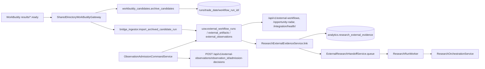
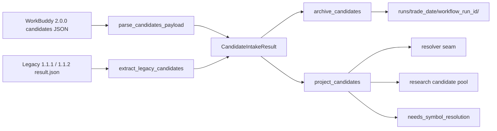
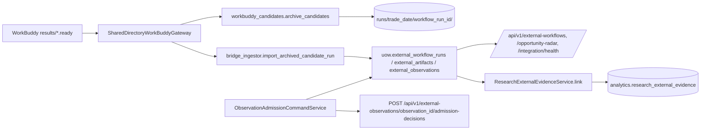
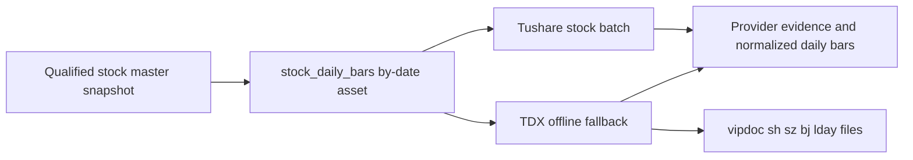

# Pipeline overview

`apps/pipeline/src/invest_pipeline/` runs the daily ETL on top of
Dagster. Assets coordinate two well-known patterns:

- **Three-layer Provider evidence write.** Every Provider call
  produces a `(ProviderRequest, ProviderAttempt, ProviderBatch)`
  triple into `raw.*`. Adapters never write to these tables
  directly — the application service inside a `SqlAlchemyUnitOfWork`
  does.
- **Standardisation into `core.*` / `analytics.*`.** The downstream
  asset reads the persisted request's `response_payload_json`
  sidecar, deserialises the records, resolves canonical IDs, and
  upserts into the business tables using the repository surface.

## 1. Module layout

```
apps/pipeline/src/invest_pipeline/
├── __init__.py
├── assets.py              # @dg.asset definitions (seed_instruments + etf_* + personal_*)
├── definitions.py         # dg.Definitions + personal_etf_daily_job
├── schedules.py           # guarded Asia/Shanghai personal daily schedule
├── daily_preflight.py     # pure run/skip/fail decision gate
├── config.py              # pydantic-settings Settings (universe + policy paths)
├── clock.py               # market_today() — pinned Asia/Shanghai business clock
├── credentials.py         # centralised, lazy provider-credential lookup
├── request_keys.py        # deterministic bounded logical request keys
├── provider_catalog.py    # declarative provider role / capability registry
├── provider_factory.py    # build_provider() — runtime fixture_dev / cifangquant / akshare / tushare
├── provider_quality.py    # DC-1 provider registry contract
├── provider_consistency.py # provider daily-bar consistency comparison
├── provider_routing/      # deterministic dataset × capability routing layer (PR-05)
│   ├── datasets.py        # Dataset StrEnum + DATASET_CAPABILITIES mapping
│   ├── selection.py       # select_providers() pure function
│   ├── coverage.py        # calculate_coverage() pure grid
│   └── probe.py           # build_coverage_samples() input builder
├── candidate_routing/     # dynamic candidate shadow MVP
│   └── shadow.py          # shadow run probe
├── provider_coverage_report.py   # CoverageReportModel + deterministic content hash
├── provider_coverage_plan.py     # select_active_etf_symbols + build_backfill_plan
├── provider_coverage_merge.py    # deterministic multi-provider report merge
├── provider_coverage_cli.py      # read-only coverage CLI (PR-05)
├── historical_daily_bars_cli.py  # guarded historical ETF backfill CLI
├── cifang_smoke.py        # opt-in real-network CifangQuant smoke CLI (ADR-0011 §3)
├── personal_universe.py   # PersonalUniverse YAML loader + resolver
├── personal_daily_cli.py  # manual personal_etf_daily_job driver CLI
├── candidate_pool_service.py  # calculate_and_publish_candidate_pool service
├── adapters/
│   ├── __init__.py        # re-exports FixtureDevInstrumentProvider + error taxonomy
│   ├── errors.py          # ProviderError hierarchy
│   ├── fixture_dev/
│   │   ├── __init__.py
│   │   ├── adapter.py     # FixtureDevInstrumentProvider
│   │   ├── etf_instruments.json
│   │   └── etf_daily_bars.json
│   ├── cifang/            # CifangQuant adapter (ADR-0011 Phase 1 + Phase 2)
│   │   ├── adapter.py     # CifangQuantInstrumentProvider (evidence-tuple adapter)
│   │   ├── client.py      # httpx transport + chunking + error classification
│   │   ├── mapper.py      # /api/fund/list + /api/fund/hist_em field mappers
│   │   ├── config.py      # CifangSettings (redacted, disabled by default)
│   │   └── README.md
│   ├── akshare/           # AkShare ETF data adapter (PR-02 + DC-2 ETF Profile)
│   │   ├── adapter.py     # AkshareInstrumentProvider (Sina-pref + Eastmoney fallback; +fetch_etf_profile + exposure methods)
│   │   ├── client.py      # lazy akshare SDK resolver + per-symbol ETF calls
│   │   ├── mapper.py      # fund_etf_fund_info_em + fund_etf_hist_em + NAV/calendar + ETF profile + holding mappers
│   │   ├── exposure_mapper.py  # CSIndex report_asset_detail / fund_portfolio_hold_em exposure mappers (DC-3)
│   │   ├── holding_mapper.py   # AkShare fund_portfolio_hold_em reported ETF holdings (DC-3)
│   │   ├── config.py      # AkshareSettings (redacted, disabled by default, adjust="")
│   │   └── README.md
│   ├── tushare/           # Tushare Pro adapter (Phase 1 bounded increment)
│   │   ├── __init__.py
│   │   ├── adapter.py     # TushareInstrumentProvider (evidence-tuple adapter)
│   │   ├── client.py      # POST-JSON TushareClient (fund_basic / fund_daily)
│   │   ├── mapper.py      # /api/fund_basic + /api/fund_daily field mappers
│   │   └── config.py      # TushareSettings (redacted, adjust="none", disabled by default)
│   ├── quicktiny_mcp/     # QuickTiny MCP read-only transport (PR-03, research_only)
│   │   ├── client.py      # JSON-RPC 2.0 over httpx (initialize / tools/list / tools/call)
│   │   ├── config.py      # QuickTinyMcpSettings (redacted, default base_url frozen)
│   │   ├── models.py      # frozen response / result dataclasses
│   │   └── README.md
│   ├── rsscast/           # RssCast MCP read-only transport (PR-04, research / index)
│   │   ├── client.py      # JSON-RPC 2.0 + ETF-DailyBar-shaped tool name rejection
│   │   ├── config.py      # RssCastMcpSettings (redacted, base_url NOT frozen)
│   │   ├── models.py      # is_forbidden_tool_name guard
│   │   └── README.md
│   ├── jiuwenswarm/       # JiuwenSwarm research-runner adapter (ADR-0012 / PR-6 Slice 1-3)
│   │   ├── runner.py      # JiuwenSwarmResearchRunner implements domain ResearchRunner port
│   │   ├── transport.py   # JiuwenSwarmGatewayTransport Protocol + result dataclass
│   │   ├── transport_cli.py  # subprocess CLI helper transport (Slice 2)
│   │   ├── codec.py       # JiuwenSwarmGatewayRequest / Completion dataclasses
│   │   ├── mapping.py     # ResearchCase → gateway request, completion → ResearchRunnerDraft
│   │   ├── prompt.py      # build_prompt_text (prompt construction helper)
│   │   ├── config.py      # JiuwenSwarmSettings (helper_path / workspace / artifact_root / timeouts, NOT SDK credential)
│   │   └── errors.py      # JiuwenSwarmError taxonomy
│   └── exposure/          # DC-3 gated ETF exposure adapter boundary
│       ├── akshare_adapter.py  # AkShare exposure adapter (CSIndex/AkShare routing)
│       ├── config.py      # ExposureAdapterSettings (redacted, disabled by default)
│       └── mapping.py     # raw payload → domain IndexProfile/Constituent/EtfHolding snapshots
├── etf_instruments.py     # write_etf_instruments_raw / upsert_etf_instruments
│                         # (owns RawEtlResult + UnitOfWorkFactory helpers)
├── etf_daily_bars.py      # write_etf_daily_bars_raw / upsert_etf_daily_bars
│                         # (re-exports RawEtlResult from etf_instruments)
├── etf_profiles.py        # write_etf_profiles_raw / upsert_etf_profiles (DC-2)
├── etf_profile_context.py # build_etf_profile_context_pack (Stage 4A context slice)
├── exposure_service.py    # persist_exposure (DC-3 bundle / observation writes)
├── exposure_cli.py        # exposure_cli driver for fixture / mapped payloads
├── real_exposure_asset.py # Dagster asset that drives AkShare/CSIndex exposure collection (DC-3)
├── real_exposure_cli.py   # manual CLI driver for real-exposure collection (DC-3)
├── real_exposure_service.py  # service module behind the DC-3 exposure asset
├── research_orchestration_service.py  # PR-7 / ADR-0012 ResearchRunner lifecycle orchestrator
├── research_context_projection.py  # load_context_projection (Stage 4B Phase 3 bundle -> ContextProjection)
├── market_breadth_service.py        # Pipeline application service for Market Breadth v1 + v2
├── market_breadth_bundle_service.py  # bind Market Breadth snapshot to ResearchEvidenceBundle
├── limit_sentiment_service.py       # Stage 4C Limit Sentiment publish service
├── stock_price_limits.py            # Stage 4C Stock Price-Limit raw/core ETL service
├── stock_daily_bars_engine.py       # Stage 4C / ADR-0013 StockDailyBars command / outcome dataclasses
├── stock_daily_bars_application.py  # ADR-0013 Phase 0 application Engine wiring
├── provider_health.py               # Stage 4C / ADR-0013 ProviderHealthSnapshot derivation
├── provider_runtime_registry.py     # ADR-0013 Phase 0 ProviderRuntimeRegistry seam
├── provider_quality.py              # DC-1 quality scorer + Stage 4C fail-closed publishability gate
├── integrations/                   # Stage 4D External Integration Workbench bridge
│   ├── __init__.py                  # re-exports import_archived_candidate_run + SharedDirectoryWorkBuddyGateway
│   ├── bridge_ingestor.py           # import_archived_candidate_run (immutable WorkBuddy archive → integration.*)
│   ├── workbuddy_shared_directory.py # SharedDirectoryWorkBuddyGateway (inbox/processing/archive/failed atomic moves)
│   ├── workbuddy_stage_worker.py    # StagePackageWorker (renameat2-backed atomic claim for all WorkBuddy stages)
│   ├── workbuddy_research_artifacts.py  # ingest_research_artifact — safe local intake of `result.json`/`report.md` packages
│   ├── workbuddy_strategy_archive.py   # StrategyCombinedArchive — phase-A capability / phase-B proposal archive MVP
│   └── admission.py                 # ObservationAdmissionService — evaluate + persist admission in one UoW
├── workbuddy_reports/               # WorkBuddy legacy M0/M1/M2 daily-report governance surface
│   ├── __init__.py                  # re-exports validate_triplet, archive_run, ImportOutcome
│   ├── __main__.py                  # `python -m invest_pipeline.workbuddy_reports {validate,import}` CLI
│   ├── validator.py                 # validate_triplet / ValidationResult / SUPPORTED_RULES_VERSION
│   └── archive.py                   # archive_run / ImportOutcome / latest-accepted pointer + fcntl.flock
├── workbuddy_candidates/            # WorkBuddy candidate intake (M0 contract-aligned)
│   ├── __init__.py                  # parse_candidates_payload / extract_legacy_candidates / CandidateIntakeResult
│   ├── archive.py                   # archive_candidates / ArchiveOutcome (idempotent, conflict-safe)
│   └── projection.py                # project_candidates / ProjectionResult (symbol resolution + dedupe)
├── external_research_handoff.py     # ExternalResearchHandoffService — admitted observation → ResearchRun queue
├── jiuwenswarm_runtime.py           # build_jiuwenswarm_orchestration_service + build_jiuwenswarm_worker
├── research_run_worker.py           # ResearchRunWorker — consumes queued ResearchRun rows
├── research_run_worker_cli.py       # `python -m invest_pipeline.research_run_worker_cli` manual driver
├── workbuddy_bridge_cli.py          # `python -m invest_pipeline.workbuddy_bridge_cli` shared-directory importer
├── workbuddy_research_ingest_cli.py # `python -m invest_pipeline.workbuddy_research_ingest_cli` research-stage manual driver
├── strategy_archive_cli.py          # `python -m invest_pipeline.strategy_archive_cli` single-run archive driver
├── workbuddy_dagster.py             # Dagster `workbuddy_import_job` + `workbuddy_result_import_schedule`
└── input_snapshot.py      # create_input_snapshot (PR-07)
```

Tests live in
[`apps/pipeline/tests/`](../../apps/pipeline/tests/);
unit tests for each service module cover contract and idempotency
guarantees.

## 2. Definitions

[`invest_pipeline.definitions.defs`](../../apps/pipeline/src/invest_pipeline/definitions.py)
registers the assets in dependency order and binds the personal daily
job:

```python
personal_etf_daily_job = dg.define_asset_job(
    name="personal_etf_daily_job",
    selection=[
        etf_instruments_raw,
        etf_instruments,
        etf_daily_bars_raw,
        etf_daily_bars,
        etf_input_snapshot,
        personal_candidate_pool,
    ],
)

dg.Definitions(
    assets=[
        seed_instruments,
        etf_instruments_raw,
        etf_instruments,
        etf_input_snapshot,    # daily-partitioned snapshot
        etf_daily_bars_raw,
        etf_daily_bars,
        personal_candidate_pool,   # partition-aligned candidate pool asset
    ],
    jobs=[personal_etf_daily_job],
    schedules=[personal_etf_daily_schedule],
)
```

The registered [`personal_etf_daily_schedule`](../../apps/pipeline/src/invest_pipeline/schedules.py)
triggers the same partitioned job only after its preflight gate passes.
`make pipeline-dev` runs `dagster dev -m invest_pipeline.definitions`,
and `make test-pipeline` runs `ruff check` + `pytest` + an import
check. `make personal-daily-run` is the manual one-command driver for
`personal_etf_daily_job` (see [Personal CLIs](#11-personal-clis)).

### Guarded schedule and preflight

[`daily_preflight.py`](../../apps/pipeline/src/invest_pipeline/daily_preflight.py)
is an infrastructure-free decision gate. In order, it fails future dates,
unknown providers and unavailable personal-universe data; skips weekends,
already-published dates, already-running dates, and (when a caller supplies
one) data that is not ready; and otherwise returns `run / ready`. Loader and
data-check exceptions become the stable failure reasons
`personal_universe_unavailable` and `data_check_failed`.

[`schedules.py`](../../apps/pipeline/src/invest_pipeline/schedules.py)
registers `personal_etf_daily_schedule` for
`personal_etf_daily_job` at `10 16 * * 1-5` in `Asia/Shanghai`. It is
`STOPPED` unless `INVEST_PIPELINE_AUTO_SCHEDULE_ENABLED=true` exactly
(case-insensitive after trimming). A ready tick emits the stable
`run_key=personal-etf-daily:{YYYY-MM-DD}`, the matching partition key, and
`trade_date` / `trigger_type=schedule` tags. A skip returns a Dagster
`SkipReason`; a failed preflight raises a runtime error. The schedule checks
both an existing published candidate-pool run and a running
`ops.pipeline_runs` row, providing two layers of single-run protection.

## 3. Asset graph

```
seed_instruments ───────────────┐
                                ↓
                etf_instruments_raw ──→ etf_instruments ──→ etf_input_snapshot ──→ personal_candidate_pool
                                          │
                                          └──→ etf_daily_bars_raw ──→ etf_daily_bars ──┘
                                                                                       ↑
                                              (partition-aligned on trade_date)
```

`personal_etf_daily_job` selects the six downstream assets
(`etf_instruments_raw` → `etf_daily_bars` → `etf_input_snapshot` →
`personal_candidate_pool`) so the whole personal daily pipeline is
materializable as a single job.

- `seed_instruments` exists for the greenfield slice and seeds the
  canonical rows directly. Production cuts over to the `etf_*`
  assets; the asset is still registered so the slice validation works.
- `etf_instruments_raw` writes the three-layer evidence bundle and
  persists the standardized records inside the SAME raw transaction
  (request → attempt → batch → instruments upsert). The asset now
  resolves the provider through `provider_factory.build_provider()`
  rather than constructing `FixtureDevInstrumentProvider` directly, so
  the `INVEST_PIPELINE_PROVIDER_KEY` setting gates which adapter is
  exercised at runtime.
- `etf_instruments` re-opens a `SqlAlchemyUnitOfWork`, reads the
  attempt's `response_payload_json`, deserialises the records and
  upserts them into `core.instruments`. Both providers and the asset
  use the formal `dataset_key="etf_instruments"`; keeping this raw
  logical key aligned prevents a CifangQuant request from being missed
  by a stale `"instruments"` lookup. If the upstream attempt
  failed the asset returns a `MaterializeResult` with `skipped=True`
  rather than raising, so a contract failure doesn't cascade into a
  Dagster retry storm.
- `etf_daily_bars_raw` / `etf_daily_bars` mirror that pattern for
  `core.daily_bars`; `etf_daily_bars.upsert_many` is the call site
  where the ADR-0006 revision rules apply (no-op on identical
  `row_hash`, `latest+1` on a content change). The raw sidecar stamps
  `source_provider` from the request's actual provider key, preserving
  `cifangquant` provenance instead of defaulting every row to
  `fixture_dev`. The raw writer uses
  `SqlAlchemyProviderRequestRepository.get_or_create` so a re-run of
  the same `(provider_key, dataset_key, request_key)` triple reuses
  the existing `raw.provider_requests` row and allocates a fresh
  `attempt_no` (rather than tripping the
  `uq_provider_requests_logical_key` constraint), keeping reruns
  idempotent. During core upsert, the service scans up to 1,000
  persisted attempts and selects the latest successful one by
  `finished_at` with `attempt_no` as the deterministic tiebreaker;
  storage returns attempts oldest-first, so taking the first success
  could otherwise replay a stale sidecar.
- `etf_input_snapshot` is a `DailyPartitionsDefinition` asset keyed
  by `trade_date` (the partition starts on `2026-07-23`). It loads
  `config/personal-universe.yaml` via `personal_universe.load_personal_universe`,
  resolves every configured symbol to exactly one ETF `Instrument`
  through `personal_universe.resolve_personal_universe`, and stores
  the resulting `InputSnapshot` (see [Personal universe](#9-personal-universe--config)).
  Resolution fails loudly when a symbol is missing, the matched
  instrument is not an ETF on SSE / SZSE, or the symbol is ambiguous
  across rows.
- `personal_candidate_pool` is a `DailyPartitionsDefinition` asset
  that runs the candidate pool service for the partition's trade
  date. It depends on `etf_input_snapshot` (so the snapshot row
  exists) and on `etf_daily_bars` (so the daily bars the calculator
  needs are already persisted). It loads
  `config/candidate-pool-personal.yaml` via
  `load_candidate_pool_policy` and delegates to
  `candidate_pool_service.calculate_and_publish_candidate_pool`
  (see [Candidate pool service](#10-candidate-pool-service)).

All six production assets in this job share the same `DailyPartitionsDefinition`
starting at `2026-07-23`. The master-data assets derive `as_of` only from
`context.partition_key` rather than `date.today()`, and the daily-bars assets
reject explicit date arguments that do not match the partition. This keeps
historical backfills on the requested trade date; `seed_instruments` remains
the intentionally unpartitioned fixture-only path.

## 4. `fixture_dev` adapter

[`FixtureDevInstrumentProvider`](../../apps/pipeline/src/invest_pipeline/adapters/fixture_dev/adapter.py)
is the **only** adapter that ships fully enabled by default; the
[`cifang` adapter](#5-cifang-adapter-adr-0011-phase-1-first--second-increments)
and [`akshare` adapter](#5b-akshare-adapter-pr-02)
are wired end-to-end but disabled until the relevant `*Settings.enabled=True`.
`fixture_dev` returns:

- **ETF instruments** from `fixture_dev/etf_instruments.json` — 16
  active SSE / SZSE ETF symbols covering the broad-market, sector
  and bond categories used throughout the slice.
- **ETF daily bars** from `fixture_dev/etf_daily_bars.json` — six
  trading days (2026-07-23..2026-07-30) of OHLCV rows including a
  deliberately mixed `trading_status` (mix of `normal` and
  `suspended`) so the calculator's `suspended` exclusion path is
  exercised by the test suite.

The adapter's role is **purely deterministic**: serialise-deserialise
helpers keep the standardisation tests honest about sidecar shapes
and the `response_payload_json` round-trip. The fixture is the
default for `INVEST_PIPELINE_PROVIDER_KEY`; production deployment
of `cifangquant` and `akshare` is still blocked on ADR-0011 O-1 /
O-3 / O-4, and the fixture is what the storage + pipeline + API
layers exercise when those open questions are unresolved.

## 5. `cifang` adapter (ADR-0011, Phase 1 first + second increments)

[`apps/pipeline/src/invest_pipeline/adapters/cifang/`](../../apps/pipeline/src/invest_pipeline/adapters/cifang/)
is the CifangQuant Provider adapter documented in
[ADR-0011](../../docs/adr/0011-cifangquant-primary-etf-provider.md)
(Status: Proposed). The package spans two stacked increments; both
keep `CifangSettings.enabled=False` as the authoritative opt-in gate
so CI never reaches the network.

**First increment (configuration + port lock).** Establishes the
public surface:

- [`CifangSettings`](../../apps/pipeline/src/invest_pipeline/adapters/cifang/config.py)
  is a `pydantic-settings` model with `enabled=False` by default,
  `adjustment` locked to the literal `"none"` (rejected otherwise,
  ADR-0005 §4) and `api_key` carried as a `pydantic.SecretStr` whose
  `__repr__` / `__str__` / `redacted_dict()` render `"***"`. The
  env-prefix is `INVEST_PIPELINE_CIFANG_*`.
- [`CifangQuantInstrumentProvider`](../../apps/pipeline/src/invest_pipeline/adapters/cifang/adapter.py)
  exposes the same `fetch_instruments` / `fetch_daily_bars` shape as
  `FixtureDevInstrumentProvider`, so the Domain
  `EtfMarketDataProvider` port is satisfied.

**Second increment (httpx client + field mapper + evidence-tuple
adapter).** Adds the real I/O pieces wired together behind the same
port:

- [`client.py`](../../apps/pipeline/src/invest_pipeline/adapters/cifang/client.py)
  wraps `httpx.Client` with endpoint construction
  (`/api/fund/list`, `/api/fund/hist_em`), `x-api-key` header
  injection, a 10s connect / 30s read timeout, bounded exponential
  backoff (3 attempts, `429 / 500 / 502 / 503 / 504` retryable;
  `401 / 403` mapped to `ProviderAuthenticationError`), and the
  50-symbol chunking rule for `/api/fund/hist_em`. Every transport
  side effect (transport, sleep, clock) is injectable so tests
  replay CI deterministically.
- [`mapper.py`](../../apps/pipeline/src/invest_pipeline/adapters/cifang/mapper.py)
  translates `CifangResponse` payloads into domain
  `Instrument` / `DailyBar` instances. It applies the
  SSE / SZSE allow-list, the ETF filter (non-ETF rows skipped with a
  warning), the `SH → SSE` / `SZ → SZSE` exchange aliasing, the
  nullable `amount` / `prev_close` fields, and the normalisation
  hooks for the real upstream payload shape.
- The `adapter` now reads `CifangSettings.enabled` and refuses to
  reach the network when `False` — both `fetch_*` methods raise
  `RealProviderRequiresExplicitEnablementError` with a pointer to
  ADR-0011 §3 / O-1 / O-3 / O-4. When `enabled=True`, the adapter
  drives the client and mapper, packages a successful (or failed)
  evidence bundle, and emits a `ProviderBatch` whose
  `raw_payload_hash` is the SHA-256 of the parsed payload (the wire
  bytes are SHA-256'd by the client too).
- The top-level
  [`adapters/__init__.py`](../../apps/pipeline/src/invest_pipeline/adapters/__init__.py)
  still does **not** re-export `CifangQuantInstrumentProvider`
  (ADR-0011 §5 defers the public symbol-table change); callers go
  through `from invest_pipeline.adapters.cifang import …` or via
  `provider_factory.build_provider()` (see
  [Provider factory](#12-provider-factory)).

The `cifang` adapter is the only ETF daily-bars **provider that has
been exercised end-to-end against a real network in this slice**.
Real calls require three opt-ins: `CifangSettings.enabled=True` (via
`INVEST_PIPELINE_CIFANG_ENABLED=true`), a non-empty
`INVEST_PIPELINE_CIFANG_API_KEY`, and `--confirm-network` on the
smoke CLI — see [Personal CLIs](#11-personal-clis). The provider
remains gated on ADR-0011 O-1 / O-3 / O-4 closure for production use.
[`akshare`](#5b-akshare-adapter-pr-02) and
[`tushare`](#5d-tushare-pro-adapter-phase-1-bounded-increment) are
also fully wired in the factory. The historical three-provider plan
(`eastmoney` / `sina` / `tonghuashun` Phase-1 stubs) was de-scoped
in this slice; see [Provider catalog](#7-provider-catalog) for the
eight catalog declarations.

## 5b. `akshare` adapter (PR-02)

[`apps/pipeline/src/invest_pipeline/adapters/akshare/`](../../apps/pipeline/src/invest_pipeline/adapters/akshare/)
is the read-only AkShare provider documented in
[`DATA-SOURCE-MIGRATION-MATRIX.md` §2 / §5.4 / §10](../../docs/implementation/DATA-SOURCE-MIGRATION-MATRIX.md).
The package mirrors the Cifang layer separation (`client.py` is the
only module that may import the `akshare` SDK; the import is
performed lazily in `_resolve_module()` and surfaces
`ProviderUnavailableError` on `ImportError` so CI never fails
purely because the optional SDK is absent).

- [`config.py`](../../apps/pipeline/src/invest_pipeline/adapters/akshare/config.py) ships `AkshareSettings` with
  `enabled=False` default, `adjust` **locked to `""`** (the
  AkShare "no adjustment" literal; ADR-0005 §4 forbids `hfq` /
  `qfq`), `timeout_seconds > 0`, optional `SecretStr` token, and a
  `redacted_dict()` that masks the token.
- [`adapter.py`](../../apps/pipeline/src/invest_pipeline/adapters/akshare/adapter.py) exposes
  `AkshareInstrumentProvider` with the same
  `EtfMarketDataProvider` surface as Cifang, plus three read-only
  extensions: `fetch_nav(symbol)` (which rides on
  `AkshareNavRecord` — `unit_nav` / `accumulated_nav` /
  `daily_growth_rate`; **NAV is never coerced to OHLCV** per the
  V2 plan §5 Task 2 invariant), `fetch_trading_calendar()` (date-only
  records), and `fetch_etf_profile()` (the DC-2 ETF Profile surface —
  fans out to `ak.fund_name_em()` and `ak.fund_etf_spot_em()`,
  joins the payloads by `基金代码` in `merge_etf_profile`, and stamps
  the result on a dedicated `ProviderBatch` with
  `dataset_key="etf_profile"`).
- [`client.py`](../../apps/pipeline/src/invest_pipeline/adapters/akshare/client.py) lazily resolves the
  optional `akshare` SDK; every call uses `hasattr(module, operation)`
  and raises `ProviderUnavailableError` on missing operations. The
  DC-2 Profile slice added `fetch_fund_name_em` and
  `fetch_fund_etf_spot_em`; the upstream `总市值` column is read
  but explicitly **not** mapped to `aum` (AUM is a Provider-disclosed
  figure, not a market-cap calculation).
- [`mapper.py`](../../apps/pipeline/src/invest_pipeline/adapters/akshare/mapper.py) translates
  `fund_etf_fund_info_em` and `fund_etf_hist_em` responses (plus
  the NAV / calendar / ETF profile surfaces) into domain
  `Instrument` / `DailyBar` / `AkshareProfileRecord` rows. As of `07cfd65` the
  `fetch_daily_bars` loop prefers Sina (`fund_etf_hist_sina`) and
  falls back to Eastmoney (`fund_etf_hist_em`); the resulting
  `DailyBar.source.provider_key` records which upstream actually
  served the row, so a Sina-success path is distinguishable from an
  Eastmoney-fallback path in the raw evidence tables. The DC-2
  slice adds `merge_etf_profile` (joins the `fund_name_em` /
  `fund_etf_spot_em` payloads by symbol) and
  `map_etf_profile_to_field_evidence` (the PR-ETF-PROFILE-02
  Provider Mapping slice that converts the merged
  `AkshareProfileRecord` rows into domain `FieldEvidence` rows for
  `FUND_TYPE` / `CATEGORY` / `SHARES` only — `AUM` and
  `MARKET_VALUE` are deliberately never emitted here).
- The `provider_factory` exposes `akshare` as the third runtime
  branch — see [Provider factory](#12-provider-factory) — and
  raises `RealProviderRequiresExplicitEnablementError` when
  `AkshareSettings.enabled=False`. When the optional `akshare`
  SDK is missing, factory construction still succeeds; the
  `ProviderUnavailableError` is raised at fetch time so a
  misconfigured deployment never silently succeeds.

`make` does not yet expose a `provider-smoke` target for AkShare; the
single-ETF / 16-symbol batch probes recorded in
[`docs/implementation/PROVIDER-COVERAGE-2026-08-04.md`](../../docs/implementation/PROVIDER-COVERAGE-2026-08-04.md)
were driven directly through `python -m
invest_pipeline.provider_coverage_cli`. As of 2026-08-04 the SDK
is installed and importable but the 16-symbol batch hit
`ProxyError / RemoteDisconnected` against EastMoney via the local
proxy; a real full-coverage verdict is pending network recovery.

## 5c. MCP research transports (PR-03 QuickTiny, PR-04 RssCast)

Two read-only MCP adapters share the same JSON-RPC 2.0 envelope but
intentionally do **not** map responses to `DailyBar`:

- [`adapters/quicktiny_mcp/`](../../apps/pipeline/src/invest_pipeline/adapters/quicktiny_mcp/)
  talks to `https://stock.quicktiny.cn/api/mcp` (the
  matrix §9.1 official endpoint) with `initialize` / `tools/list` /
  `tools/call` methods. `QuickTinyMcpSettings` defaults to
  `enabled=False`, `base_url` frozen to the official endpoint,
  bounded timeout, and redacted `SecretStr` token. PR-03 deliberately
  ships transport only — no `etf_market` → `DailyBar` mapping per
  matrix §3 / §5.4 / §9.2 — so the catalog advertises only
  `RESEARCH` and `MARKET_SNAPSHOT`.
- [`adapters/rsscast/`](../../apps/pipeline/src/invest_pipeline/adapters/rsscast/) shares the
  JSON-RPC envelope but **rejects ETF-DailyBar-shaped tool names**
  (`etf_daily_bars`, `fund_history`, `etf_kline_em`, …) at
  `call_tool` time via `is_forbidden_tool_name`, raising
  `ProviderDataContractError("RSSCAST_ETF_DAILY_BARS_FORBIDDEN")` so
  a misconfigured caller cannot accidentally promote an upstream
  ETF-DailyBar-shaped response into a `core.daily_bars` row.
  `RssCastMcpSettings` defaults to `enabled=False` and `base_url=""`
  — matrix §1 explicitly notes that the archive did not freeze a
  fixed endpoint, so operators must set
  `INVEST_PIPELINE_RSSCAST_BASE_URL` before enabling the adapter.

Neither adapter extends `provider_factory.build_provider`; both are
exercised only through the catalog declaration. The MCP transports
are research-only — they do not write to PostgreSQL, do not
participate in the `personal_etf_daily_job` and do not reach the
Dagster asset graph. CI uses `httpx.MockTransport` so the suite
never opens a TCP connection.

## 5d. Tushare Pro adapter (Phase 1 bounded increment)

[`apps/pipeline/src/invest_pipeline/adapters/tushare/`](../../apps/pipeline/src/invest_pipeline/adapters/tushare/)
is the read-only Tushare Pro adapter that PR-02 / DC-1 added as a
secondary ETF source. The package mirrors the Cifang layer
separation (`client.py` is the only module that may issue
HTTP/POST-JSON; the mapper is pure):

- [`config.py`](../../apps/pipeline/src/invest_pipeline/adapters/tushare/config.py) ships `TushareSettings`
  with `enabled=False` default, `adjust` **locked to `"none"`**
  (ADR-0005 §4), and a `SecretStr` token whose `__repr__` / `__str__`
  / `redacted_dict()` masks the value. The token is read from the
  centralized credential store at request time only
  (`TushareSettings.resolved_token()`) so the settings object is
  safe to construct in CI without credentials being present.
- [`client.py`](../../apps/pipeline/src/invest_pipeline/adapters/tushare/client.py) wraps
  `httpx.Client` against the single `https://api.tushare.pro`
  endpoint with a `POST` JSON body of
  `{api_name, token, params, fields}`. The client is inert until
  the first `fetch_*` call; constructor injection lets tests
  substitute a `FakeTushareClient` and the suite never opens a
  real TCP connection.
- [`mapper.py`](../../apps/pipeline/src/invest_pipeline/adapters/tushare/mapper.py) translates
  `fund_basic` and `fund_daily` payloads into domain
  `Instrument` / `DailyBar` instances. The slice is intentionally
  bounded to the two documented ETF surfaces; the SSE / SZSE
  allow-list and the `SH → SSE` / `SZ → SZSE` exchange aliasing
  mirror the Cifang mappers.
- [`adapter.py`](../../apps/pipeline/src/invest_pipeline/adapters/tushare/adapter.py) exposes
  `TushareInstrumentProvider` with the same
  `EtfMarketDataProvider` surface as the Cifang / AkShare adapters
  (`fetch_instruments` / `fetch_daily_bars`). The provider reads
  `TushareSettings.enabled` and refuses to reach the network when
  `False` — both `fetch_*` methods raise
  `RealProviderRequiresExplicitEnablementError` with a pointer to
  the centralized credential store. When `enabled=True`, the
  adapter drives the client and mapper, packages a successful (or
  failed) evidence bundle, and emits a `ProviderBatch` whose
  `raw_payload_hash` is the SHA-256 of the parsed payload.
- The `provider_factory` exposes `tushare` as the fourth runtime
  branch — see [Provider factory](#12-provider-factory) — and
  raises `RealProviderRequiresExplicitEnablementError` when
  `TushareSettings.enabled=False` and `ProviderAuthenticationError`
  when the token is empty. Construction always succeeds; the
  token is read lazily on the first request so a CI build can
  construct the provider without the secret file being present.

### Centralized credential store

[`apps/pipeline/src/invest_pipeline/credentials.py`](../../apps/pipeline/src/invest_pipeline/credentials.py)
is the single source of truth for provider credentials:

- `DEFAULT_SECRETS_DIR` is `/home/claw/invest-secrets`; the env
  variable `INVEST_PIPELINE_SECRETS_DIR` overrides the root.
- The `_CREDENTIAL_FILES` table maps every supported provider_key
  to its filename inside the secrets directory
  (`cifangquant.api_key` / `akshare.token` / `rsscast.token` /
  `tushare.token` / `hithink.api_key`). The `hithink` mapping is the
  reserved entry
  ([`tasks/hithink-reserved-provider-plan.md`](../../tasks/hithink-reserved-provider-plan.md))
  exposes today; the file is never read by a runtime factory
  branch, but `CredentialStore.resolve("hithink", explicit_value)`
  already returns the value once a real credential is dropped into
  the centralized secrets directory.
- `CredentialStore.resolve(provider_key, explicit_value="")` returns
  the explicit value when supplied and otherwise reads and trims
  the matching file. Unknown provider_keys raise `ValueError`;
  `OSError` from a malformed file becomes a `RuntimeError` that
  never embeds the credential value.
- Per-adapter settings classes (`CifangSettings.api_key` /
  `AkshareSettings.token` / `RssCastMcpSettings.token` /
  `TushareSettings.token`) call
  `CredentialStore().resolve(provider_key, explicit_value)` so the
  explicit `INVEST_PIPELINE_*` env-var override remains the
  highest-priority path; the centralized file is the fallback.

The historical V2 three-provider plan
([`docs/plan/invest-infra-v2-all-data-sources-integration-plan.md`](../../docs/plan/invest-infra-v2-all-data-sources-integration-plan.md))
once proposed standalone `eastmoney` / `sina` / `tonghuashun`
adapters. That plan has been **de-scoped** in this slice: the
three sources are not selectable runtime providers in V2 and the
catalog carries no declaration for them. Their public
historical-quotes endpoints remain internal upstreams of the
AkShare aggregator (`fund_etf_hist_sina` / `fund_etf_hist_em`)
and surface only as `source_key` values on `BarSource` rows
produced by the AkShare adapter.

## 5e. `jiuwenswarm` research-runner adapter (PR-6 Slice 1-3, historical compatibility)

> **Historical-compatibility note.** The JiuwenSwarm adapter,
> runtime composition root, and queued `ResearchRunWorker` are
> preserved in the codebase for historical compatibility only. Per
> [`docs/plan/README.md`](../../docs/plan/README.md) the external
> research platform is "已停止采用" (no longer adopted); current
> active plans must not depend on JiuwenSwarm for integration,
> upgrades, or acceptance gates. The Stage 4D controlled
> `ResearchRun` queue still defaults to
> `JIUWENSWARM_RUNNER_KEY="jiuwenswarm-runner-v1"` because that
> is the single runner key the existing pipeline handoff service
> admits — see [§5k](#5k-stage-4d-external-integration-workbench-bridge-ingest--shared-directory-gateway) —
> but the runner key is the only operational link, not a forward
> integration commitment.

[`apps/pipeline/src/invest_pipeline/adapters/jiuwenswarm/`](../../apps/pipeline/src/invest_pipeline/adapters/jiuwenswarm/)
is the research-runner adapter behind the
[`ResearchRunner`](../domain/overview.md#4c-evidence-driven-research-lifecycle-adr-0012)
domain port that ADR-0012 mandates. It is a pure pipeline-side
boundary — **no JiuwenSwarm credential or SDK is imported by the
domain package**. The package lands in three staged slices:

- **Slice 1 — port + runner.**
  [`runner.py`](../../apps/pipeline/src/invest_pipeline/adapters/jiuwenswarm/runner.py)
  is the only layer that wires the domain `ResearchRunner` port to
  the JiuwenSwarm gateway transport. It enforces three contracts:
  the runner / playbook / pack trio must be bound (case / run IDs
  match the pack, the run is `RUNNING`, the playbook's key matches
  the run's `playbook_key`); the adapter version declared by the
  gateway completion must match the runner's `adapter_version` so
  a re-deploy cannot masquerade as the previous version's
  results; the transport is called exactly once per `runner.run`
  invocation (the Slice 3 orchestrator owns retry policy).
  [`config.py`](../../apps/pipeline/src/invest_pipeline/adapters/jiuwenswarm/config.py)
  freezes seven explicit fields the contract requires
  (`helper_path` / `workspace` / `artifact_root` /
  `python_executable` / `mode` / `timeout_seconds` /
  `idle_timeout_seconds`) and is intentionally a plain dataclass so
  the runner is constructed explicitly by the orchestrator without
  pulling in `pydantic_settings`.
  [`codec.py`](../../apps/pipeline/src/invest_pipeline/adapters/jiuwenswarm/codec.py)
  freezes the JSON envelope (`JiuwenSwarmGatewayRequest`,
  `JiuwenSwarmCompletion`, `JiuwenSwarmAcceptance`,
  `JIUWENSWARM_SCHEMA_VERSION`); [`mapping.py`](../../apps/pipeline/src/invest_pipeline/adapters/jiuwenswarm/mapping.py)
  translates `ResearchCase` + `EvidencePack` into the gateway
  request and a submitted completion back into a
  `ResearchRunnerDraft`. [`prompt.py`](../../apps/pipeline/src/invest_pipeline/adapters/jiuwenswarm/prompt.py)
  builds the prompt text the gateway streams.
  [`errors.py`](../../apps/pipeline/src/invest_pipeline/adapters/jiuwenswarm/errors.py)
  is the stable taxonomy: `JiuwenSwarmError` →
  `JiuwenSwarmTransportError` / `JiuwenSwarmMalformedResultError` /
  `JiuwenSwarmRemoteFailureError` /
  `JiuwenSwarmTimeoutUncertainError`.
- **Slice 2 — subprocess CLI transport.**
  [`transport.py`](../../apps/pipeline/src/invest_pipeline/adapters/jiuwenswarm/transport.py)
  is the synchronous `JiuwenSwarmGatewayTransport` Protocol Slice 2
  satisfies; [`transport_cli.py`](../../apps/pipeline/src/invest_pipeline/adapters/jiuwenswarm/transport_cli.py)
  is the `JiuwenSwarmCliGatewayTransport` implementation that
  invokes a single helper-CLI process with
  `--transport gateway --task-file TASK --mode MODE --session-key
  KEY --workspace WORKSPACE --request-id REQUEST_ID --output-dir
  DIR --timeout TIMEOUT --idle-timeout IDLE`. The transport writes
  per-request artefacts inside an operator-controlled
  `artifact_root` and parses a `request_id`-anchored summary line
  out of the helper stdout so the orchestration service can
  reconcile the external identity.
- **Slice 3 — identity-bearing orchestrator surface.**
  [`runner.py`](../../apps/pipeline/src/invest_pipeline/adapters/jiuwenswarm/runner.py)
  exposes `run_with_identity(case, run, playbook, pack) -> JiuwenSwarmRunOutcome`
  so the orchestrator can persist the
  `(request_id, session_id)` pair the gateway echoed back
  alongside the `ResearchRunnerDraft`. `run(...)` is preserved as
  a delegating wrapper so Slice 1 / Slice 2 callers see no
  behavioural change.

The adapter is opt-in: the Slice 1 transport can be substituted
with any structural implementation of `JiuwenSwarmGatewayTransport`
(a fake used by `test_jiuwenswarm_adapter.py`,
`test_jiuwenswarm_slice2.py`, and the
`research_orchestration_service` test doubles). The CLI helper
binary is operator-pinned (`JiuwenSwarmSettings.helper_path`); the
transport never resolves `PATH` and never falls back to a bare
`python` lookup.

## 5f. Exposure adapters and DC-3 collection (PR-DC3)

[`apps/pipeline/src/invest_pipeline/adapters/exposure/`](../../apps/pipeline/src/invest_pipeline/adapters/exposure/)
defines the gated ETF exposure surface — `akshare_adapter.py`
routes CSIndex (`report_asset_detail` / `fund_portfolio_hold_em`)
and AkShare holding calls into `IndexProfile`,
`IndexConstituentSnapshot`, `EtfIndexMapping` and
`EtfHoldingSnapshot` rows. `ExposureAdapterSettings` defaults to
`enabled=False`. The complementary
[`akshare/exposure_mapper.py`](../../apps/pipeline/src/invest_pipeline/adapters/akshare/exposure_mapper.py)
and
[`akshare/holding_mapper.py`](../../apps/pipeline/src/invest_pipeline/adapters/akshare/holding_mapper.py)
cover the unstructured payload paths so a single AkShare session can
saturate the index-constituent, ETF-mapping and ETF-holding
surfaces without going through a second transport.

The pipeline-side collectors are `real_exposure_asset.py` (the
Dagster asset wrapping the collection), `real_exposure_service.py`
(transport-aware service module: per-record six-digit symbol /
exchange normalisation, naive-`observed_at` rejection, ETF-only
filter, instrument-id resolution, content-hash dedupe) and
`real_exposure_cli.py` (manual driver that emits the same JSON
summary shape the asset emits). The
[`exposure_service.persist_exposure`](../../apps/pipeline/src/invest_pipeline/exposure_service.py)
function is the **only** writer — it opens a `UnitOfWork`, persists
the bundle + observations, and returns the persisted bundle id.
The matching `exposure_cli.py` is the fixture payload driver.

## 5g. Research orchestration service (PR-7 / ADR-0012)

[`apps/pipeline/src/invest_pipeline/research_orchestration_service.py`](../../apps/pipeline/src/invest_pipeline/research_orchestration_service.py)
is the application service that drives one research attempt through
its full lifecycle. `ResearchOrchestrationService.execute(run_id)`
uses short `SqlAlchemyUnitOfWork` transactions to load and start the
bounded `ResearchCase` / `ResearchRun` / evidence-pack trio, invokes
the configured `ResearchRunnerWithIdentity` outside the database
transaction, and then persists the external identity, terminal state,
and result through `uow.research_runs` + `uow.research_results`.
JiuwenSwarm transport outcomes are translated into deterministic
orchestration outcomes and exceptions, including timeout-uncertain and
reconciliation-required states. The service is intentionally conservative:
it never invents
`evidence_ids`, never publishes a `ResearchResult` whose evidence
references are not in the pack, and rejects duplicate-request
scenarios with `ResearchOrchestrationConflictError` so the
idempotency-keyed `analytics.research_runs` row is the single
source of truth.

## 5h. Research context-projection loader (ADR-0012 / Stage 4B Phase 3)

[`apps/pipeline/src/invest_pipeline/research_context_projection.py`](../../apps/pipeline/src/invest_pipeline/research_context_projection.py)
is the application-layer gateway that rebuilds a
[`ContextProjection`](../../packages/domain/src/invest_domain/research/evidence_bundle.py)
for a single `ResearchRun` from the
`ResearchEvidenceBundle` row plus the `MarketObservationSnapshot`
rows it references. It is intentionally read-only: the helper
takes an already-opened `SqlAlchemyUnitOfWork` and the case / run /
evidence-pack trio that the orchestrator's Tx1 path has already
loaded, then re-derives the projection through the pure-domain
`invest_domain.research.evidence_bundle.build_projection` factory.
It does not open its own transaction and does not call
`commit` / `rollback`; the orchestrator owns the boundary.

Failures fail closed via a single `ContextProjectionLoadError`
(a `ValueError`):

- A `ResearchRun` with `evidence_bundle_id is None` cannot silently
  downgrade to a no-op projection; the helper raises so the caller
  must opt out explicitly by checking the field before invoking.
- A missing `ResearchEvidenceBundle` row, missing
  `MarketObservationSnapshot` row, or any drift on bundle id / case
  id / pack id / pack hash / as-of date / snapshot id / snapshot
  content hash / snapshot as-of date / `QualityStatus.COMPLETE` /
  `FreshnessStatus.FRESH` raises the same exception. The domain
  `build_projection` then re-validates the supplied upstream
  evidence so a stale snapshot cannot leak into the AI input even
  if the storage read lies.

Focused tests live in
[`apps/pipeline/tests/unit/test_research_context_projection.py`](../../apps/pipeline/tests/unit/test_research_context_projection.py)
and cover the success path, the missing bundle / missing snapshot
negatives, the full mismatch matrix, and the legacy `None` case.
This slice provides the application-side reader that goes through
`uow.research_evidence_bundles.get_by_id` and
`uow.market_observation_snapshots.get_by_content_hash`. The
`ResearchOrchestrationService` loads it inside Tx1 for bundle-bound
runs, and the JiuwenSwarm adapter forwards the serialized projection
under `payload.context_projection`. Runs without a Bundle retain the
legacy EvidencePack-only payload. The bundle / snapshot repositories
therefore have a verified downstream research consumer
(see [Storage overview §3](../storage/overview.md#3-repositories-repositoriespy)).

## 5i. Stage 4C Stock Price-Limits ETL service

[`apps/pipeline/src/invest_pipeline/stock_price_limits.py`](../../apps/pipeline/src/invest_pipeline/stock_price_limits.py)
hosts the asset-agnostic ETL logic for the
`stock_price_limits` vertical slice. The slice persists the PR-02
three-layer evidence bundle and the ADR-0006 §3 revision-model
core rows behind two transactions:

- `write_stock_price_limits_raw(provider, session_factory, *,
  unit_of_work_factory=SqlAlchemyUnitOfWork)` calls the Provider,
  resolves the existing `provider_requests` row through
  `SqlAlchemyProviderRequestRepository.get_or_create`, allocates a
  fresh `attempt_no`, persists the attempt and (on success) the
  batch, and stamps the deterministic JSONB sidecar onto
  `raw.provider_attempts.response_payload_json`. Failed attempts
  persist only the request + attempt; no batch row is created
  per the `ck_provider_attempts_failed_has_error` invariant.
- `upsert_stock_price_limits(session_factory, *, ...)` re-opens a
  fresh UoW, locates the latest successful attempt for the
  `(provider_key, dataset_key, request_key)` triplet, deserialises
  the records from the sidecar, resolves the active
  `core.instruments.id` per `(exchange, symbol)`, and upserts the
  price-limit rows into `core.stock_price_limits` under the
  revision rules. A sidecar record carrying status `unknown` is
  rejected with `ValueError` so the application service refuses to
  write `core` rows for indeterminate policy results — the
  upstream regime coverage gap cannot silently land in the core
  table.

`_VALID_STATUSES` freezes the
`{"known", "unlimited", "unknown"}` vocabulary the
`PriceLimitRecord.status` sidecar may carry; the `_PRICE_LIMITS_SCHEMA_VERSION`
constant is part of the sidecar payload so a future format change
is detected at parse time. The `serialize_stock_price_limits` /
`deserialize_stock_price_limits` helpers use `sort_keys=True` so
re-collects of identical content produce byte-identical payloads
and `raw.provider_attempts.response_payload_sha256` stays stable
across reruns.

The fixture provider lives at
[`apps/pipeline/src/invest_pipeline/adapters/fixture_dev/price_limits.py`](../../apps/pipeline/src/invest_pipeline/adapters/fixture_dev/price_limits.py).
`FixtureDevStockPriceLimitsProvider` returns the PR-02 evidence
tuple directly (`ProviderRequest` / `ProviderAttempt` /
`ProviderBatch[PriceLimitRecord]`) with a deterministic payload
hash for the regimes in `DEFAULT_PRICE_LIMIT_REGIMES` plus the
risk-warning and IPO unlimited-session branches the domain policy
distinguishes. It is **not** catalog-routed: the
`ProviderCapability.STOCK_PRICE_LIMITS` enum member and the
`Dataset.STOCK_PRICE_LIMITS` dataset key are frozen without a
matching provider declaration, so
`select_providers(Dataset.STOCK_PRICE_LIMITS)` keeps raising
`NoEligibleProviderError`. The provider is callable directly
(`FixtureDevStockPriceLimitsProvider()`).

Focused tests live in
[`apps/pipeline/tests/unit/test_stock_price_limits_service.py`](../../apps/pipeline/tests/unit/test_stock_price_limits_service.py)
and
[`apps/pipeline/tests/unit/test_fixture_dev_price_limits.py`](../../apps/pipeline/tests/unit/test_fixture_dev_price_limits.py);
run them with
`cd apps/pipeline && uv run pytest -q tests/unit/test_stock_price_limits_service.py tests/unit/test_fixture_dev_price_limits.py`.

## 5j. Stage 4C Market Breadth v2 + Limit Sentiment publish services

The Stage 4C observation-snapshot family adds two new pure
publish services on top of the existing
`SqlAlchemyMarketObservationSnapshotRepository`:

- [`market_breadth_service.py`](../../apps/pipeline/src/invest_pipeline/market_breadth_service.py)
  hosts `calculate_and_publish_market_breadth` (v1) and
  `calculate_and_publish_market_breadth_v2`. The v2 path extends
  the per-instrument input to carry `ma60` / `is_new_high` /
  `is_new_low`; the v2 builder publishes the affected ratio as
  `None` and downgrades the snapshot to `PARTIAL / FRESH` whenever
  a normal-trading instrument is missing any v2 field. The lookback
  window widened to `_BREADTH_LOOKBACK_NATURAL_DAYS = 60` (and
  `_V2_BREADTH_LOOKBACK_NATURAL_DAYS = 400` for v2) so the worst
  Chinese-market holiday run cannot leave the breadth builder with
  fewer than 20 trading days. The `StockUniverseEmptyError`
  fail-closed exception surfaces a missing active `STOCK` universe
  as a hard error rather than a partial `InputSnapshot`.
- [`limit_sentiment_service.py`](../../apps/pipeline/src/invest_pipeline/limit_sentiment_service.py)
  hosts `calculate_and_publish_limit_sentiment(uow_factory, *,
  input_snapshot, inputs, as_of)`. The service validates the
  `input_snapshot.snapshot_date` matches `as_of`, refuses
  duplicate or mismatched `instrument_id`s, delegates the
  three-ratio aggregate to
  `invest_domain.analytics.limit_sentiment.build_limit_sentiment`,
  and persists the resulting `MarketObservationSnapshot` through
  the existing repository. The default `algorithm_version` is
  `"1.0.0"`.

Both services are Dagster-free — no asset / schedule / log
machinery — so they can be unit-tested with a hand-rolled fake
UoW. The Stage 4C Checkpoint B acceptance
([`docs/validation/stage4c-mvp-checkpoint-b-acceptance.md`](../../docs/validation/stage4c-mvp-checkpoint-b-acceptance.md))
signs off on the contract suite (`test_stage4c_seeded_replay.py`
+ `test_tushare_tdx_consistency_golden.py`) end-to-end.

## 5k. Stage 4D External Integration Workbench (bridge ingest + shared-directory gateway)

[`apps/pipeline/src/invest_pipeline/integrations/`](../../apps/pipeline/src/invest_pipeline/integrations/)
is the Stage 4D bridge between the WorkBuddy candidate archive
(see [§5n](#5n-workbuddy-candidate-intake-m0-contract-aligned-slice))
and the new `integration.external_*` tables that the read API
([§1 / §2 of API overview](../api/overview.md#2-routing-surface))
surfaces. The bridge stays deliberately minimal — no Provider,
no HTTP, no Dagster asset, no candidate-pool writer. The package
lands in three focused slices:

- **Bridge ingest — `bridge_ingestor.import_archived_candidate_run`.**
  Reads one already-archived WorkBuddy run at
  `<archive_root>/runs/<trade_date>/<workflow_run_id>/{candidates.json,manifest.json}`
  (the same `candidate-intake.manifest/1.0` archive the
  `workbuddy_candidates.archive_candidates` slice writes in
  [§5n](#5n-workbuddy-candidate-intake-m0-contract-aligned-slice)).
  The bridge is **safe by construction**:

  - `trade_date` matches `^\d{4}-\d{2}-\d{2}$` and survives
    `date.fromisoformat()`; `workflow_run_id` matches
    `^[A-Za-z0-9][A-Za-z0-9._-]{0,127}$`. Both checks run before
    the resolved path is computed, so `..` / `.hidden` / a
    non-canonical date cannot smuggle through
    `os.path.join`. The final `(root / "runs" / trade_date /
    workflow_run_id).resolve()` is verified to remain under
    `archive_root` — any escape raises
    `ValueError("archive path escapes archive root")` and aborts
    the import.
  - The manifest's `files[0].sha256` and `files[0].size_bytes`
    are recomputed against the on-disk `candidates.json` payload
    bytes; mismatch raises `ValueError("candidate archive hash or
    size does not match manifest")` so the bridge never persists
    a tampered archive.
  - Stable UUIDs are derived through `uuid5(NAMESPACE_URL,
    "invest-infra:workbuddy-run:<workflow_run_id>")` and
    `uuid5(NAMESPACE_URL, "invest-infra:workbuddy-artifact:<sha256>")`
    so a re-import of the same archive **always** resolves to the
    same `run_id` / `artifact_id` — the integration UoW treats
    those as the natural idempotency keys.
  - On a re-import the bridge returns the existing
    `ExternalWorkflowRun` / `ExternalArtifact` / observation tuple
    with `BridgeImportResult.idempotent=True`; no rows are
    touched, no `project_candidates` re-run, no duplicate
    observations created.
  - Per-observation IDs are `uuid5(NAMESPACE_URL,
    "invest-infra:workbuddy-observation:<workflow_run_id>:<index>:<payload>")`,
    so two archives with byte-identical payloads get identical
    observation IDs across runs.
- **Shared-directory gateway — `workbuddy_shared_directory.SharedDirectoryWorkBuddyGateway`.**
  Manages the filesystem state machine the WorkBuddy producer
  drives via a `<root>/workbuddy/results/<package>.ready/`
  inbox. `process_once()` claims every visible `*.ready` package
  with `os.replace(ready_path, processing/<package>)`, loads the
  payload (preferring `candidates.json`; falling back to the
  legacy `sector_result*.json` / `result*.json` triplet through
  `extract_legacy_candidates`), archives it through
  `archive_candidates(...)` so the governance archive stays the
  single source of truth, then delegates to the bridge above. On
  failure the package is `os.replace`-moved to
  `workbuddy/failed/<package>` and the `SharedDirectoryImport.error`
  field carries the exception text so the operator can diagnose
  without losing the input. On success the package is moved to
  `workbuddy/archive/<package>`. The gateway enforces a 16 MiB
  per-file size cap and refuses any file path that escapes the
  claimed package directory. The whole module is the production
  surface the
  [`docs/plan/invest-infra-stage4d-mvp-phased-execution-plan-v1.0.md`](../../docs/plan/invest-infra-stage4d-mvp-phased-execution-plan-v1.0.md)
  M3 step plugs into; the production CLI
  (`python -m invest_pipeline.integrations …`) is not wired in
  this MVP slice — see [§8 Provider error model](#8-provider-error-model).
- **Observation admission service — `admission.ObservationAdmissionService`.**
  Thin UoW-bound wrapper around the pure-domain
  `invest_domain.integration.evaluate_admission`. The pipeline
  service is the read-only mirror of the API's
  [`ObservationAdmissionCommandService`](../api/overview.md#schemasadmissionpy-stage-4d-gated-command);
  it takes the domain `AdmissionVerification` facts and writes
  the `pending → admitted|rejected|corroborated|conflict`
  transition through `SqlAlchemyExternalObservationRepository.save_admission`.
  No DAG asset / schedule / sensor today — admission is driven
  from the gated HTTP command endpoint per [API overview §5k](../api/overview.md).
- **External research handoff — `external_research_handoff.ExternalResearchHandoffService`.**
  Stage 4D controlled bridge from an admitted external observation
  to the ADR-0012 Research lifecycle. `queue(case_id, evidence_pack_id, playbook, runner_key)`
  runs inside a short `SqlAlchemyUnitOfWork`: it resolves the
  `ResearchCase`, requires at least one linked
  `uow.research_external_evidence.list_by_case(case_id)` row
  (`ExternalResearchHandoffInputError` otherwise), validates the
  bound `EvidencePack`, and refuses a `runner_key` outside the
  frozen `JIUWENSWARM_RUNNER_KEY="jiuwenswarm-runner-v1"`. Existing
  queued/running/succeeded runs for the same
  `(evidence_pack_id, runner_key, playbook_key)` triple return
  the existing row idempotently; `DRAFT` cases are transitioned
  to `READY` through `case_repository.save_transition`. The
  companion `execute(...)` re-uses
  [`ResearchOrchestrationService.execute`](../pipeline/overview.md#5g-research-orchestration-service-pr-7--adr-0012)
  for the long-running external gateway boundary, so the handoff
  service is a pure seam between the WorkBuddy intake and the
  ADR-0012 lifecycle. The API's
  [`ResearchRunCommandService`](../api/overview.md#stage-4d-external-workflow--opportunity-radar--admission--evidence-link-endpoints)
  and the production `ResearchRunWorker` are the two upstream
  callers.



Focused tests live in
[`tests/pipeline/test_bridge_ingestor.py`](../../tests/pipeline/test_bridge_ingestor.py)
(path-safety rejection, manifest hash mismatch, idempotent
re-import, symbol/projection tagging),
[`tests/pipeline/test_workbuddy_shared_directory.py`](../../tests/pipeline/test_workbuddy_shared_directory.py)
(claim-then-move atomicity, success → archive, failure → failed,
legacy-fallback when `candidates.json` is absent, 16 MiB size
cap, package-path-escape rejection),
[`apps/pipeline/tests/unit/test_external_research_handoff.py`](../../apps/pipeline/tests/unit/test_external_research_handoff.py)
(missing case / missing evidence / missing pack / cross-runner-key
rejection, idempotent re-queue, DRAFT → READY transition, fake
research handoff e2e), and the matching API suites
[`apps/api/tests/test_research_external_evidence.py`](../../apps/api/tests/test_research_external_evidence.py),
[`apps/api/tests/test_research_run_command.py`](../../apps/api/tests/test_research_run_command.py).
The pure-domain admission suite lives in
[`packages/domain/tests/test_integration.py`](../../packages/domain/tests/test_integration.py).

## 5l. Provider–Engine–Event Phase 0 seam

The [Provider–Engine–Event Phase 0 seam](provider-engine-event.md)
ships three thin modules on top of the existing catalog / factory
authority:

- `ProviderRuntimeRegistry` — typed seam future Engine / Event
  layers consume. Resolves the ETF / stock runtime provider behind
  a `Settings` instance and returns a frozen `ResolvedProvider`
  (provider, declaration, key). Preserves the four fail-closed
  error categories (`KeyError` / `UnknownProviderError` /
  `RealProviderRequiresExplicitEnablementError` /
  `ProviderAuthenticationError`) verbatim.
- `StockDailyBarsEngine` + `StockDailyBarsApplication` — command /
  outcome dataclasses and the application-layer Engine wiring
  (`ProviderResolver` / `RawIngestor` / `CorePublisher` /
  optional `HealthPreflight`). The outcome dataclass scrubs the
  `_ERROR_SECRET_MARKERS` tuple (`api_key` / `access_token` /
  `token=` / `password` / `secret`) so an api_key or token
  fragment cannot leak through the engine summary.
- `ProviderHealthSnapshot` derivation — five-level priority
  (`DISABLED` / `UNKNOWN` / `STALE` / `DEGRADED` / `HEALTHY`)
  that never lowers a higher-precedence result to a lower one
  even when the underlying quality ratios look perfect.
- `ProviderPublishDecision` gate — the audit-grade fail-closed
  decision (`publishable=True` only when every reason slot is
  empty; reasons are appended in a stable, deterministic order:
  `low_coverage` / `low_completeness` /
  `stale_or_failed_freshness` / `failed_symbols`). The freshness
  requirement is fixed at `"fresh"` and may not be lowered by
  callers.

Phase 0 ships **no** Event Dispatcher and **no** Engine-driven
asset wiring (ADR-0013 §3); the seam is the typed entry point
future consumers will use without re-implementing the catalog /
factory. See
[Provider–Engine–Event seam](provider-engine-event.md) for the
full authority model, the focused test layout, and the explicit
"what stays outside Phase 0" list.

## 5m. WorkBuddy daily-report governance (M0 / M1 / M2 atomic slices)

[`apps/pipeline/src/invest_pipeline/workbuddy_reports/`](../../apps/pipeline/src/invest_pipeline/workbuddy_reports/)
is the **legacy report-audit** surface. After the 2026-08-14 contract
re-scoping
([`docs/implementation/WORKBUDDY-CANDIDATE-INTAKE-M0-CONTRACT.md`](../../docs/implementation/WORKBUDDY-CANDIDATE-INTAKE-M0-CONTRACT.md))
it remains the strict-report-audit tool for the historical WorkBuddy
triplet — it is **not** the candidate-intake gate. The package splits
into three independently-shippable slices:

- **M0 first slice — validator.**
  [`validator.validate_triplet`](../../apps/pipeline/src/invest_pipeline/workbuddy_reports/validator.py)
  is the public entry point. The contract freezes
  `SUPPORTED_RULES_VERSION = "1.1.2"` and an explicit
  `_COMPATIBLE_RULES_VERSIONS = frozenset({"1.1.1", "1.1.2"})` set —
  there is no string-range comparison, no PATCH/MINOR/MAJOR
  inference. Anything outside the set (1.0.x, 2.0.x, 1.1.3) raises
  `unsupported_version` → exit `4`. The validator normalises the
  legacy `result.status` alias into `result.producer_status` (with a
  warning) so the historical 2026-08-13 sample is not silently
  reinterpreted; the normalised value still goes through the same
  `_PRODUCER_STATUSES = frozenset({"succeeded", "failed_validation",
  "failed_execution", "needs_rule_confirmation"})` allow-list, so a
  producer `failed_validation` / `failed_execution` /
  `needs_rule_confirmation` status can never reach `accepted`. Path
  safety is enforced at the validator boundary: `trade_date` is
  matched by `^\d{4}-\d{2}-\d{2}$` and then validated through
  `date.fromisoformat()` so attacker-controlled values cannot construct
  `<root>/runs/<trade_date>/`; `workflow_run_id` is matched by
  `^[A-Za-z0-9][A-Za-z0-9._-]{0,127}$` (leading letter/digit,
  bounded length, no path separators, no whitespace, no control
  characters) so `..` / `.hidden` cannot smuggle through
  `os.path.join`. Cross-file identity is computed on the four
  canonical fields `workflow_run_id` / `trade_date` /
  `report_rules_version` / `strategy_version` (the
  `producer_status` slot is intentionally excluded from
  cross-file matching per M0 §2). After identity passes, the
  validator runs the full hard-validation matrix — stage
  adjacency, applied rules, scores, ranking, candidates, markdown
  consistency — and classifies the final verdict
  `rejected > partial > accepted` (see
  `ValidationResult.exit_code`).
- **M1 first atomic slice — immutable archive.**
  [`archive.archive_run`](../../apps/pipeline/src/invest_pipeline/workbuddy_reports/archive.py)
  builds the immutable archive at
  `<root>/runs/<trade_date>/<workflow_run_id>/` (original basenames
  + `governed-quality-report.json` +
  `invest-pipeline/workbuddy-governed-quality-report@1.0` +
  `manifest.json` with the
  `invest-pipeline/workbuddy-archive-manifest@1.0` schema). The
  archive is staged in a `tempfile.mkdtemp(prefix=".tmp-")`
  directory next to the target; the source triplet is
  `shutil.copy2`'d into staging, every archived file's bytes are
  re-hashed independently, the manifest is round-tripped through
  the staging directory, and the staging dir is moved into place
  via `os.replace`. Re-importing an identical triplet is
  idempotent (`is_idempotent=True`, exit `0`); re-importing the
  same `(trade_date, workflow_run_id)` with different bytes
  produces a conflict outcome (`is_conflict=True`, exit `5`) and
  never overwrites the existing archive. `validated_at` is
  derived from the source triplet's max mtime (with a UTC
  fallback) so an unchanged source always triggers the
  idempotency path.
- **M2 second atomic slice — `latest-accepted.json` pointer.**
  Only accepted runs advance the pointer. The writer serializes
  on a fixed lock file inside `governance_root` (`.latest-accepted.lock`)
  via `fcntl.flock(LOCK_EX)` and refuses to overwrite an older
  `(trade_date, finished_at, workflow_run_id)` key. The
  replacement uses `tempfile.mkstemp` + `flush` + `fsync` +
  `os.replace` so a crash mid-write cannot leave a partial
  pointer on disk. A parse-failure on the existing pointer or a
  missing required sort field surfaces as `_LatestPointerCorrupt`
  (safety halt, never overwritten).

Discovery (`discover_triplet`) accepts the canonical M1 names
`sector_result*.json` / `板块强度排行榜*.md` /
`sector_quality*.json` and falls back to the legacy
`result*.json` / `report*.md` / `quality_report*.json`
triplets for backward compatibility with the 2026-08-13 sample.

The CLI is [`__main__.py`](../../apps/pipeline/src/invest_pipeline/workbuddy_reports/__main__.py):

```bash
python -m invest_pipeline.workbuddy_reports validate \
    --source-dir /path/to/run
python -m invest_pipeline.workbuddy_reports import \
    --source-dir /path/to/run \
    --root /var/lib/workbuddy/governance
```

The CLI emits a single JSON object on stdout (the contract §9
shape: `workflow_run_id`, `trade_date`, `producer_status`,
`governance_status`, `errors`, `warnings`, `file_hashes`,
`run_dir`, `manifest_path`, `governed_report_path`,
`is_idempotent`, `is_conflict`, `pointer_updated`, `pointer_path`,
`exit_code`) and a diagnostic line on stderr. Exit codes are
`0` (accepted / idempotent), `2` (partial), `3`
(validation-level rejection), `4` (input / argument /
unsupported-version), `5` (archive conflict or I/O failure).
No Make target wraps either subcommand today — see
[§11 Personal CLIs](#11-personal-clis) for the existing CLI
catalogue; the promotion plan is the M2 / M3 phase in the candidate
intake plan (see §5m below) and the
[WorkBuddy Candidate Intake MVP](../../docs/plan/invest-infra-workbuddy-daily-report-governance-mvp-plan-v1.0.md).

Focused tests live in
[`apps/pipeline/tests/unit/test_workbuddy_reports_validator.py`](../../apps/pipeline/tests/unit/test_workbuddy_reports_validator.py)
(30 tests covering `SUPPORTED_RULES_VERSION` pinning, the
`result.status` alias normalization, the full rejection matrix
on unsupported versions / cross-file identity drift / stage
adjacency / applied rules / scoring / ranking / candidates /
markdown) and
[`apps/pipeline/tests/unit/test_workbuddy_reports_archive.py`](../../apps/pipeline/tests/unit/test_workbuddy_reports_archive.py)
(46 tests covering the atomic rename, the manifest-on-disk
re-hash, the idempotent re-import, the conflict-safe
non-overwrite path, the M2 `latest-accepted.json` lock + sort-key
contract, and the `fcntl.flock` serialization). Run them with:

```bash
cd apps/pipeline && uv run pytest -q \
    tests/unit/test_workbuddy_reports_validator.py \
    tests/unit/test_workbuddy_reports_archive.py
```

The legacy `workbuddy_reports` surface is **not** part of the
`personal_etf_daily_job` asset graph, does not write to
PostgreSQL, and never participates in `provider_factory` or
`ProviderRuntimeRegistry`. It is a self-contained audit tool
that other operators / CI jobs can drive directly.

## 5n. WorkBuddy candidate intake (M0 contract-aligned slice)

[`apps/pipeline/src/invest_pipeline/workbuddy_candidates/`](../../apps/pipeline/src/invest_pipeline/workbuddy_candidates/)
is the **candidate intake** surface that the M0 contract
re-scoping
([`docs/implementation/WORKBUDDY-CANDIDATE-INTAKE-M0-CONTRACT.md`](../../docs/implementation/WORKBUDDY-CANDIDATE-INTAKE-M0-CONTRACT.md))
elevates to the canonical WorkBuddy entry. The contract
re-defines WorkBuddy as a **candidate clue producer** rather
than a full report publisher: production rules 2.0.0 only
require run identity (`workflow_run_id` / `trade_date` /
`strategy_id` / `status`) plus `candidates[]` with non-empty
`symbol` and `reason` fields. Score, ranking, stage
adjacency, source refs, Markdown, quality report and producer
self-checks are **optional context** that cannot block intake.
The package lands in three small slices:

- **Parser.** [`parse_candidates_payload`](../../apps/pipeline/src/invest_pipeline/workbuddy_candidates/__init__.py)
  is a pure, DB-free parser. Required fields at batch level are
  `workflow_run_id` / `trade_date` / `strategy_id` / `status` /
  `candidates`; missing or wrong-typed fields raise `ValueError`
  and refuse the whole batch. Identity is validated against
  the same path-safety contract as the legacy report-audit:
  `trade_date` matches `^\d{4}-\d{2}-\d{2}$` and survives
  `date.fromisoformat()`, `workflow_run_id` matches
  `^[A-Za-z0-9][A-Za-z0-9._-]{0,127}$` so a stray `..` or
  `/` cannot smuggle through the archive path. Inside
  `candidates[]`, a missing or empty `symbol` / `reason`
  **isolates that item** (it lands in `rejected` and contributes
  a `{scope: item, index, error: "symbol and reason must be
  non-empty strings"}` finding) — the rest of the batch still
  parses. Unknown fields on a candidate are preserved on
  `CandidateItem.raw` so downstream score / reason fields the
  WorkBuddy producer chose to attach round-trip through the
  archive unchanged.
- **Legacy adapter.** [`extract_legacy_candidates`](../../apps/pipeline/src/invest_pipeline/workbuddy_candidates/__init__.py)
  pulls `candidates[]` out of the historical 1.1.1 / 1.1.2
  `result.json` without requiring the strict-report-audit
  triplet to be present. It accepts `strategy_id` directly or
  falls back to `strategy_version` so the legacy report's
  strategy-version field still anchors the run. Items that
  fail the same symbol / reason check are isolated at item
  level; the absence of `scores`, `ranking`, `stages`,
  `sources`, Markdown or `quality_report` is **not** an
  intake blocker — they are optional context.
- **Immutable archive.**
  [`archive.archive_candidates`](../../apps/pipeline/src/invest_pipeline/workbuddy_candidates/archive.py)
  writes the per-run archive at
  `<archive_root>/runs/<trade_date>/<workflow_run_id>/` with a
  `candidates.json` (the encoded payload, JSON with
  `sort_keys=True` for byte-stable re-imports) and a
  `manifest.json` carrying the
  `candidate-intake.manifest/1.0` schema plus the
  `candidate_rules_version: "2.0.0"` marker. Re-importing an
  identical `candidates.json` returns `ArchiveOutcome.idempotent=True`;
  re-importing the same identity with different bytes returns
  `ArchiveOutcome.conflict=True` and never overwrites the
  existing archive. The staging directory uses
  `tempfile.mkdtemp(prefix=".archive-", dir=archive_root)`
  and the move into place is `os.replace`-based, so a crash
  mid-import cannot leave a partial `run_dir` on disk.
- **Pure projection.**
  [`projection.project_candidates`](../../apps/pipeline/src/invest_pipeline/workbuddy_candidates/projection.py)
  is a database-free projection helper. It takes the
  `CandidateIntakeResult` plus an injected `Resolver`
  callable (the seam where the downstream code plugs in its
  master-data lookup) and a pre-populated `seen_keys`
  iterable for cross-batch deduplication. Resolved items are
  re-tagged `status="pending_validation"`; unresolved items
  move to `ProjectionResult.needs_symbol_resolution` with a
  per-item finding so the downstream research pipeline can
  re-attempt resolution without re-reading WorkBuddy
  artefacts. Resolver exceptions are caught and isolated —
  a master-data outage on one symbol does not cascade to the
  rest of the batch.



The package is intentionally minimal: no Dagster sensor, no
CLI subcommand, no API/Web surface, no DB write. Promotion
to a Make target, the production `python -m
invest_pipeline.workbuddy_candidates …` CLI, and the
candidate-pool writer is the M2 / M3 phase per
[`docs/plan/invest-infra-workbuddy-daily-report-governance-mvp-plan-v1.0.md` §5](../../docs/plan/invest-infra-workbuddy-daily-report-governance-mvp-plan-v1.0.md).

Focused tests live in
[`apps/pipeline/tests/unit/test_workbuddy_candidates.py`](../../apps/pipeline/tests/unit/test_workbuddy_candidates.py)
(minimal payload / item isolation / unknown-field
preservation / batch failure / `legacy_extracted` strategy-version
fallback),
[`apps/pipeline/tests/unit/test_workbuddy_candidates_archive.py`](../../apps/pipeline/tests/unit/test_workbuddy_candidates_archive.py)
(idempotent re-import / conflict-safe non-overwrite /
item-level finding surfacing / unsafe-identity rejection) and
[`apps/pipeline/tests/unit/test_workbuddy_candidates_projection.py`](../../apps/pipeline/tests/unit/test_workbuddy_candidates_projection.py)
(symbol resolution / `pending_validation` tag / `needs_symbol_resolution`
isolation / in-batch + cross-batch dedupe /
`rejected_by_intake` finding propagation). Run them with:

```bash
cd apps/pipeline && uv run pytest -q \
    tests/unit/test_workbuddy_candidates.py \
    tests/unit/test_workbuddy_candidates_archive.py \
    tests/unit/test_workbuddy_candidates_projection.py
```

## 5o. Stage 4D WorkBuddy stage worker — strategy, candidate, research, observation

Stage 4D extends WorkBuddy beyond candidate intake with a
shared atomic stage worker and a research-result intake surface:

- **Stage worker — `integrations/workbuddy_stage_worker.StagePackageWorker`.**
  The four canonical WorkBuddy stages are
  `("strategy", "candidate", "research", "observation")`. For
  every stage the worker creates
  `<bridge_root>/workbuddy/<stage>/{inbox,processing,results,archive,failed}`
  and refuses symlinked roots. Claiming a `<task_id>.ready`
  package uses `renameat2(RENAME_NOREPLACE)` when the libc
  symbol is present (so the inbox rename into `processing/`
  is atomic) and falls back to `os.replace` elsewhere. The
  `recover_once(handler)` entry-point resumes any safe residue
  left in `processing/` so a crashed run can be retried without
  re-claiming the inbox. `discover_ready()` / `discover_processing()`
  return sorted-by-`name` tuples so the suite is deterministic.
- **Research artifact intake — `integrations/workbuddy_research_artifacts.ingest_research_artifact`.**
  Validates one `result.json` + `report.md` pair (the
  `workbuddy.invest-result/1.0` schema, hard-bounded to
  16 MiB / 32 MiB per file). `result_hash` is recomputed against
  the canonical JSON (`sort_keys=True`, `separators=(",", ":")`)
  and `artifacts[0].sha256` is recomputed against the on-disk
  `report.md`; mismatch is a `ValueError` so a tampered pair
  never reaches the archive. The archive lives under
  `<archive_root>/<task_id>/<schema_version>/<content_hash>/`,
  where `content_hash` is the SHA-256 over the
  length-prefixed `result.json + report.md` bytes; a re-import
  with the same `content_hash` returns
  `ResearchArtifactImport(idempotent=True)`, a re-import with
  different bytes raises `ValueError("duplicate delivery has
  different ... bytes")`. `discover_research_artifact_packages(results_root)`
  is the deterministic pre-flight list used by
  `StagePackageWorker` and the focused tests.
- **Strategy archive MVP — `integrations/workbuddy_strategy_archive.StrategyCombinedArchive`.**
  Paired `task` + `result` archive for the strategy stage. Both
  sources (`<bridge_root>/workbuddy/strategy/inbox/<task_id>.ready/`
  and `…/results/<task_id>.ready/`) are claimed into
  `processing/<task_id>/{task,result}`, validated for identity,
  and routed through one of two preflight validators:

  - `phase-a` capability-assessment (`strategy-capability-assessment-task/1.0`,
    `scripts/validate_strategy_delivery.py` → `validation-report.json`).
  - `phase-b` strategy-engineering (`strategy-engineering-task/1.0`,
    `scripts/validate_strategy_proposal.py` → `proposal-preflight-report.json`).

  The router table `_ROUTING` is the single source of truth for
  the `(schema_version, task_type) → (validator_path, report_name)`
  mapping; an unknown pair raises `TaskJsonError` and the
  worker moves the package to `failed/<task_id>`. The validator
  is invoked with a bounded 60-second default timeout
  (`DEFAULT_VALIDATOR_TIMEOUT`) and a 64 KiB evidence cap
  (`DEFAULT_EVIDENCE_MAX_BYTES`); output and error paths are
  redacted against `<bridge-root>` / `<repository-root>` so
  filesystem text never leaks to the operator. `manifest.json`
  is written under
  `MANIFEST_SCHEMA_VERSION="strategy-archive-manifest/1.0"`
  and re-verified on the `recover_once` path so a tampered
  archive cannot pass identity checks. The companion
  [`strategy_archive_cli.py`](../../apps/pipeline/src/invest_pipeline/strategy_archive_cli.py)
  is the `python -m invest_pipeline.strategy_archive_cli
  --bridge-root PATH [--recover]` driver — it runs one
  `process_once()` / `recover_once()` and emits a redacted
  JSON line per `StrategyPackageOutcome`. Exit code 0 covers
  `success` / `validated` / `already_archived`; exit code 1
  covers every other outcome.
- **WorkBuddy research-ingest CLI — `workbuddy_research_ingest_cli`.**
  `python -m invest_pipeline.workbuddy_research_ingest_cli
  --archive-root PATH [--bridge-root PATH] [--recover]` is the
  manual one-shot driver for the research stage. It composes
  `StagePackageWorker(..., "research")` +
  `ingest_research_artifact(...)`; failure on a single package
  yields exit code 1 but the remaining packages continue.

## 5p. Stage 4D WorkBuddy bridge Dagster schedule

[`apps/pipeline/src/invest_pipeline/workbuddy_dagster.py`](../../apps/pipeline/src/invest_pipeline/workbuddy_dagster.py)
is the DAG surface for the shared-directory gateway. It defines:

- `workbuddy_import_op` (`@dg.op`) — invokes the existing
  `workbuddy_bridge_cli.run_import` entry-point, logs the
  return code, and raises `RuntimeError("WorkBuddy import failed")`
  for any non-zero code so the DAG run surfaces the failure.
- `workbuddy_import_job` (`@dg.job`) — single-op job; the only
  consumer of the op today.
- `workbuddy_result_import_schedule` (`@dg.schedule`,
  `*/5 * * * 1-5`, `Asia/Shanghai`) — five-minute weekday schedule
  with `dg.DefaultScheduleStatus.STOPPED` by default. When
  `INVEST_PIPELINE_WORKBUDDY_AUTO_SCHEDULE_ENABLED=true`, the
  default flips to `RUNNING`. The skip predicate walks
  `settings.workbuddy_source_dir` for `candidates_*.json` and
  returns `dg.SkipReason("no candidates_*.json under ...")` when
  none are visible, so a quiet day never opens a DAG run. Each
  emission tags `trigger_type=schedule`, the resolved
  `bridge_root`, and `pending_source="candidates_json"`.



Focused tests live in
[`tests/pipeline/test_bridge_ingestor.py`](../../tests/pipeline/test_bridge_ingestor.py)
(path-safety rejection, manifest hash mismatch, idempotent
re-import, symbol/projection tagging) and
[`tests/pipeline/test_workbuddy_shared_directory.py`](../../tests/pipeline/test_workbuddy_shared_directory.py)
(claim-then-move atomicity, success → archive, failure → failed,
legacy-fallback when `candidates.json` is absent, 16 MiB size
cap, package-path-escape rejection). The pure-domain admission
suite is in
[`packages/domain/tests/test_integration.py`](../../packages/domain/tests/test_integration.py).

## 5q. Historical Research Run queue and retired JiuwenSwarm compatibility

The Stage 4D "controlled research handoff" slice adds three
focused modules on top of the existing JiuwenSwarm adapter and
[`ResearchOrchestrationService`](../pipeline/overview.md#5g-research-orchestration-service-pr-7--adr-0012):

- [`apps/pipeline/src/invest_pipeline/external_research_handoff.py`](../../apps/pipeline/src/invest_pipeline/external_research_handoff.py)
  is the pipeline-side mirror of
  [`ResearchRunCommandService`](../api/overview.md#stage-4d-external-workflow--opportunity-radar--admission--evidence-link-endpoints).
  `ExternalResearchHandoffService.queue(case_id, evidence_pack_id, playbook, runner_key)`
  opens a short UoW to persist the queued run (with
  `JIUWENSWARM_RUNNER_KEY` pinned); `execute(...)` then drives
  the queued row through `ResearchOrchestrationService.execute(...)`
  so the long-running JiuwenSwarm boundary stays outside the
  initial database transaction. The service is the producer side
  of the controlled-research slice.
- [`apps/pipeline/src/invest_pipeline/jiuwenswarm_runtime.py`](../../apps/pipeline/src/invest_pipeline/jiuwenswarm_runtime.py)
  is the retained **compatibility root** for the retired JiuwenSwarm
  orchestrator and worker. It is not a current production route.
  `build_jiuwenswarm_orchestration_service(...)`
  wires the SQLAlchemy engine / session-factory / UoW together
  with the validated CLI transport (`JiuwenSwarmCliGatewayTransport`),
  the configured playbook, the lifecycle clock, and the
  orchestrator; `build_jiuwenswarm_worker(...)` wraps the same
  components inside a `ResearchRunWorker`. Both factories honour
  the `transport` injection seam so deterministic tests can swap
  in a fake without spinning up the CLI helper. The module never
  imports `os.environ` directly — every parameter is explicit
  and `get_settings()` is the only external dependency. The
  default playbook key / version pair
  (`"etf_medium_term_assessment"` / `"v0.1.0"`) lives in the
  manual CLI driver.
- [`apps/pipeline/src/invest_pipeline/research_run_worker.py`](../../apps/pipeline/src/invest_pipeline/research_run_worker.py)
  defines `ResearchRunWorker(uow_factory, orchestration)` with
  two entry points: `run_once(run_id)` validates the run's
  status (`QUEUED` only, otherwise `ResearchRunWorkerInputError`),
  commits the UoW so the orchestrator sees the queued row, and
  then delegates to `orchestration.execute(run_id)`; `run_next(limit)`
  pulls the oldest queued `ResearchRun` from
  `uow.research_runs.list_recent(limit=limit, offset=0)` and
  feeds it to `run_once`. Both methods keep the
  compare-and-swap lifecycle CAS in the orchestrator — the
  worker never bypasses the existing transition guards.
- [`apps/pipeline/src/invest_pipeline/research_run_worker_cli.py`](../../apps/pipeline/src/invest_pipeline/research_run_worker_cli.py)
  is the manual `python -m
  invest_pipeline.research_run_worker_cli` driver. It accepts
  `--run-id UUID` (single-run mode) or `--limit N` (next-queued
  mode), wires the worker through `build_jiuwenswarm_worker`,
  and prints a single-line `{"status": ..., "run_id": ...,
  "case_id": ..., "replay": ...}` summary on stdout. Errors
  emit `error: <ExceptionClass>` on stderr and exit 1; the
  CLI never echoes the database URL, the workspace, or the
  artifact root.

The companion contract gates the slice end-to-end:

- `ResearchRun` rows are persisted through
  `uow.research_runs.add(...)` (the existing CAS-guarded
  `SqlAlchemyResearchRunRepository`); status transitions remain
  the orchestrator's responsibility.
- `JIUWENSWARM_RUNNER_KEY="jiuwenswarm-runner-v1"` is the only
  `runner_key` accepted by both the API command service and
  the pipeline handoff service; anything else raises 409
  (`unsupported external research runner ...`).
- `E2E` proof lives in
  [`apps/pipeline/tests/unit/test_external_research_handoff.py`](../../apps/pipeline/tests/unit/test_external_research_handoff.py)
  (the `FakeResearchHandoffE2ETest` covers queue → execute →
  result lifecycle end-to-end against an in-memory fake runner).

## 6. ETL service modules

The assets wrap testable, asset-agnostic service functions so the
contract tests can drive them without spinning up Dagster:

- [`etf_instruments.py`](../../apps/pipeline/src/invest_pipeline/etf_instruments.py)
  defines `write_etf_instruments_raw(provider, session_factory, as_of=...)`
  and `upsert_etf_instruments(session_factory, as_of=...)`. Both sides
  use the formal `etf_instruments` dataset key across fixture and real
  providers. It is the **single source of truth** for the shared
  `RawEtlResult` dataclass and the `UnitOfWorkFactory` /
  `_coerce_session_factory` helpers both ingestion paths need.
- [`etf_daily_bars.py`](../../apps/pipeline/src/invest_pipeline/etf_daily_bars.py)
  defines `write_etf_daily_bars_raw(provider, session_factory, *,
  symbols, start_date, end_date)` and `upsert_etf_daily_bars(...)`.
  The raw writer distinguishes three failure cases: a failed
  attempt persists only the request + attempt (no batch), a
  successful attempt without batch persists request + attempt +
  marked-partial request status, and a successful attempt with a
  non-empty batch persists all three rows. The request row is
  resolved through `SqlAlchemyProviderRequestRepository.get_or_create`
  and a fresh `attempt_no` is allocated on each call, so a rerun of
  the same `(provider_key, dataset_key, request_key)` does not trip
  the `uq_provider_requests_logical_key` constraint and is therefore
  idempotent. The upsert wrapper reads
  the persisted attempt's `response_payload_json` sidecar, resolves
  `core.instruments.id` per symbol and calls
  `SqlAlchemyDailyBarRepository.upsert_many`. `RawEtlResult` is
  re-exported from `etf_instruments` so both slices share one
  terminal-status shape; the slice-specific `_ProviderPort` Protocol
  is retained because `fetch_daily_bars` (symbols + range) is
  semantically different from `fetch_instruments` (as_of date).
- [`input_snapshot.py`](../../apps/pipeline/src/invest_pipeline/input_snapshot.py)
  exposes a single `create_input_snapshot(uow_factory,
  snapshot_date, instrument_ids)` that builds an `InputSnapshot`,
  deduplicates IDs, opens a UoW, calls
  `uow.input_snapshot_repository.add(snapshot)` and commits.
- [`etf_profiles.py`](../../apps/pipeline/src/invest_pipeline/etf_profiles.py)
  is the DC-2 ETF Profile ETL service. `write_etf_profiles_raw(provider,
  session_factory, *, unit_of_work_factory=SqlAlchemyUnitOfWork)`
  drives the `provider.fetch_etf_profile()` call and persists the
  PR-02 three-layer evidence bundle to `raw.provider_*` with
  `dataset_key="etf_profile"`, `request_key="etf-profile"` and a
  single JSONB sidecar that carries every `AkshareProfileRecord`
  (symbol / exchange / `fund_type` / `category` / `shares`).
  `upsert_etf_profiles(session_factory, *, ...)` re-opens a fresh
  UoW, locates the latest successful attempt for the
  `(provider_key, dataset_key="etf_profile", request_key="etf-profile")`
  triplet, deserialises the sidecar, resolves the real
  `core.instruments.id` per `(symbol, exchange)` and upserts the
  standardised profile records into `core.etf_profiles`. The
  function also persists the per-field `FieldEvidence` rows through
  `uow.etf_profile_fields` so the resolver's read path stays
  pre-populated. The slice stays conservative: `aum` / `manager` /
  `benchmark_index` / `inception_date` / `management_fee` /
  `custody_fee` stay `None` until a dedicated profile endpoint is
  verified, the `total_market_value` column from `fund_etf_spot_em`
  is never aliased to `aum`, and NAV remains on the dedicated
  `fund_etf_fund_daily_em` path.
- [`etf_profile_context.py`](../../apps/pipeline/src/invest_pipeline/etf_profile_context.py)
  is the pure pipeline builder for the `etf_profile`
  `ResearchContextPack` (Stage 4A evidence / context separation).
  `build_etf_profile_context_pack(evidence_rows, *, instrument_id,
  observed_at, created_at=None, context_version=1)` runs the
  domain `resolve_etf_profile_evidence` resolver, projects every
  canonical `FieldKey` (`MANAGER` / `BENCHMARK_INDEX` / `CATEGORY` /
  `INCEPTION_DATE` / `FUND_TYPE` / `MANAGEMENT_FEE` / `CUSTODY_FEE` /
  `AUM` / `SHARES`) into a `ContextItem` whose `quality_status`
  is `COMPLETE` / `CONFLICT` / `MISSING` according to the
  resolver's `ResolutionStatus`, and returns a hash-stable
  `ResearchContextPack` ready for `uow.research_context_packs`.
  The builder never fabricates a Provider identifier for a
  `MISSING` field; the audit chain is anchored on the resolver-side
  `"resolver"` / `"etf_profile_resolution"` provenance so the
  `ContextItem` still has a stable source reference without an
  invented value.

The services rely on `SqlAlchemyUnitOfWork` as the only transactional
adapter — the asset-level integration is verified through the test
suite without booting a real database in unit tests.

## 7. Provider catalog

[`provider_catalog.py`](../../apps/pipeline/src/invest_pipeline/provider_catalog.py)
is a **declarative** registry — not a runtime factory — that records
the `provider_key`, `role`, `capabilities` and `enabled_by_default`
flag of every Provider V2 knows about by name. The catalog is
stdlib-only (no SDK, HTTP or MCP transport is imported) and is the
code-level mirror of the roles / capabilities listed in
[`DATA-SOURCE-MIGRATION-MATRIX.md` §3 / §6](../../docs/implementation/DATA-SOURCE-MIGRATION-MATRIX.md).

Object surface:

- `ProviderRole(StrEnum)` — `RESEARCH_ONLY`, `SECONDARY`, `PRIMARY`,
  `OUT_OF_SCOPE_FOR_ETF`, `FIXTURE_DEV`. String values are frozen by
  the migration matrix and must not change without an ADR.
- `ProviderCapability(StrEnum)` — `RESEARCH`, `MARKET_SNAPSHOT`,
  `ETF_DAILY_BARS`, `ETF_MASTER_DATA`, `INDEX_DAILY_BARS`,
  `STOCK_DAILY_BARS`, `STOCK_MASTER_DATA`, `STOCK_FINANCIALS`,
  `STOCK_VALUATIONS`. The latter six exist so the catalog can
  explicitly **omit** capabilities a provider must not advertise;
  `STOCK_FINANCIALS` / `STOCK_VALUATIONS` are the two new
  identifiers the reserved HiThink slice adds to advertise its
  upstream stock-finance and stock-valuation surfaces.
- `ProviderDeclaration` — a frozen dataclass carrying the four
  declaration fields. The `capabilities` tuple is immutable and
  ordered for deterministic output.
- `lookup_provider(provider_key)` — pure lookup; raises `KeyError`
  with the requested key when the provider is not registered.

The catalog registers **eight** frozen declarations
(`apps/pipeline/src/invest_pipeline/provider_catalog.py`):

| Key | Role | Capabilities | `enabled_by_default` |
|---|---|---|---|
| `akshare` | `research_only` | `ETF_DAILY_BARS` / `ETF_MASTER_DATA` / `INDEX_DAILY_BARS` | `False` |
| `cifangquant` | `secondary` | `ETF_DAILY_BARS` / `ETF_MASTER_DATA` / `INDEX_DAILY_BARS` | `False` |
| `fixture_dev` | `fixture_dev` | `ETF_DAILY_BARS` / `ETF_MASTER_DATA` | `True` |
| `hithink` | `research_only` | `RESEARCH` / `MARKET_SNAPSHOT` / `STOCK_DAILY_BARS` / `STOCK_MASTER_DATA` / `STOCK_FINANCIALS` / `STOCK_VALUATIONS` | `False` |
| `quicktiny_mcp` | `research_only` | `RESEARCH` / `MARKET_SNAPSHOT` | `False` |
| `rsscast` | `out_of_scope_for_etf` | `INDEX_DAILY_BARS` / `RESEARCH` | `False` |
| `tdx_offline` | `research_only` | `STOCK_DAILY_BARS` | `False` |
| `tushare` | `secondary` | `ETF_DAILY_BARS` / `ETF_MASTER_DATA` | `False` |

The Stage 4C Phase 0 freeze
([`tasks/stage4c-core-data-layer-integration-plan.md`](../../tasks/stage4c-core-data-layer-integration-plan.md))
adds four `ProviderCapability` members — `STOCK_MINUTE_BARS` /
`STOCK_BLOCK_MEMBERSHIPS` / `STOCK_PRICE_LIMITS` /
`TDX_GUI_ANALYSIS` — but does **not** register a matching provider
declaration in this slice; the corresponding providers
(`tdx_offline_minute` / `tdx_local_block` /
`FixtureDevStockPriceLimitsProvider` / `tdx_gui_analysis`) land in
later Stage 4C phases and the "do not claim capabilities for
providers that are not implemented yet" guardrail forbids
pre-emptive catalog entries. The TDX offline slice's
`STOCK_DAILY_BARS` capability is intentionally kept unchanged.
[`FixtureDevStockPriceLimitsProvider`](../../apps/pipeline/src/invest_pipeline/adapters/fixture_dev/price_limits.py)
is callable directly today without catalog routing
(see [§5i Stage 4C Stock Price-Limits ETL service](#5i-stage-4c-stock-price-limits-etl-service)).

The negative-capability contract is part of the public catalog
contract: `quicktiny_mcp`, `rsscast` and `hithink` must never
advertise `ETF_DAILY_BARS` or `ETF_MASTER_DATA` (matrix §3 / §5.4
/ §9.2 forbid it), and a future regression that silently re-adds an
ETF daily-bars capability to a research-only source would
violate the catalog's frozen string values. `hithink` additionally
ships with `has_runtime_factory_adapter=False`, so the
`invest_pipeline.provider_factory.KNOWN_PROVIDER_KEYS` tuple
continues to gate the runtime factory at the four
`fixture_dev` / `cifangquant` / `akshare` / `tushare` branches
and any future `INVEST_PIPELINE_PROVIDER_KEY=hithink` request
fails with `UnknownProviderError("hithink")` per the reserved
[`tasks/hithink-reserved-provider-plan.md`](../../tasks/hithink-reserved-provider-plan.md)
slice. `tdx_offline` is the Stage 4B Phase 5 (slice 1) Tushare →
TDX offline fallback catalog entry — it ships with the same
`has_runtime_factory_adapter=False` flag so the runtime factory
keeps refusing `INVEST_PIPELINE_PROVIDER_KEY=tdx_offline` with
`UnknownProviderError("tdx_offline")`. The Stage 4B stock by-date
asset owns an application-level Tushare → TDX fallback on top
of this catalog entry; see
[§7b Stock daily-bars fallback and TDX offline provider](#7b-stock-daily-bars-fallback-and-tdx-offline-provider).
`iter_provider_declarations()` returns the declarations in
ascending `provider_key` order so tests and the routing layer can
iterate the catalog without depending on `dict` insertion order.
`lookup_provider(key)` raises `KeyError(key)` so callers can
assert on the offending key.

The deterministic routing / coverage layer that consumes this
catalog lives in `provider_routing/` (`select_providers`,
`calculate_coverage`, `build_coverage_samples`) together with the
operator-facing `provider_coverage_*` helpers and the
`provider_coverage_cli` runner; the canonical home for that
material is §12 ([Provider factory](overview.md#12-provider-factory)).

## 7b. Stock daily-bars fallback and TDX offline provider

The Stage 4B stock by-date path is deliberately separate from the
ETF provider factory. The by-date path is owned by
[`stock_daily_bars.py`](../../apps/pipeline/src/invest_pipeline/stock_daily_bars.py):
it prefers the qualified `(market, symbol)` universe and Tushare
batch provider, then falls back to the local TDX reader when the
Tushare route is unavailable or produces no usable batch. The
fallback is an application-level choice; `tdx_offline` remains
absent from the generic `build_provider()` factory so ETF runtime
selection cannot accidentally activate local files.

`TdxOfflineStockProvider` in
[`adapters/tdx_offline/stock_adapter.py`](../../apps/pipeline/src/invest_pipeline/adapters/tdx_offline/stock_adapter.py)
implements the stock daily-bars shape used by
`StockTushareProvider`. Its reader discovers only filenames
matching `sh|sz|bj` plus six digits under `vipdoc/{market}/lday`,
sorts the result deterministically, applies inclusive date
filtering, and maps markets through the single `MARKET_TO_EXCHANGE`
mapping (`sh → SSE`, `sz → SZSE`, `bj → BJSE`). `TdxOfflineSettings`
is disabled by default, validates a non-negative `record_cap`, and
redacts `data_root` in logs.

Slice 2 (`tushare_pair_request_keys_bounded`) further bounds the
TDX reader pair-request keys so the by-pairs widening introduced
in Stage 4B does not leak unbounded multi-pair keys into the
upstream `provider_requests.request_key` sidecar. `prev_close`
for the first bar is `None`; subsequent bars inherit the
immediately previous bar's `close` within the same per-security
sequence (per ADR-0005 §3 / Stage 4C Task 1.1), so two symbols
read in the same run never share `prev_close` state. Missing or
invalid `.day` files fail closed with a
`ProviderAttemptStatus.FAILED` attempt so the orchestrator can
surface the gap rather than silently fabricate a stale bar.

The stock asset also reuses a previously persisted stock-master
snapshot when one exists, rather than rediscovering the universe
on every daily-bars run. This preserves the qualified-pair
identity needed for Beijing symbols and keeps a successful master
snapshot stable across fallback retries. A missing snapshot is
the boundary where discovery/provider setup must be revisited; it
is not silently fabricated.



Focused checks are
`apps/pipeline/tests/unit/test_tdx_offline_reader.py`,
`test_tdx_offline_stock_provider.py`,
`test_stock_daily_bars_tdx_fallback.py`, and
`test_stock_assets_wiring.py`; run them with
`cd apps/pipeline && uv run pytest -q tests/unit/test_tdx_offline_reader.py tests/unit/test_tdx_offline_stock_provider.py tests/unit/test_stock_daily_bars_tdx_fallback.py tests/unit/test_stock_assets_wiring.py`.
The broader `make test-pipeline` is conditional when changing
Dagster registration or package-wide contracts.

## 8. Provider error model

[`adapters/errors.py`](../../apps/pipeline/src/invest_pipeline/adapters/errors.py)
defines the exception hierarchy every adapter must raise:

- `ProviderError` (top of tree)
- `ProviderAuthenticationError`, `ProviderRateLimitError`,
  `ProviderTimeoutError`, `ProviderUnavailableError`,
  `ProviderPermanentError`, `ProviderBadResponseError`,
  `ProviderDataContractError`, `ProviderAdapterNotImplementedError`,
  `InvalidProviderCapabilityError`,
  `RealProviderRequiresExplicitEnablementError`, `UnknownProviderError`.

Mapping to `ProviderFailureStage` (domain enum) lives in the same
module; the README documents the rule that the contract failure
detected here translates into an `ERROR`-level RuleOutcome at the
candidate-pool calculator's validation step. The `cifang` adapter
raises `RealProviderRequiresExplicitEnablementError` whenever
`CifangSettings.enabled=False` and otherwise classifies HTTP / SDK
failures into the same exception types.

## 9. Personal universe & config

The daily pipeline is driven by a personal ETF universe
[`config/personal-universe.yaml`](../../config/personal-universe.yaml)
and a personal candidate-pool policy
[`config/candidate-pool-personal.yaml`](../../config/candidate-pool-personal.yaml).
Both files are versioned, kept outside the application packages and
loaded through small helper modules so the rest of the pipeline
remains unaware of the format:

- [`personal_universe.py`](../../apps/pipeline/src/invest_pipeline/personal_universe.py)
  ships two narrow slices. PR-2A exposes `load_personal_universe(path)`
  which parses the YAML, validates that every symbol is exactly six
  ASCII digits, deduplicates per-symbol entries across groups and
  emits a `PersonalUniverse` frozen value object with a stable
  `content_hash` over the canonical content. PR-2B adds
  `resolve_personal_universe(universe, lookup)` which aligns every
  symbol to **exactly one** ETF `Instrument` on SSE / SZSE via an
  injected `InstrumentLookup` callable. The resolver raises
  `PersonalUniverseMissingSymbolError`,
  `PersonalUniverseInvalidInstrumentError`, or
  `PersonalUniverseAmbiguousSymbolError` for every resolution failure
  mode so a stale YAML or a mis-classified `core.instruments` row is
  surfaced loudly rather than silently producing a partial snapshot.
  The resolver is database-free; the Dagster asset wires it to the
  storage layer.
- [`Settings`](../../apps/pipeline/src/invest_pipeline/config.py)
  resolves `personal_universe_path` and
  `candidate_pool_policy_path` from
  `INVEST_PIPELINE_PERSONAL_UNIVERSE_PATH` /
  `INVEST_PIPELINE_CANDIDATE_POOL_POLICY_PATH`, falling back to
  `config/personal-universe.yaml` and
  `config/candidate-pool-personal.yaml`.

The `personal-universe.yaml` file declares groups (e.g.
`broad_market`, `technology`, `overseas`) and an `enabled_groups`
list; only the symbols in enabled groups contribute to the universe.
The `candidate-pool-personal.yaml` file supplies
`algorithm.{key,version,parameter_set_key}`,
`eligibility.{min_volume,min_amount}` and `selection.max_candidates`
— the calculator's other structural fields are filled with explicit
legal defaults so the minimum calculator receives a well-formed
`CandidatePoolPolicy` (see [Candidate pool service](#10-candidate-pool-service)).

## 10. Candidate pool service

[`candidate_pool_service.py`](../../apps/pipeline/src/invest_pipeline/candidate_pool_service.py)
hosts the Dagster-free application service that the
`personal_candidate_pool` asset wraps:

- `load_candidate_pool_policy(path)` parses
  `config/candidate-pool-personal.yaml` into a fully-formed
  `CandidatePoolPolicy` (the smaller YAML surface is enough to drive
  the PR-08 minimum calculator without inventing scoring behaviour).
- `calculate_and_publish_candidate_pool(uow_factory, *,
  trade_date, snapshot_id, policy)` resolves the persisted
  `InputSnapshot` by id (raising
  `CandidatePoolSnapshotNotFoundError` if missing), reads the
  partition's latest daily bars through `Adjust.NONE`, runs
  `DefaultMinimumCandidatePoolCalculator.calculate(...)`, persists
  one `CandidatePoolRun` plus every `CandidatePoolItem` inside a
  single `UnitOfWork`, and transitions the run through the existing
  repository state machine (`CALCULATED → VALIDATED → PUBLISHED`).
- The slice is intentionally minimal: no asset wiring, no
  superseded state, no publication pipeline. The state-machine
  transitions are delegated to
  `SqlAlchemyCandidatePoolRunRepository.transition_status`, which
  enforces the legal-transition set from
  [Candidate pool](../domain/candidate-pool.md#1-state-machine).

The PR-08 minimum algorithm covers `no_data` / `suspended` /
`invalid_price` / `low_volume` / `low_amount` exclusions and ranks
included items by `close * volume` with `uuid.bytes` as the
deterministic tiebreaker (see
[Candidate pool §4](../domain/candidate-pool.md#4-the-minimum-calculators-exclusion-tree)).

## 11. Personal CLIs

Two CLIs land alongside the personal pipeline:

- [`cifang_smoke.py`](../../apps/pipeline/src/invest_pipeline/cifang_smoke.py)
  is an opt-in smoke against the real CifangQuant HTTP API
  (`make provider-smoke`). It requires **three** opt-ins — the
  `CifangSettings.enabled=True` setting, a non-empty
  `INVEST_PIPELINE_CIFANG_API_KEY`, and the explicit
  `--confirm-network` CLI flag — and refuses to construct the
  adapter when any of them is missing. On success it emits a single
  redacted JSON line (provider key, trade date, instrument count,
  daily-bar count, batch status); it never prints the API key,
  raw payload, headers or exception reprs.
- [`personal_daily_cli.py`](../../apps/pipeline/src/invest_pipeline/personal_daily_cli.py)
  is the manual `personal_etf_daily_job` driver
  (`make personal-daily-run`). It validates `--trade-date`, accepts
  optional `--universe` / `--policy` overrides that are mapped to
  the corresponding env vars before `definitions.defs` is imported,
  enforces the same `confirm-network` gate for `cifangquant`, and
  emits a single safe-counts JSON line on success. Fixture / dev
  runs never need `--confirm-network`. The default CLI also starts an
  `ops.pipeline_runs` audit row with `job_key=personal_etf_daily_job`,
  `trigger_type=manual`, and the trade-date partition, then marks it
  succeeded or failed. The single-run guard calls
  `SqlAlchemyPipelineRunRepository.get_blocking_by_job_and_partition`
  so an already `queued` / `running` / `succeeded` row for the same
  partition causes the recorder to skip the new `running` insert; only
  `failed` / `partial` / `cancelled` prior rows are treated as
  retryable and a fresh audit row is opened (see
  [Storage overview](../storage/overview.md#pipeline-run-audit-guards)).
  Audit insertion and terminal-state updates are
  best-effort: database errors produce a warning but never replace the
  job's summary or exit code, and recorded failure summaries scrub the
  configured provider token. The CLI also pins the market clock
  through `invest_pipeline.clock.market_today()` so the trade-date
  validation and the preflight gate agree on the same `Asia/Shanghai`
  business date.

For operations, [`make reprocess-date`](../../Makefile) is the canonical
single-date replay alias; it requires `TRADE_DATE` and delegates to the same
manual CLI, so it preserves the pipeline's idempotency behavior. The
`personal-backfill` target loops through an inclusive date range in
chronological order, validates a maximum of 90 natural days, skips weekends,
and aborts on the first failed weekday. Its shell-side date validation uses
GNU `date -d`, so macOS operators need an equivalent GNU date implementation.
The authentication and replay procedures are maintained in
[`docs/runbooks/cifang-auth-failure.md`](../../docs/runbooks/cifang-auth-failure.md)
and [`docs/runbooks/reprocess-trade-date.md`](../../docs/runbooks/reprocess-trade-date.md).

The fourth CLI, [`historical_daily_bars_cli.py`](../../apps/pipeline/src/invest_pipeline/historical_daily_bars_cli.py),
is the guarded historical ETF daily-bars backfill driver. It is
paired with the [`make historical-daily-bars-backfill`](../../Makefile)
target and:

- Replays `write_etf_daily_bars_raw` + `upsert_etf_daily_bars` over
  an inclusive `[start_date, end_date]` range, chunked into at most
  90 natural-day blocks processed in order. Both arguments are
  required, must parse as `YYYY-MM-DD`, and `end_date` must not be
  in the future; the CLI raises `HistoricalDailyBarsCLIConfigError`
  (exit `2`) for any of these without importing Dagster or
  touching any DB state.
- Accepts an optional `--universe` override that maps to
  `INVEST_PIPELINE_PERSONAL_UNIVERSE_PATH` **before**
  `invest_pipeline.config.get_settings()` is first hit (settings are
  `lru_cache`-d).
- Validates `--provider-key` against the
  `KNOWN_PROVIDER_KEYS` tuple — only `fixture_dev` and
  `cifangquant` are admitted (the Cifang branch additionally
  requires the documented triple opt-in). AkShare and Tushare are
  **not** accepted by the historical backfill CLI in this slice even
  though the factory wires them; align this gap before any
  historical run depends on the third or fourth runtime provider.
- Persists through `SqlAlchemyUnitOfWork` and reuses the
  `RawEtlResult` shape from `etf_daily_bars` /
  `etf_instruments` so the rerun idempotency contract
  (`get_or_create` on `(provider_key, dataset_key, request_key)`)
  remains single-source.
- Stops at the first chunk whose attempt is not `succeeded` and
  exits `3`; never prints the API key, raw payload, headers or
  exception reprs. Exits `2` for configuration errors, `0` for
  success.

## 12. Provider factory

[`provider_factory.py`](../../apps/pipeline/src/invest_pipeline/provider_factory.py)
is the runtime selection surface for the personal pipeline. The
factory has four branches and four explicit failure modes:

- `fixture_dev` → `FixtureDevInstrumentProvider()`.
- `cifangquant` → `CifangQuantInstrumentProvider(CifangSettings())`;
  raises `RealProviderRequiresExplicitEnablementError` when
  `CifangSettings.enabled=False` and
  `ProviderAuthenticationError` when the resolved API key (env
  override or centralized file) is empty.
- `akshare` → `AkshareInstrumentProvider(AkshareSettings())`;
  raises `RealProviderRequiresExplicitEnablementError` when
  `AkshareSettings.enabled=False`. Construction succeeds even when
  the optional `akshare` SDK is absent; the inner
  `AkshareClient` surfaces `ProviderUnavailableError` at fetch
  time (not at construction time) so a missing optional
  dependency never silently swaps in another provider.
- `tushare` → `TushareInstrumentProvider(TushareSettings())`;
  raises `RealProviderRequiresExplicitEnablementError` when
  `TushareSettings.enabled=False` and `ProviderAuthenticationError`
  when the resolved token is empty. The token is read from
  `TushareSettings.resolved_token()` (env override → centralized
  `tushare.token` file) lazily on the first request, so the
  factory can construct the provider without the secret file
  being present.
- Anything else → `UnknownProviderError` carrying the offending key.

The factory never silently falls back to the fixture provider, so a
misconfigured `INVEST_PIPELINE_PROVIDER_KEY` is surfaced at job-start
time, not at fetch time. `KNOWN_PROVIDER_KEYS = ("fixture_dev",
"cifangquant", "akshare", "tushare")` is exported as a frozen tuple
for documentation and testing, and `test_provider_factory_runtime.py`
pins that exact tuple so a fifth runtime branch cannot land
without an explicit test update. The `cifangquant` /
`akshare` / `tushare` settings objects accept an injected
pre-built instance so hermetic tests never have to touch real
environment variables; the `provider_key` itself is read from
`Settings.provider_key` (`INVEST_PIPELINE_PROVIDER_KEY`).

### Provider routing layer (`provider_routing/`)

[`apps/pipeline/src/invest_pipeline/provider_routing/`](../../apps/pipeline/src/invest_pipeline/provider_routing/)
is the deterministic dataset × declaration selection layer PR-05
adds on top of the catalog. It is pure (never imports the factory,
network or DB) and exports four small modules:

- `datasets.py` freezes five dataset identifiers
  (`ETF_DAILY_BARS` / `ETF_INSTRUMENTS` / `INDEX_DAILY_BARS` /
  `RESEARCH` / `MARKET_SNAPSHOT`) plus the canonical
  `DATASET_CAPABILITIES` mapping each dataset uses. The string
  values are persisted in `raw.provider_requests.dataset_key` so
  a change here requires a migration. Note that
  `Dataset.ETF_INSTRUMENTS` resolves to the `ETF_MASTER_DATA`
  capability to keep backwards compatibility with already-persisted
  `etf_instruments` rows.
- `selection.py` exports the pure `select_providers(declarations,
  dataset, *, enabled_only=True, exclude_research_only_for_etf_daily_bars=True)`
  function. Three documented rules apply in order: capability
  match (declaration must advertise the required capability);
  default-enable gate (when `enabled_only=True`, declarations with
  `enabled_by_default=False` are dropped — keeps the function safe
  in dev without silently enabling a third-party API); and the
  research-only-rejection rule, which is **scoped to
  `ETF_DAILY_BARS` / `ETF_INSTRUMENTS`** (matrix §5.4 "no
  research-only source as production SLA"). `INDEX_DAILY_BARS` /
  `RESEARCH` / `MARKET_SNAPSHOT` keep research-only providers as
  eligible, because those surfaces are explicitly reserved for the
  MCP research feeds. The function returns a sorted tuple
  (`provider_key` ascending) and raises `NoEligibleProviderError`
  carrying the dataset string as its first argument when no
  declaration matches.
- `coverage.py` exposes `calculate_coverage`, a pure deterministic
  grid builder that takes per-`(provider, symbol)` probe samples
  and returns a `CoverageReport` with sorted `providers` and
  sorted per-symbol date ranges. It never touches the network, DB
  or filesystem.
- `probe.py` is the pure input builder for `calculate_coverage`
  (`build_coverage_samples`); the frozen `NAV_FIELDS` /
  `DAILY_BARS_FIELDS` / `INSTRUMENT_FIELDS` / `CALENDAR_FIELDS`
  constants anchor the field set the operator-facing tooling
  consumes.

### Provider coverage report / plan / merge

The routing layer's read-only coverage surface is the JSON-ready
[CoverageReportModel](../../apps/pipeline/src/invest_pipeline/provider_coverage_report.py).
The model is rich and deterministic: it pins
`schema_version=1`, exposes a stable `content_hash` (SHA-256 of
the canonical business content, **excluding** `generated_at`),
sorts symbols ascending and providers by `provider_key`, and is
serialised by `serialize_coverage_report()` with `sort_keys=True`.
`provider_coverage_plan.select_active_etf_symbols` filters an
`Instrument` iterable to the active SSE/SZSE ETF universe
(`is_active=True`, `status=ACTIVE`, `InstrumentType.ETF`),
raising `ActiveUniverseAmbiguityError` when a single symbol maps
to multiple exchanges; `build_backfill_plan` then sorts
`(provider_priority, 0/1 for failed-vs-missing, symbol)` so the
operator-facing CLI prints a stable work list.
`provider_coverage_merge.merge_coverage_reports` is the
deterministic multi-provider merge: it rejects mismatched
`schema_version`, rejects duplicate provider keys, and produces
an aggregate `content_hash = SHA-256(sorted(report.content_hashes))`.
None of these modules import the factory, network or DB.

### Provider coverage CLI

[`provider_coverage_cli.py`](../../apps/pipeline/src/invest_pipeline/provider_coverage_cli.py)
is the operator-facing CLI that drives the coverage matrix against
the V2 ETF adapters in two explicit opt-in modes:

- **Offline mode (default).** The CLI uses
  `FixtureDevInstrumentProvider` and never reaches the network.
- **Real-network opt-in.** `--provider cifangquant` requires the
  triple opt-in (`INVEST_PIPELINE_CIFANG_ENABLED=true`,
  `INVEST_PIPELINE_CIFANG_API_KEY`, `--confirm-network`);
  `--provider fixture_dev` never needs `--confirm-network`. The
  CLI rejects every other `--provider` value upfront (it only
  accepts the two keys above) because AkShare / QuickTiny /
  RssCast are explicitly excluded from the ETF daily-bars
  surface (matrix §5.4).

`--symbols` is required (1..20, no duplicates); the default date
window is the fixture's six-day `2026-07-23..2026-07-30` range
so a default run produces a stable, inspectable report. `--dataset`
is hard-coded to `etf_daily_bars` (the field-completeness contract
is the OHLCV surface the daily-bars mappers stamp on
`DailyBar`). The CLI never writes to PostgreSQL, never invokes
Dagster assets, never performs backfill, and never prints the
API key, raw payload, request headers, exception reprs or
absolute filesystem paths. It exits `0` on success with a single
deterministic redacted JSON line; exit code `2` on configuration
errors. There is no `make provider-coverage` target; invoke
`python -m invest_pipeline.provider_coverage_cli --symbols …`
directly (or wire up a Make target of your own).

## 13. Configuration

`invest_pipeline.config.Settings` mirrors the API's pydantic-settings
contract:

- `database_url` (default points at the local `postgres:5432/invest`
  service).
- `provider_key` (default `fixture_dev`, env
  `INVEST_PIPELINE_PROVIDER_KEY`) — selected by
  `provider_factory.build_provider()`.
- `personal_universe_path` (default
  `config/personal-universe.yaml`, env
  `INVEST_PIPELINE_PERSONAL_UNIVERSE_PATH`).
- `candidate_pool_policy_path` (default
  `config/candidate-pool-personal.yaml`, env
  `INVEST_PIPELINE_CANDIDATE_POOL_POLICY_PATH`).

Provider-specific settings (`CifangSettings`,
`AkshareSettings`, `TushareSettings`, `QuickTinyMcpSettings`,
`RssCastMcpSettings`) live next to their adapter and follow the
redaction rules in ADR-0010 §5 / §6 and ADR-0011 §3. Real
credentials are looked up through the centralized
[`credentials.py`](#5d-tushare-pro-adapter-phase-1-bounded-increment)
store; the explicit `INVEST_PIPELINE_CIFANG_API_KEY` /
`INVEST_PIPELINE_AKSHARE_TOKEN` / `INVEST_PIPELINE_TUSHARE_TOKEN`
/ `INVEST_PIPELINE_RSSCAST_TOKEN` env-var overrides remain the
highest-priority path. The MCP adapters (`quicktiny_mcp` /
`rsscast`) and the catalog-only declarations are configuration-only
in this slice and do not extend `provider_factory`; only
`cifangquant`, `akshare` and `tushare` are runtime-selectable
through `build_provider()` alongside `fixture_dev`.

## 14. Pipeline run audit

`SqlAlchemyPipelineRunRepository` writes `ops.pipeline_runs` (six-value
status vocabulary: `queued`, `running`, `succeeded`, `failed`,
`partial`, `cancelled`). The manual `personal_daily_cli` now uses this
repository through `SqlAlchemyPipelineRunRecorder`, recording a
`running → succeeded|failed` lifecycle in transactions separate from
the Dagster job; audit failures are non-fatal so they cannot mask the
primary run result. Every asset's transaction can therefore be
linked back to a Domain `PipelineRun` value object (with `job_key`,
`trigger_type` and `error_summary` columns — see
[Storage overview](../storage/overview.md#5-where-each-table-is-written));
the `count_by_status` helper is the basis for the future
`/v1/pipeline-runs` page noted in PR-09 backward planning. The
`PipelineRun` domain object carries `job_key` (non-empty string),
`trigger_type` (non-empty string) and `error_summary` (only set on
`failed` / `partial`); the schema-level CHECK constraint enforces the
six-value status vocabulary.
