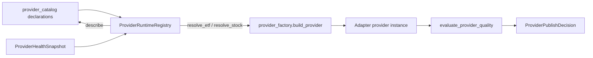

# Provider–Engine–Event seam

[ADR-0013](../../docs/adr/0013-provider-engine-event-architecture.md)
(Accepted for Phase 0, implementation gated by checkpoints) freezes
the **authority boundaries** that keep catalog / routing / factory /
Dagster / Event layers from drifting:

- `provider_catalog` — provider declarations and capabilities.
- `provider_routing.datasets` — dataset → capability selection rules.
- `provider_factory` / `ProviderRuntimeRegistry` — adapter construction.
- `dagster` — job graphs and schedules.
- `pipeline_runs` / `raw.*` / `core.*` / `analytics.*` — persisted
  run facts.
- Event Dispatcher — already-published batch results only.

The current Phase 0 / Phase 1 implementation lands **three thin modules** plus the
Stage 4C fail-closed publishability gate. They are deliberately
small: every one of them is a composition root that reuses an
existing authority rather than a parallel source of truth. No new
database schema, no Dagster asset, no Schedule, no SDK / HTTP import.

## 1. `ProviderRuntimeRegistry`

[`apps/pipeline/src/invest_pipeline/provider_runtime_registry.py`](../../apps/pipeline/src/invest_pipeline/provider_runtime_registry.py)
is the typed seam future Engine / Event layers consume. It owns
**no** state, schedule, event, session or database handle.

- `ProviderRuntimeRegistry.resolve_etf(settings, *, cifang_settings,
  akshare_settings, tushare_settings)` looks the request's
  `provider_key` up in the catalog and delegates construction to
  `invest_pipeline.provider_factory.build_provider`. The four
  fail-closed categories are preserved verbatim:

  - `KeyError(provider_key)` for any unregistered key (e.g.
    `"eastmoney"`, a typo, an empty string or mistyped case);
  - `UnknownProviderError(key)` for catalog-only entries
    (`tdx_offline` / `hithink` / `rsscast` / `quicktiny_mcp`)
    and any other key outside the runtime-supported set;
  - `RealProviderRequiresExplicitEnablementError` for real
    providers whose `enabled` flag is `False`;
  - `ProviderAuthenticationError` for real providers whose
    credential (`api_key` / `token`) is missing or empty.

  The result is a frozen `ResolvedProvider` carrying the
  constructed provider, the catalog declaration and the canonical
  `provider_key` so callers can introspect the resolved surface
  (`role` / `capabilities` / `enabled_by_default`) without
  re-issuing `lookup_provider`.
- `resolve_stock(settings, *, tushare_settings)` is intentionally
  narrower: only `tushare` has a stock provider today. `tdx_offline`
  is catalog-only and the factory rejects it with
  `UnknownProviderError("tdx_offline")` until a follow-up ADR wires
  the offline reader; the registry preserves that contract.
- `describe(provider_key)` is a thin wrapper over
  `provider_catalog.lookup_provider` so callers have one entry
  point that reads the catalog and never re-implements it.

The registry never adds a fallback chain, retry policy or
scheduling hook. The registry's `KNOWN_PROVIDER_KEYS` alias is not
declared: the factory's `KNOWN_PROVIDER_KEYS` tuple remains the
single source of truth (GOV-04). The registry is an adapter /
reader of that authority, not a parallel source of truth.

## 2. `StockDailyBarsEngine` + `StockDailyBarsApplication`

[`apps/pipeline/src/invest_pipeline/stock_daily_bars_engine.py`](../../apps/pipeline/src/invest_pipeline/stock_daily_bars_engine.py)
freezes the command / outcome dataclasses the future Engine layer
will hand to the application layer:

- `StockDailyBarsCommand` — opaque request bundle (resolver
  inputs, raw ingestor inputs, core publisher inputs).
- `StockDailyBarsOutcome` — terminal status
  (`PipelineRunStatus` from `invest_domain.pipeline`), record
  counts, source batch id, and a fail-closed `error_summary`. The
  string status is canonicalised through `PipelineRunStatus`
  before being persisted; the outcome scrubber walks the
  `_ERROR_SECRET_MARKERS` tuple (`api_key` / `access_token` /
  `token=` / `password` / `secret`) so an api_key or token
  fragment can never leak through the engine outcome.

[`apps/pipeline/src/invest_pipeline/stock_daily_bars_application.py`](../../apps/pipeline/src/invest_pipeline/stock_daily_bars_application.py)
is the application-layer Engine that wires four `Protocol` callables
around the engine:

- `ProviderResolver` — maps `StockDailyBarsCommand → Provider`.
- `RawIngestor` — runs the Provider and writes the three-layer
  evidence bundle to `raw.*`.
- `CorePublisher` — reads the sidecar and upserts the core rows.
- `HealthPreflight` — optional snapshot returned before resolution;
  a `DISABLED` / `UNKNOWN` / `STALE` result short-circuits with
  `_UNHEALTHY_PREFLIGHT_SUMMARY` so a disabled provider cannot be
  resolved and a stale one cannot reach the core publisher.

The application class is asset-agnostic — it is not wired into any
Dagster asset yet — so the contract can be exercised in unit
tests without booting the asset graph.

## 3. Fail-closed publishability gate

[`apps/pipeline/src/invest_pipeline/provider_quality.py`](../../apps/pipeline/src/invest_pipeline/provider_quality.py)
extends the existing quality scorer with the immutable
`ProviderPublishDecision` value object. The defaults are strict and
non-parameterisable:

- `DEFAULT_MIN_COVERAGE_RATIO = Decimal("1")`
- `DEFAULT_MIN_COMPLETENESS_RATIO = Decimal("1")`
- `_REQUIRED_FRESHNESS_STATUS = "fresh"`

`decide_provider_publishability(report, registration,
expected_symbols, as_of_date)` returns a `ProviderPublishDecision`
whose `publishable` flag is `True` only when every reason slot is
empty. Reasons are appended in a stable, deterministic order:

1. `low_coverage` (coverage below the min threshold)
2. `low_completeness` (completeness below the min threshold)
3. `stale_or_failed_freshness` (freshness is not `fresh`)
4. `failed_symbols` (any failed symbol in the coverage report)

The freshness requirement is fixed at `fresh` and **may not be
lowered** by callers; the function never re-derives a quality
score and never modifies the `evaluate_provider_quality`
contract. `decision_from_score(score)` is the standalone builder
the Engine layer uses when it has a precomputed
`ProviderQualityScore`.

The Stage 4C Checkpoint B acceptance
([`docs/validation/stage4c-mvp-checkpoint-b-acceptance.md`](../../docs/validation/stage4c-mvp-checkpoint-b-acceptance.md))
signs off on this gate as the canonical publishability contract;
no asset wires the gate into a downstream consumer yet — that is a
follow-up slice.

## 4. `ProviderHealthSnapshot`

[`apps/pipeline/src/invest_pipeline/provider_health.py`](../../apps/pipeline/src/invest_pipeline/provider_health.py)
is the snapshot the optional `HealthPreflight` Protocol returns. The
function is intentionally tiny and side-effect free: it never calls
the coverage engine, never re-derives a quality score, never queries
a clock. Status priority (highest first):

1. `DISABLED` — registered but disabled at the call site.
2. `UNKNOWN` — no coverage evidence at all.
3. `STALE` — latest evidence older than the freshness SLA.
4. `DEGRADED` — coverage / completeness below the perfect threshold
   or at least one failed symbol.
5. `HEALTHY` — coverage and completeness are both `1` and freshness
   is `"fresh"`.

The derivation never lowers a `DISABLED` / `UNKNOWN` / `STALE`
result to `DEGRADED` / `HEALTHY` even when the underlying quality
ratios look perfect. The snapshot is reproducible from its inputs
(quality score + registration + `as_of` date) so a CI snapshot and
a runtime snapshot for the same `(provider, dataset, as_of)` triple
are byte-identical.

## 5. What stays outside Phase 0

Per [ADR-0013 §3](../../docs/adr/0013-provider-engine-event-architecture.md):

- **Engine consumers.** No Engine-driven Dagster asset is wired in
  this slice; the seam is the typed entry point future Engine
  layers will consume without re-implementing the catalog / factory.
- **Event Dispatcher.** The Phase 0 slice ships **no** dispatcher.
  ADR-0013 §3 requires two independent approved consumers before the
  dispatcher lands; the catalog / factory / registry chain is the
  only authority an Event layer would consume.
- **Provider quality publishability gate consumer.** The
  `ProviderPublishDecision` gate is the audit-grade contract; no
  asset reads it yet. The Stage 4C Checkpoint B acceptance signs off
  on the contract, not on the asset-level integration.

## 6. Focused tests

- `apps/pipeline/tests/unit/test_provider_runtime_registry.py` and
  `test_provider_runtime_registry_characterization.py` cover the
  `ResolvedProvider` shape, the four fail-closed error categories
  and the registry's role as a thin reader.
- `apps/pipeline/tests/unit/test_stock_daily_bars_engine.py` and
  `test_stock_daily_bars_application.py` cover the engine
  command / outcome dataclasses, the secret-marker scrubber, and
  the application-layer preflight / resolver / ingestor / publisher
  wiring.
- `apps/pipeline/tests/unit/test_provider_health.py` covers the
  five-level status priority and the reproducibility invariant.
- `apps/pipeline/tests/unit/test_provider_quality.py` covers the
  fail-closed `ProviderPublishDecision` and the
  `decision_from_score` builder; the existing
  `test_provider_coverage_merge.py` keeps the multi-provider
  coverage merge deterministic on top of the new decision.
